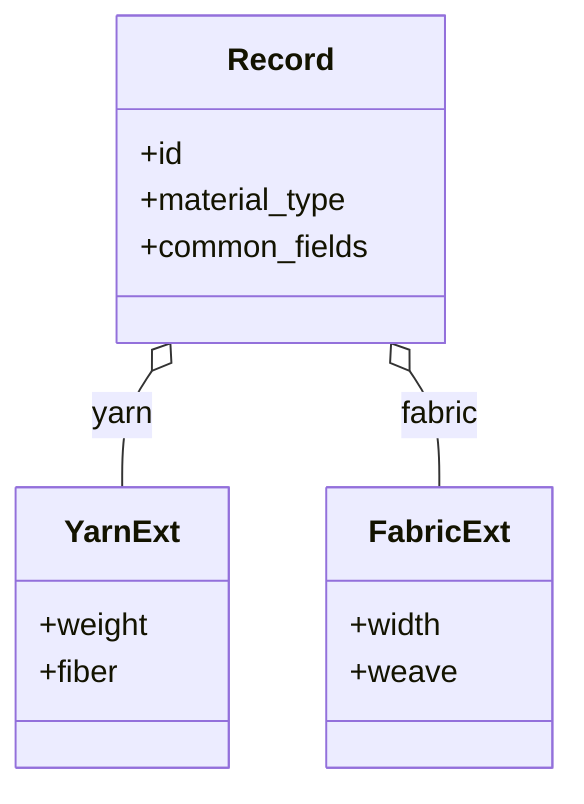

# Polymorphic Record

**Also known as:** Tagged Union, Discriminated Union

**Category:** Structure & Data  
**Status in practice:** mature

## Intent

Represent a family of related entities in a single core schema with type-specific extensions.

## Context

A team is designing a data model for a family of related entities that share most of their fields but differ in a few. A textile catalogue has yarn, fabric, and trim records, each with a common core (a stock-keeping unit, a supplier, a lead time) plus a handful of type-specific fields (yarn weight, fabric weave, trim attachment). A user-content system has projects, queues, and favourites that share an owner and a timestamp but diverge in their payloads. The team has to decide how to represent the shared core and the divergent extensions in a single schema that clients of different ages can still read.

## Problem

Two naive choices both go wrong. One schema per sub-type duplicates the common fields and forces every client to know about every sub-type; when a new sub-type appears, old clients break or have to be updated in lockstep. A single flat schema that contains every possible field for every sub-type is bloated, hard to validate, and silently allows nonsensical combinations such as a fabric record carrying a yarn weight. The team needs a representation that keeps the common parts common, isolates the per-sub-type fields, and lets old clients survive the addition of a new sub-type.

## Forces

- Common fields must stay common; new sub-types must not break old ones.
- Type-specific fields need a clean place to live.
- Validation must be per-sub-type, not just per-record.

## Therefore

Therefore: factor the family into a core schema with a discriminator plus namespaced extension blocks, so that common fields stay common and sub-types extend without breaking older clients.

## Solution

Define a core schema with the common fields and a discriminator (e.g. `material_type`). Sub-type fields live in a namespaced extension block (e.g. `yarn: {...}` for yarn-specific). Clients that do not understand a sub-type still read the core fields and round-trip the rest without data loss.

## Diagram

## Example scenario

A textile-trading platform has yarn, fabric, and trim records, each with shared fields (sku, supplier, lead-time) plus type-specific ones (yarn count, fabric weave, trim attachment). Three separate schemas duplicate code; one bloated 'material' schema with every field is unenforceable. The team adopts a polymorphic-record: a core schema with the shared fields and a `material_type` discriminator, plus namespaced extension blocks (yarn:{}, fabric:{}, trim:{}). Clients that don't understand a sub-type still read the core fields and round-trip the rest losslessly.

## Consequences

**Benefits**

- Forward-compatible: new sub-types don't break old clients.
- One core schema; many specialisations.

**Liabilities**

- Validation logic per sub-type adds complexity.
- Discriminator-driven code paths can be hard to debug.

## What this pattern constrains

Sub-type fields must live under their namespaced extension; they cannot pollute the core.

## Applicability

**Use when**

- A family of related entities shares a core schema with type-specific extensions.
- Clients should round-trip unknown sub-types without losing data.
- A discriminator field can flag the sub-type cleanly.

**Do not use when**

- Sub-types share so few fields that separate schemas are clearer.
- All clients understand all sub-types and a flat schema is simpler.
- Sub-type extension blocks would proliferate unboundedly without governance.

## Components

- Core schema — common fields shared by every sub-type, readable by clients that do not know any sub-type
- Discriminator field — names the sub-type (e.g. material_type) and drives per-sub-type validation
- Namespaced extension block — holds the sub-type-specific fields under a key (e.g. yarn: {...}) so they cannot pollute the core
- Per-sub-type validator — checks that the extension block matches the discriminator value
- Round-trip preserver — keeps unknown extension blocks intact when a client reads and rewrites a record

## Tools

- JSON Schema with oneOf + discriminator — standard mechanism for declaring polymorphic records
- OpenAPI discriminator — language-neutral way to expose the pattern in an API contract
- Tagged-union type (Pydantic discriminated union, TypeScript discriminated union, Rust enum) — language-level enforcement of the pattern in code

## Evaluation metrics

- Per-sub-type validation pass rate — how often records actually conform to their declared discriminator
- Forward-compatibility round-trip rate — fraction of unknown-sub-type records that old clients read and write back without data loss
- Discriminator mismatch rate — records whose extension block does not match the declared sub-type
- Core-field pollution count — sub-type-specific fields that leaked into the core schema and need to be moved
- Sub-type proliferation rate — new sub-types added per release; flags governance drift

## Known uses

- **Weft** _available_ — Material with material_type=yarn / fabric / thread / etc.; Pattern across knitting / crochet / weaving / etc.
- **FHIR resource polymorphism** _available_
- **Stripe API discriminated objects** _available_
- **JSON-LD @type** _available_
- **OpenAPI discriminator/oneOf** _available_
- **[Stripe API (PaymentMethod object)](https://docs.stripe.com/api/payment_methods/object)** _available_ — A single PaymentMethod record carries a type field plus a matching nested hash with type-specific fields.
- **[HL7 FHIR (choice[x] elements)](https://build.fhir.org/formats.html)** _available_ — Polymorphic elements named nnn[x] where [x] is replaced by the title-cased name of the type actually used.

## Related patterns

- _complements_ **Schema Extensibility**
- _complements_ **Translation Layer**

## References

- [Designing Data-Intensive Applications](https://dataintensive.net/) — Martin Kleppmann, 2017
