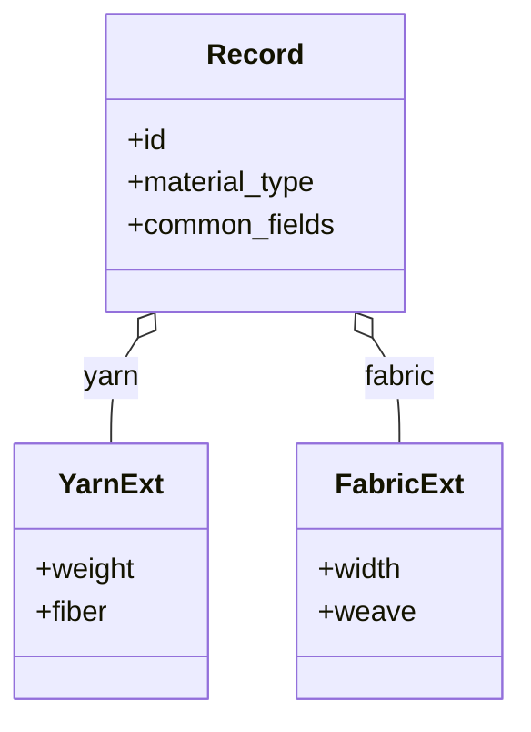

# Polymorphic Record

**Also known as:** Tagged Union, Discriminated Union

**Category:** Structure & Data  
**Status in practice:** mature

## Intent

Represent a family of related entities in a single core schema with type-specific extensions.

## Context

A team is designing a data model for a family of related entities that share most of their fields but differ in a few. A textile catalogue has yarn, fabric, and trim records, each with a common core (a stock-keeping unit, a supplier, a lead time) plus a handful of type-specific fields (yarn weight, fabric weave, trim attachment). A user-content system has projects, queues, and favourites that share an owner and a timestamp but diverge in their payloads. The team has to decide how to represent the shared core and the divergent extensions in a single schema that clients of different ages can still read.

## Problem

Two naive choices both go wrong. One schema per sub-type duplicates the common fields and forces every client to know about every sub-type; when a new sub-type appears, old clients break or have to be updated in lockstep. A single flat schema that contains every possible field for every sub-type is bloated, hard to validate, and silently allows nonsensical combinations such as a fabric record carrying a yarn weight. The team needs a representation that keeps the common parts common, isolates the per-sub-type fields, and lets old clients survive the addition of a new sub-type.

## Forces

- Common fields must stay common; new sub-types must not break old ones.
- Type-specific fields need a clean place to live.
- Validation must be per-sub-type, not just per-record.

## Applicability

**Use when**

- A family of related entities shares a core schema with type-specific extensions.
- Clients should round-trip unknown sub-types without losing data.
- A discriminator field can flag the sub-type cleanly.

**Do not use when**

- Sub-types share so few fields that separate schemas are clearer.
- All clients understand all sub-types and a flat schema is simpler.
- Sub-type extension blocks would proliferate unboundedly without governance.

## Therefore

Therefore: factor the family into a core schema with a discriminator plus namespaced extension blocks, so that common fields stay common and sub-types extend without breaking older clients.

## Solution

Define a core schema with the common fields and a discriminator (e.g. `material_type`). Sub-type fields live in a namespaced extension block (e.g. `yarn: {...}` for yarn-specific). Clients that do not understand a sub-type still read the core fields and round-trip the rest without data loss.

## Variants

- **Discriminator + per-type extension block** — Core record carries `type`; sub-type fields live under a namespaced extension (`yarn: {...}`).
- **oneOf / discriminator (OpenAPI)** — Sub-types are full schemas in a `oneOf`, keyed by a discriminator field; validators enforce the right schema per record.
- **Inline polymorphism (FHIR `value[x]`)** — Sub-type information is encoded in the field name itself (`valueQuantity`, `valueString`); no separate discriminator needed.

## Example scenario

A textile-trading platform has yarn, fabric, and trim records, each with shared fields (sku, supplier, lead-time) plus type-specific ones (yarn count, fabric weave, trim attachment). Three separate schemas duplicate code; one bloated 'material' schema with every field is unenforceable. The team adopts a polymorphic-record: a core schema with the shared fields and a `material_type` discriminator, plus namespaced extension blocks (yarn:{}, fabric:{}, trim:{}). Clients that don't understand a sub-type still read the core fields and round-trip the rest losslessly.

## Diagram

## Consequences

**Benefits**

- Forward-compatible: new sub-types don't break old clients.
- One core schema; many specialisations.

**Liabilities**

- Validation logic per sub-type adds complexity.
- Discriminator-driven code paths can be hard to debug.

## What this pattern constrains

Sub-type fields must live under their namespaced extension; they cannot pollute the core.

## Known uses

- **Weft** — *Available*. Material with material_type=yarn / fabric / thread / etc.; Pattern across knitting / crochet / weaving / etc.
- **FHIR resource polymorphism** — *Available*
- **Stripe API discriminated objects** — *Available*
- **JSON-LD @type** — *Available*
- **OpenAPI discriminator/oneOf** — *Available*

## Related patterns

- *complements* → [schema-extensibility](schema-extensibility.md)
- *complements* → [translation-layer](translation-layer.md)

## References

- (book) Martin Kleppmann, *Designing Data-Intensive Applications*, 2017

**Tags:** schema, polymorphism, data
