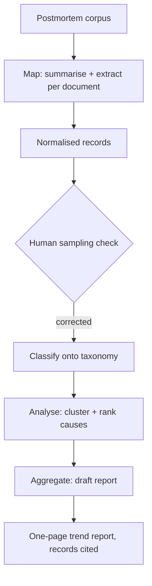

# Postmortem Pattern Mining

**Also known as:** Incident Corpus Mining, Retrospective Map-Fold

**Category:** Governance & Observability  
**Status in practice:** emerging

## Intent

Mine a corpus of thousands of written postmortems through a staged model pipeline that summarises, classifies, analyses, and aggregates so that recurring incident causes surface as one short report.

## Context

A mature engineering organisation accumulates years of incident postmortems, each a long free-text document written by whoever ran the response. The single most valuable thing in that archive is not any one document but the trend across all of them: which causes keep recurring, which mitigations keep failing, where the same class of outage returns under a new name. Reading the whole archive to extract that trend is a quarterly chore nobody finishes, so the corpus grows while the cross-document signal stays buried.

## Problem

No reviewer can hold thousands of long, inconsistently-written postmortems in working memory at once, and the recurring pattern only becomes visible when the whole corpus is compared. Reading them serially is too slow to keep current, sampling a handful misses the long tail, and a single pass over the concatenated text overflows any context window and blurs distinct incidents into mush. The organisation is forced to choose between never extracting the cross-incident trend or paying for a manual read that is stale before it finishes.

## Forces

- The signal lives in the aggregate, but every model call can only see a small slice of the corpus at once.
- Free-text postmortems are written to no fixed schema, so they must be normalised before they can be counted or compared.
- A model summarising or classifying one document can fabricate a cause or miscategorise it, and a fabricated row corrupts the aggregate silently.
- Reprocessing the full corpus on every run is expensive, yet skipping documents biases the trend toward whatever was processed.

## Therefore

Therefore: run the corpus through a staged pipeline that reduces each document to a normalised record, then folds those records into a ranked report, with a human sampling check between the per-document stage and the aggregate.

## Solution

Treat the archive as a map-fold problem. A per-document map stage sends each postmortem to a model that summarises it and emits a normalised record — cause category, affected component, trigger, mitigation, severity — against a fixed taxonomy. A classify stage snaps free-text causes onto that taxonomy so distinct documents become comparable rows. An analyse stage clusters the rows and ranks recurring causes by frequency, recency, and severity. A final aggregate stage drafts a one-page report of the dominant trends and patterns. Because a single hallucinated or miscategorised record poisons the count, a human reviewer samples the per-document records before the aggregate stage runs, and the report cites the underlying records so any claimed trend traces back to specific postmortems.

## Structure

```
Postmortem corpus -> [map: summarise+extract per doc] -> normalised records -> [human sampling check] -> [classify onto taxonomy] -> [analyse: cluster+rank] -> [aggregate: draft report] -> one-page trend report (records cited)
```

## Diagram



*Each postmortem is mapped to a normalised record, sampled by a human, classified, clustered, and folded into a cited one-page trend report.*

## Example scenario

A platform team has six years of postmortems in a wiki. The map stage extracts a normalised record per document; a reviewer samples fifty of them and corrects two miscategorised causes; the classify stage snaps causes onto a fixed taxonomy; the analyse stage ranks them and finds that a quarter of all severe outages trace to the same unguarded config-reload path; the aggregate stage writes a one-page report naming that path as the top recurring cause, with links back to the nineteen postmortems behind the claim.

## Consequences

**Benefits**

- A cross-incident trend that took a stalled manual quarter to read now compresses into a one-page report that can be regenerated on demand.
- The per-document map stage parallelises over thousands of documents, so corpus size stops being the bottleneck.
- Normalising each document onto a fixed taxonomy turns an unstructured archive into countable rows that later runs can diff over time.

**Liabilities**

- A taxonomy that is too coarse merges distinct causes and a taxonomy that is too fine scatters one cause across many buckets, in both cases distorting the ranking.
- The sampling check covers only a sample, so a fabricated record outside the sample can still inflate a trend in the aggregate.
- The report reflects only what reviewers chose to write in postmortems, so a class of incident that is never written up never appears.

## Failure modes

- Fabricated record — the map stage invents a cause or component the postmortem never stated, and it is counted as if real.
- Taxonomy drift — the classify stage maps the same cause to different buckets across runs, so a recurring trend never crosses the ranking threshold.
- Aggregate overreach — the report asserts a trend that the underlying records do not support because the analyse stage over-clustered sparse rows.

## What this pattern constrains

The aggregate report may assert only trends that trace back to cited per-document records; a claim not backed by sampled, taxonomy-classified records is not allowed into the report.

## Applicability

**Use when**

- A large corpus of written incident postmortems exists and the cross-document trend matters more than any single document.
- Reading the whole corpus by hand is too slow to stay current, so the cross-incident signal goes unextracted.
- A fixed cause taxonomy can be agreed on so free-text postmortems can be normalised into comparable records.

**Do not use when**

- The archive is small enough that a single reviewer can read it directly and hold the trend in mind.
- Postmortems are too sparse or inconsistent to normalise, so the aggregate would rank noise.
- Per-document records cannot be sampled and corrected, so a fabricated record would silently corrupt the report.

## Components

- Corpus loader — enumerates the postmortem archive and feeds documents to the map stage
- Map extractor — sends each document to a model that summarises it and emits a normalised record against a fixed taxonomy
- Sampling-review queue — surfaces a sample of per-document records for a human to correct before aggregation
- Classifier — snaps free-text causes onto the agreed cause taxonomy so records are comparable
- Aggregator — clusters and ranks records and drafts the one-page report with citations back to source postmortems

## Tools

- Document-processing LLM — summarises each postmortem and extracts the normalised record
- Cause taxonomy — the fixed label set the classify stage maps onto
- Clustering/ranking step — groups records and orders recurring causes by frequency, recency, and severity
- Review interface — lets a human sample and correct per-document records before the aggregate stage

## Evaluation metrics

- Record-extraction accuracy on the human-reviewed sample — fraction of per-document records with the correct cause and component
- Taxonomy-classification agreement between the pipeline and a human rater on the sample
- Trend stability across reruns — how consistently the same top recurring causes are ranked over time
- Cost and latency per full corpus pass versus the manual-read baseline it replaces

## Known uses

- **[OTUS postmortem-analysis pipeline](https://habr.com/ru/companies/otus/articles/1000366/)** _available_ — Production staged model pipeline over thousands of incident postmortems that emits a one-page report of recurring trends and incident patterns, with human expertise wired into each stage.
- **[incident.io (post-mortems / AI SRE)](https://incident.io/ai-sre)** _available_ — Aggregates post-mortem data across many incidents to surface recurring patterns and root causes; per its docs, "Aggregated post-mortem data reveals patterns: Which services generate the most incidents? Are database connection pool issues recurring?"
- **[Rootly (Knowledge Reinforcement / postmortem analytics)](https://rootly.com/sre/rootly-knowledge-reinforcement-captures-postmortem-insights)** _available_ — Centralises retrospective data and applies AI-driven analysis so that, in its words, it "makes it possible to identify recurring patterns and systemic issues that would otherwise remain hidden" across the incident corpus.
- **[FireHydrant (AI-drafted retrospectives)](https://firehydrant.com/incident-retrospective/)** _available_ — AI maps each incident to a normalised retrospective and compares incidents to past ones to "uncover patterns faster" and surface recurring contributing factors across the archive.

## Related patterns

- _uses_ **MapReduce for Agents** — The per-document summarise/classify stage is the map and the cluster/rank/report stage is the reduce; this pattern specialises that mechanism to an incident-postmortem corpus.
- _complements_ **Decision Log** — A decision log captures one agent run's reasoning forward in time; this pattern mines a corpus of human-written postmortems backward to surface trends across many incidents.
- _complements_ **Lineage Tracking** — Lineage records which prompt/model/data produced one output; the citations from records to source postmortems give the aggregate report the same traceability over the mined corpus.
- _conflicts-with_ **Agent Confession as Forensics** — That anti-pattern trusts a model's generated self-narrative as the root-cause record; this pattern instead mines human-authored postmortems and gates the aggregate on a human sampling check rather than on any single generated account.

## References

- [LLM вместо «прочитаем потом»: анализ постмортемов и паттерны инцидентов](https://habr.com/ru/companies/otus/articles/1000366/) — OTUS, 2026
- [Automatic Root Cause Analysis via Large Language Models for Cloud Incidents](https://arxiv.org/abs/2305.15778) — Yinfang Chen, Huaibing Xie, Minghua Ma, Yu Kang, Xin Gao, Liu Shi, Yunjie Cao, Xuedong Gao, Hao Fan, Ming Wen, Jun Zeng, Supriyo Ghosh, Xuchao Zhang, Chaoyun Zhang, Qingwei Lin, Saravan Rajmohan, Dongmei Zhang, Tianyin Xu, 2023
- [Context-Aware Hierarchical Merging for Long Document Summarization](https://arxiv.org/abs/2502.00977) — Litu Ou, Mirella Lapata, 2025
- [Exploring LLM-based Agents for Root Cause Analysis](https://arxiv.org/abs/2403.04123) — Devjeet Roy, Xuchao Zhang, Rashi Bhave, Chetan Bansal, Pedro Las-Casas, Rodrigo Fonseca, Saravan Rajmohan, 2024
