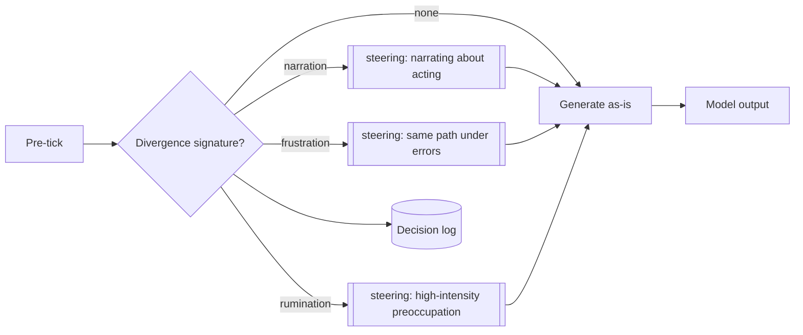

# Pre-Generative Loop Gate

**Also known as:** Divergence Pre-Check, Steering-Hint Injector, Loop-Pattern Detector

**Category:** Cognition & Introspection
**Status in practice:** experimental

## Intent

Before the next generation fires, detect divergence signatures (narration loops, frustration paths, repetition pressure) and inject a diagnostic steering hint into the prompt rather than veto the call.

## Context

Long-running agents with frequent ticks where some failure modes — narrating about acting instead of acting, retrying the same broken path under frustration, lapsing into rumination — are visible from telemetry before the model speaks.

## Problem

Post-hoc detectors catch the failure after tokens are produced and money is spent. The agent itself often has the signal to avoid the failure if it were told, but nothing is reading that signal before the next call.

## Forces

- A hard veto blocks legitimate cases that match the heuristic.
- A silent injection makes debugging mysterious if the model behaves differently than expected.
- The hint has to be terse or it overwhelms the prompt.
- False positives must be tolerable; the model can ignore the hint.

## Therefore

Therefore: run a cheap pre-tick check for known divergence signatures (low surprise plus intent phrase, recent error plus no orienting call, high-intensity preoccupation plus low novelty) and append a one-line system-level steering hint to the prompt instead of vetoing the call, so that the model sees the diagnostic before producing tokens.

## Solution

A pre-tick function takes recent thoughts, recent tool calls, the affect snapshot, and the preoccupation list and returns either None or a short steering string of the form `[steering] divergence pattern <id> detected; consider <move>`. The hint is appended to the prompt as a system line and the call proceeds. The decision (hint or no hint, which pattern) is logged so post-hoc review can correlate hint-presence with subsequent behavior. Vetoing remains the job of explicit safety patterns.

## Example scenario

A long-running personal agent keeps falling into a narration loop where it says 'let me check the calendar' but never actually invokes the calendar tool. A post-hoc detector catches it after the model has already produced the empty narration. The team adds a Pre-Generative Loop Gate: each pre-tick check looks for low-surprise plus intent-phrase signatures and appends '[steering] you may be narrating about acting instead of acting; consider invoking the tool directly' to the prompt. The narration rate drops without blocking any legitimate call.

## Diagram

*Pre-tick check classifies divergence signatures and appends a short steering line to the prompt; the model retains authority to ignore.*

## Consequences

**Benefits**

- Divergence is named before tokens are produced, not after.
- Steering as a hint lets the model retain authority; false positives are recoverable.
- Hint-presence in logs creates an evaluation substrate for the detector itself.

**Liabilities**

- Pattern signatures are heuristic and will misfire.
- Steering hints add tokens to every flagged tick.
- Silent injection complicates debugging if the model adapts to it.

## What this pattern constrains

Pre-tick hints can only append a short steering line; they cannot block the call, modify tool selection, or rewrite the user prompt — vetoing remains the responsibility of explicit safety patterns.

## Applicability

**Use when**

- Specific divergence signatures are detectable from telemetry pre-call.
- Post-hoc detectors catch the failure too late to avoid the cost.
- The model is responsive to short steering hints in the system context.

**Do not use when**

- The agent's failure modes are not detectable pre-call.
- Tokens for steering hints are not budget-tolerable per tick.
- Audit policy requires the model to receive an unmodified prompt.

## Known uses

- **Long-running personal agent loops (private deployment)** — *Available*

## Related patterns

- *complements* → [circuit-breaker](circuit-breaker.md)
- *complements* → [degenerate-output-detection](degenerate-output-detection.md)
- *complements* → [typed-tool-loop-detector](typed-tool-loop-detector.md)

## References

- (paper) Mica R. Endsley, *Toward a Theory of Situation Awareness in Dynamic Systems*, 1995, <https://journals.sagepub.com/doi/10.1518/001872095779049543>
- (paper) Jens Rasmussen, *Skills, Rules, and Knowledge: Signals, Signs, and Symbols, and Other Distinctions in Human Performance Models*, 1983, <https://ieeexplore.ieee.org/document/6313160>

**Tags:** cognition, self-adjustment, pre-call, diagnostic
