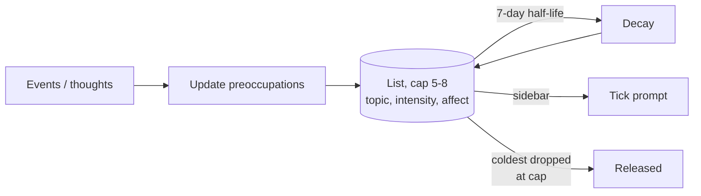

# Preoccupation Tracking

**Also known as:** Mid-Term Working Memory, Affect-Tagged Concerns, Background Chewing

**Category:** Memory
**Status in practice:** emerging

## Intent

Maintain a small set of mid-term, affect-tagged concerns that persist across days and surface in every prompt, distinct from the single-item working focus and from long-term insights.

## Context

Long-running agents that hold a single working focus and a long-term insight store but nothing in between. Without an intermediate tier, the things the agent is currently 'chewing on' either dominate focus or vanish entirely between sessions.

## Problem

Working focus holds one item; insights are too distilled. Between them there is a missing tier — the things the agent is chewing on across days — and without it concerns either crowd out the active focus or fall off the back of the window before they resolve.

## Forces

- A cap is needed or preoccupations crowd out everything else.
- Decay must be automatic; the agent left to itself will not let go.
- Affect tagging is what makes a preoccupation different from a todo.
- Display every tick costs tokens, but invisibility defeats the point.

## Solution

Cap a list at 5-8 preoccupations stored as small JSON entries with topic, intensity (0..1), affect tag, opened-at, last-touched. Apply a 7-day half-life decay to intensity. When the cap is reached, release the coldest entry. Surface all current preoccupations in every tick prompt as a brief sidebar. The agent has explicit `touch` (raise intensity) and `release` (drop) operations.

## Example scenario

A long-running personal agent has a 'current focus' slot that holds one item and a long-term insight store that is too distilled. Mid-tier concerns — a project the user is wrestling with, a relationship issue they keep returning to — either crowd out the active focus or fall off the back of the context window. The team adds preoccupation-tracking: a capped list of 5–8 affect-tagged concerns with topic, intensity, and last-touched, decaying with a 7-day half-life, surfaced as a sidebar in every tick prompt. Mid-tier context now persists across days without overwhelming the foreground.

## Diagram

## Consequences

**Benefits**

- Mid-term concerns persist without crowding focus.
- Cap plus decay keeps the list bounded without manual gardening.
- Affect tags expose the emotional shape of what the agent is carrying.

**Liabilities**

- Surfacing preoccupations every tick costs tokens.
- Mis-cap and items churn before they consolidate.
- Decay rate is empirical and one rate may not fit all topic types.

## What this pattern constrains

The active preoccupation list is hard-capped at the configured size; new entries displace the coldest, and intensity decays automatically — the agent cannot extend the cap or freeze decay from inside the loop.

## Applicability

**Use when**

- The agent runs across many sessions and has affective or motivational state that should persist between them.
- There are mid-term concerns (worries, interests, anticipations) that are too persistent for working memory and too volatile for long-term insights.
- Reasoning quality improves when the agent can reference its current concerns explicitly.

**Do not use when**

- The agent is stateless or session-scoped only.
- Affect and motivation are out of scope (e.g. a transactional API agent).
- Persisting concerns across sessions would create privacy or alignment risks.

## Variants

### Hard-capped slot list

Maintain a fixed-size array (e.g. 5) of preoccupations; new entries displace the coldest by salience.

*Distinguishing factor:* cap by count

*When to use:* Default. Predictable size, easy to surface in prompts.

### Decay-and-prune

Each preoccupation has an intensity scalar that decays over time; entries below threshold are pruned.

*Distinguishing factor:* cap by intensity

*When to use:* When some concerns should fade naturally rather than be evicted by competition.

### Affect-tagged with valence

Each preoccupation carries explicit affect tags (worry, anticipation, curiosity) and a valence sign so reflection passes can act differently per type.

*Distinguishing factor:* typed affect

*When to use:* When downstream patterns (dream consolidation, mode-adaptive cadence) must distinguish kinds of concern.

## Known uses

- **Long-running personal agent loops (private deployment)** — *Available*

## Related patterns

- *complements* → [five-tier-memory-cascade](five-tier-memory-cascade.md)
- *complements* → [awareness](awareness.md)
- *alternative-to* → [scratchpad](scratchpad.md)
- *uses* → [salience-attention-mechanism](salience-attention-mechanism.md)

## References

- (paper) Park, O'Brien, Cai, Morris, Liang, Bernstein, *Generative Agents: Interactive Simulacra of Human Behavior*, 2023, <https://arxiv.org/abs/2304.03442>

**Tags:** memory, mid-term, affect, tick-loop
