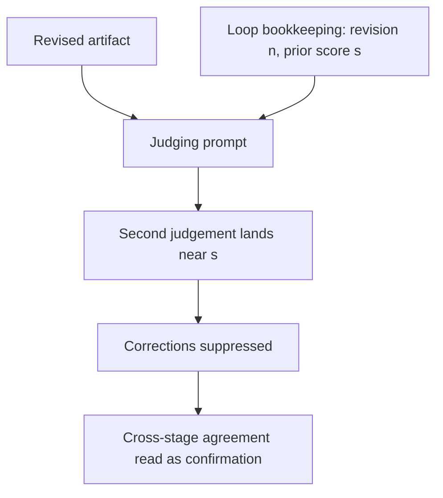

# Prior-Estimate Anchoring

**Also known as:** Anchored Second Opinion, Prior-Score Contamination, Metadata Anchoring

**Category:** Anti-Patterns  
**Status in practice:** emerging

## Intent

Anti-pattern: pass a prior score, attempt counter, or earlier verdict into the context of the stage meant to judge independently, so the second judgement is pulled toward the first and agreement is manufactured.

## Context

A pipeline judges the same artifact more than once. A refinement loop scores a draft, sends it back for revision, and scores it again; a review stage asks for a second opinion on an earlier verdict; a triage agent inherits the previous shift's severity rating; a negotiation agent reads the other side's opening offer. The harness carries its own bookkeeping forward for good reasons — the revision number, the attempt counter, the prior score, the earlier classification are what detect convergence, track progress, and give the next stage background. That state ends up in the same prompt as the artifact under judgement.

## Problem

The second judgement is supposed to be independent, and it is not. A prior score included only as context metadata shifts the new rating toward its value: across 185,271 successful evaluations the shift reached a Cohen's d of 0.71, and 48% of the corrections the judge would otherwise have made were blocked, so a draft that scored low stayed low and one that scored high stayed high. The pull is not an artifact of weak models — a fourteen-model benchmark found frontier systems above 95% accuracy on the anchor-free control condition still moved, so control accuracy does not predict resistance to a plausible anchor. It is not confined to numbers either: a categorical prior analysis result shifts a code-vulnerability agent's call at 23.5% cross-model susceptibility, behind framing at 33.2% and ahead of the halo effect at 18.4%. Chain-of-thought does not remove the effect, and neither does an instruction to disregard the metadata. Agreement between stages therefore measures the strength of the pipeline's own bookkeeping rather than the quality of the artifact.

## Forces

- A refinement loop needs its own bookkeeping — revision number, attempt count, previous score — to detect convergence and stop, so the state that anchors the judge is the same state that makes the loop terminate.
- More background usually improves a judgement, and the earlier verdict is genuinely informative, so removing it from the judging call feels like withholding evidence.
- The anchor is cheap to pass and invisible in the transcript: the second judgement reads as considered whether or not it moved.
- Telling the judge to ignore the metadata costs nothing and looks like a fix, but the measured total effect survives both that warning and chain-of-thought prompting.
- Model quality is the usual lever for judgement problems, yet accuracy on the anchor-free control condition does not predict how far a plausible anchor moves the answer, so upgrading the judge does not settle it.

## Therefore

Therefore: do not place a prior score, attempt counter, or earlier verdict in the context of a stage whose judgement is meant to be independent; keep that bookkeeping in the orchestrator, and count agreement across stages as confirmation only when the later stage could not see the earlier one.

## Solution

Separate the loop's bookkeeping from the judging context. The orchestrator retains the revision number, the attempt counter, and every prior score for convergence detection and logging, while the judging call receives only the artifact and the rubric — no field, header, or preamble naming a previous value, and no summary that implies one. Where a second opinion has to follow a first, run both judgements from independent contexts and combine them afterwards instead of nesting one inside the other. When prior state genuinely has to stay visible, blind or randomise it so it cannot act as a numeric target; the 6G control work replaces fixed heuristic anchors with a randomised draw for exactly this reason. Measure what is left with a paired experiment that re-scores the same artifacts with and without the metadata, and treat a disregard instruction as a note rather than a control, because the measured effect persists through it.

## Structure

```
Loop bookkeeping (revision n, attempt k, prior score s) -> merged into the judging prompt -> second score lands near s -> corrections suppressed -> cross-stage agreement counted as confirmation (BROKEN) ; Corrected: bookkeeping stays in the orchestrator, the judging call sees artifact + rubric only, prior scores are combined after the fact
```

## Diagram



*The harness merges its own bookkeeping into the judging prompt, so the second score lands near the first and the pipeline's agreement reflects the metadata rather than the artifact.*

## Example scenario

A code-review loop scores a patch 4 out of 10, the author agent rewrites it, and the same reviewer is asked to score the new version. The rewrite is much better, but the reviewer's prompt still carries the line "revision 2, previous score 4", and the new score comes back as 5. A reviewer handed only the rewritten patch and the rubric scores it 8. The loop's own bookkeeping, not the patch, decided the number.

## Consequences

**Liabilities**

- Corrections the judge would have made are suppressed — 48% of them in the measured refinement loop — so real defects survive revision.
- Cross-stage agreement stops being evidence of correctness, because the later stage was shown the earlier stage's answer.
- A harsh first score becomes self-fulfilling as the artifact is pulled down on every later pass, and a generous first score is equally sticky.
- The defect leaves no trace in the transcript: the anchored judgement reads as reasoned, and the shift shows up only in a paired experiment that removes the metadata.
- Routing to a stronger or different model does not remove the pull, so the usual remedy for judgement quality is spent without effect.

## Failure modes

- Prior-score carryover — the previous rating rides into the judging context as metadata and the new rating lands beside it.
- Attempt-counter anchoring — a revision or attempt number tells the judge how much work has already happened and stands in for a quality prior.
- Correction suppression — the judge names a defect in its reasoning but does not move the score far enough from the anchor for the gate to act.
- Manufactured consensus — a second opinion that could read the first is counted as an independent confirmation.
- Warning-as-control — a disregard-the-metadata instruction is recorded as a mitigation although the measured effect persists through it.
- Anchor injection — an adversary writes a prior analysis verdict into the material under review and steers the judgement without touching the artifact.

## What this pattern constrains

A stage whose judgement is meant to be independent must not receive a prior score, attempt counter, or earlier verdict in its context, not even as metadata paired with an instruction to disregard it; the loop's bookkeeping stays with the orchestrator, and agreement between stages cannot be counted as confirmation unless the later stage was blind to the earlier one.

## Applicability

**Use when**

- Recognising this failure when a scoring, grading, or triage stage receives the previous score, attempt count, or earlier verdict in its context.
- Reviewing a refinement loop whose scores creep by one point per revision no matter how much the artifact changed.
- Auditing a second-opinion or escalation step that was sequenced after a first judgement it could read.
- Investigating why a judge names a defect in its written reasoning but does not move the score enough for the gate to act on it.

**Do not use when**

- The judging call is already built from the artifact and the rubric alone, with the loop's bookkeeping held in the orchestrator.
- The prior value is itself the object of review, as in an appeal or an audit of an earlier decision, where seeing it is the point.
- The stage aggregates judgements already formed elsewhere rather than forming one, so no independent opinion is expected of it.

## Components

- Prior judgement — the earlier score, rating, or verdict the pipeline produced and kept
- Loop bookkeeping — revision number, attempt counter, and convergence state the harness writes for its own control flow
- Judging stage — the call expected to form an independent opinion on the artifact
- Context assembler — the step that merges artifact, rubric, and harness metadata into one prompt and carries the anchor across
- Missing isolation boundary — the absent rule that would keep harness metadata out of the judging context
- Downstream gate — the consumer that reads agreement between stages as confirmation

## Tools

- Evaluation harness or judge framework — assembles the scoring call and decides what metadata rides along with the artifact
- Paired scoring experiment — re-scores the same artifacts with and without the prior value to expose the shift
- Effect-size statistics such as Cohen's d — quantifies how far anchored scores moved from blind ones
- Context-isolation wrapper — the corrective that builds the judging call from artifact and rubric only
- Randomised anchor draw — the corrective for cases where prior state has to remain visible

## Evaluation metrics

- Anchored-versus-blind score shift — effect size between the same artifact scored with and without the prior value
- Correction-suppression rate — share of defects a blind judge flags that the anchored judge lets pass
- Score-movement distribution across revisions — how often a rating changes at all once a previous rating is in context
- Independence audit coverage — fraction of judging calls verified to contain no prior score, counter, or verdict
- Anchor-resistance gap — difference between control-condition accuracy and accuracy under a plausible anchor

## Known uses

- **[LLM-as-a-Judge scoring and refinement pipelines](https://arxiv.org/abs/2608.25869)** _available_ — Across 185,271 successful evaluations, prior scores supplied only as context metadata shifted ratings toward their values with effect sizes up to Cohen's d 0.71 and blocked 48% of error corrections; neither chain-of-thought nor a metadata-disregard warning removed the total effect.
- **[AnchorBench multi-pathway anchoring benchmark](https://arxiv.org/abs/2608.14320)** _available_ — Measures the anchoring effect across fourteen models and several anchor pathways, and finds that frontier API models above 95% accuracy on the anchor-free control condition remain susceptible to plausible anchors.
- **[LLM-based code vulnerability detection](https://arxiv.org/abs/2606.30587)** _available_ — Holding the code fixed and varying only the surrounding context, a prior analysis result changed the vulnerability verdict at 23.5% cross-model susceptibility, behind framing at 33.2% and ahead of the halo effect at 18.4%, and the same channel supports a black-box exploit.
- **[Agentic control of 6G autonomous networks](https://arxiv.org/abs/2510.19973)** _available_ — Lists anchoring in its taxonomy of cognitive biases for agents and mitigates it by replacing fixed heuristic anchors with a randomised anchor strategy, roughly doubling system-wide energy savings without breaching latency limits.

## Related patterns

- _alternative-to_ **Blind Grader with Isolated Context** — The structural corrective, but isolation from the producer's reasoning trace is necessary and not sufficient: a grader that never sees the trace is still anchored by the loop's own bookkeeping, so the isolated context has to exclude harness metadata as well.
- _complements_ **LLM-as-Judge** — The judging stage is where the anchor lands; a scoring call that receives the previous score is not the independent judgement the pattern assumes.
- _complements_ **Evaluator-Optimizer** — The refinement loop is the usual carrier: it passes its own iteration state to the evaluator, and the evaluator's score is pulled toward the score it produced last time.
- _complements_ **Uncertainty Neglect Bias** — Sibling bias from the same taxonomy of cognitive biases in agents; that one discards the spread of a prediction, this one moves a judgement toward a number the system itself supplied.
- _complements_ **Sycophancy** — Both bend a judgement toward a value the model was shown, but sycophancy needs a human interlocutor and an expressed belief, while this anchor is an impersonal scalar the harness writes and it works on categorical labels too.
- _complements_ **Lost in the Middle (Positional Bias)** — Positional bias concerns where evidence sits in the prompt; this is a pull toward a particular value wherever it sits.
- _complements_ **Memo-As-Source Confusion** — There the agent substitutes a stale self-authored summary for the artifact; here it does re-read the artifact and still shifts its verdict toward the earlier number.
- _complements_ **Consensus-Averaging Over Expertise** — Both manufacture agreement, one by averaging expert and non-expert views, the other by showing the second judge what the first judge decided.
- _complements_ **Heterogeneous-Model Council with Synthesis Judge** — Decorrelating members by model architecture does not remove the anchor, which was measured across fourteen models including frontier systems, so the council's independence has to come from what each member is shown and not only from whose weights it runs on.
- _complements_ **Self-Consistency** — Sampling and aggregating helps only while the samples are independent; a shared prior score correlates them and the vote inherits the anchor.
- _complements_ **AI-Targeted Comment Injection** — The anchor needs no adversary, but it is also weaponisable: a prior analysis verdict written into the material under review steers the judgement without altering the artifact.

## References

- [Anchoring Bias in LLM-as-a-Judge Systems: Prior Scores Compromise Evaluation Independence](https://arxiv.org/abs/2608.25869) — 2026
- [AnchorBench: A Multi-Pathway Benchmark for the Anchoring Effect in LLMs](https://arxiv.org/abs/2608.14320) — 2026
- [Words Speak Louder Than Code: Investigating Cognitive Heuristics in LLM-Based Code Vulnerability Detection](https://arxiv.org/abs/2606.30587) — 2026
- [A Tutorial on Cognitive Biases in Agentic AI-Driven 6G Autonomous Networks](https://arxiv.org/abs/2510.19973) — 2025
