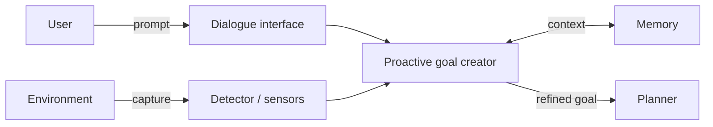

# Proactive Goal Creator

**Also known as:** Multimodal Goal Anticipator, Context-Capturing Goal Creator

**Category:** Planning & Control Flow  
**Status in practice:** emerging

## Intent

Anticipate the user's goal by capturing surrounding multimodal context (gestures, screen state, environment) in addition to what the user types or says.

## Context

The agent operates in a setting where the user's articulated prompt alone is too thin — accessibility needs, embodied/physical interaction, ambient assistance — and where cameras, microphones, screen capture, or other sensors can supply the missing context.

## Problem

Dialogue alone underspecifies the goal in embodied or accessibility-driven settings. The agent needs to actively capture context that the user may not articulate at all.

## Forces

- Underspecification: users may be unable or unwilling to verbalise full context.
- Accessibility: users with motor or speech impairments cannot rely on dialogue alone.
- Overhead: multimodal capture adds cost (sensors, bandwidth, privacy review).

## Applicability

**Use when**

- Embodied / ambient interaction is the primary surface, not chat.
- Accessibility needs make dialogue-only interaction insufficient.
- Context-capture is justified by clear user value and disclosed appropriately.

**Do not use when**

- Sensors / capture infrastructure are unavailable or disallowed (privacy, regulation).
- Articulated prompts already suffice — passive goal creator is simpler.

## Therefore

Therefore: pair the dialogue interface with one or more detectors (camera, screen, microphone, environment sensor) and synthesise the captured multimodal signal with the user's prompt into a refined goal, so that the agent can anticipate intent rather than wait for the user to articulate it completely.

## Solution

A proactive goal creator runs alongside the dialogue interface. It activates context-capture devices (cameras for gestures, screen recorders for UI state, microphones for ambient audio, environment sensors), passes the multimodal data through context engineering, and combines it with the user's articulated prompt to produce a refined goal. The component must notify users when context is being captured, with a low false-positive rate, to avoid surprise.

## Example scenario

A user points at an object on their desk and says "can you order another one of these". A proactive goal creator captures the camera frame, recognises the object, combines that with the spoken request, and emits a goal: "reorder the visible model of headphones for the user's default address". The user never had to type a SKU.

## Diagram

*Proactive Goal Creator fuses captured multimodal context with the user's prompt.*

## Consequences

**Benefits**

- Interactivity: agent acts on anticipated intent, not only on explicit prompts.
- Goal-seeking: richer context yields more accurate goal extraction.
- Accessibility: users with disabilities can interact via captured context rather than dialogue alone.

**Liabilities**

- Overhead: multimodal capture and continuous processing are expensive.
- Privacy/consent: capture must be disclosed and bounded.
- False positives can interrupt the user when no intent was actually expressed.

## What this pattern constrains

Multimodal capture must be disclosed to the user; downstream planning may not consume raw sensor streams — only the synthesised goal.

## Known uses

- **GestureGPT** — *Available*. Cited by Liu et al. (2025) §4.2 — deciphers users' hand-gesture descriptions to comprehend intent.
- **ProAgent** — *Available*. Cited by Liu et al. (2025) §4.2 — observes the behaviours of other teammate agents, deduces their intentions, and adjusts the planning accordingly.
- **Programming screencast analysis tool (Zhao et al. 2023b)** — *Available*. Extracts coding steps and code snippets from screen capture.

## Related patterns

- *alternative-to* → [passive-goal-creator](passive-goal-creator.md)
- *complements* → [input-output-guardrails](input-output-guardrails.md)
- *used-by* → [prompt-response-optimiser](prompt-response-optimiser.md)
- *complements* → [computer-use](computer-use.md)

## References

- (paper) Yue Liu, Sin Kit Lo, Qinghua Lu, Liming Zhu, Dehai Zhao, Xiwei Xu, Stefan Harrer, Jon Whittle, *Agent design pattern catalogue: A collection of architectural patterns for foundation model based agents* (2025) — https://doi.org/10.1016/j.jss.2024.112278

**Tags:** goal, multimodal, accessibility, liu-2025
