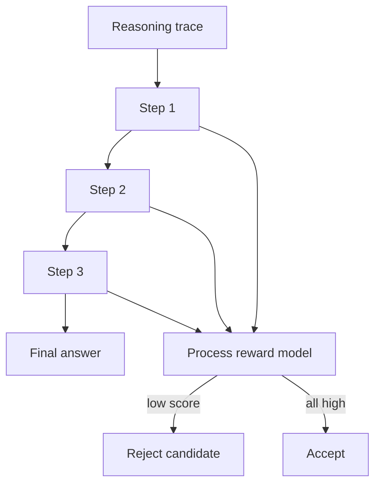

# Process Reward Model

**Also known as:** PRM, Step-Level Verifier

**Category:** Verification & Reflection  
**Status in practice:** emerging

## Intent

Train a verifier that scores each reasoning step rather than only the final answer.

## Context

A team trains or evaluates a model on multi-step reasoning tasks such as mathematics word problems, multi-hop question answering, or chains of logical deduction. The model produces a chain of intermediate steps and a final answer, and the team has been training or selecting candidates using an outcome reward model (a verifier that only scores whether the final answer is right). They also have, or could collect, human labels at the level of individual reasoning steps.

## Problem

Outcome-only scoring cannot tell the difference between reasoning that got to the right answer correctly and reasoning that got to the right answer by lucky shortcuts, cancelled errors, or fabricated intermediate facts. Reinforcing on outcome alone rewards those shortcuts, so the model becomes more confident in chains of thought that contain wrong intermediate steps. Later, on harder problems where the shortcut does not exist, the same kinds of wrong intermediate steps lead to wrong final answers. The team needs a feedback signal that can reject a candidate because step three is wrong, even when step five happens to land on the right number.

## Forces

- Step-level annotation is expensive (humans must label each step).
- Step boundaries vary across tasks.
- PRM and outcome reward sometimes conflict on what counts as 'correct'.

## Applicability

**Use when**

- Outcome-only reward reinforces shortcut reasoning that lands on the right answer the wrong way.
- Step-level labels (correct, neutral, incorrect, hallucination) can be collected at scale.
- Test-time search or fine-tuning can consume step-level scores.

**Do not use when**

- Outcome reward already produces robust generators on the target task.
- Collecting step-level labels at sufficient scale is not feasible.
- Inference-time scoring overhead exceeds the quality gain.

## Therefore

Therefore: label and score reasoning steps individually rather than only the final answer, so that bad intermediate hops can be rejected before they propagate into a confidently wrong conclusion.

## Solution

Collect step-level labels (correct / neutral / incorrect / hallucination) for chain-of-thought traces. Train a classifier to predict step labels. At inference, score every step; reject candidates whose intermediate steps have low scores. Powers test-time search and fine-tuning of the generator.

## Example scenario

A maths-reasoning agent passes most of the eval set but on inspection many traces have correct final answers reached through wrong intermediate steps — shortcuts the outcome reward model rewarded. The team trains a process-reward-model: human raters label each chain-of-thought step as correct, neutral, incorrect, or hallucinated; a classifier learns step-level scores. At inference, candidates whose intermediate steps score low are rejected even when the final answer happens to match. The agent's reasoning quality, not just its final accuracy, improves.

## Diagram

## Consequences

**Benefits**

- Catches wrong-reasoning-right-answer cases.
- Enables tree-search and best-of-N with finer signal.

**Liabilities**

- Annotation cost.
- PRM calibration shifts with model capability.

## What this pattern constrains

Final answers are accepted only when intermediate steps pass the PRM threshold.

## Known uses

- **OpenAI 'Let's Verify Step by Step' baseline** — *Available*
- **DeepMind reasoning evaluators** — *Available*

## Related patterns

- *uses* → [best-of-n](best-of-n.md)
- *specialises* → [test-time-compute-scaling](test-time-compute-scaling.md)
- *complements* → [lats](lats.md)

## References

- (paper) Lightman, Kosaraju, Burda, Edwards, Baker, Lee, Leike, Schulman, Sutskever, Cobbe, *Let's Verify Step by Step*, 2023, <https://arxiv.org/abs/2305.20050>

**Tags:** verification, reward, step-level
