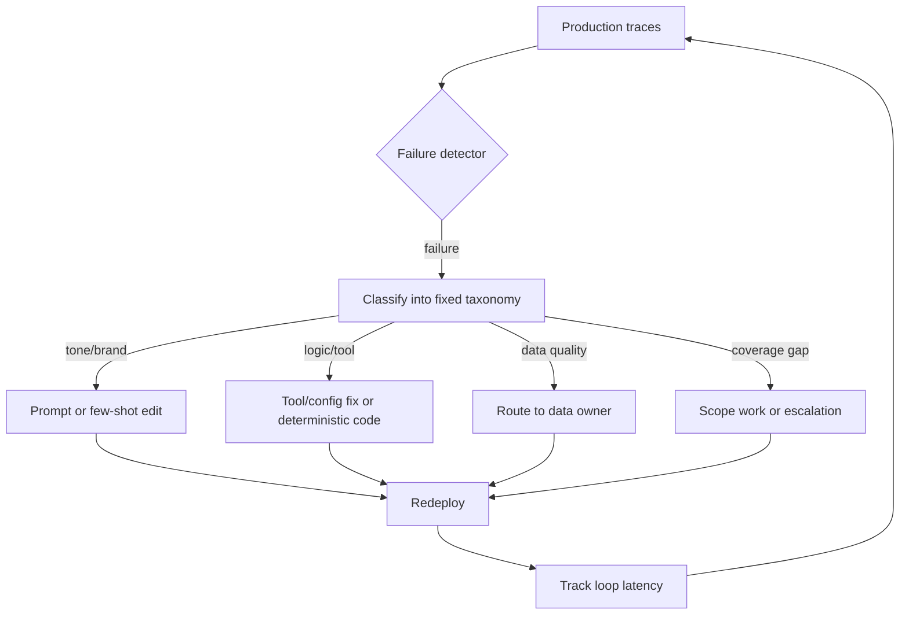

# Production Failure Triage Loop

**Also known as:** Failure-Class Routed Remediation, Post-Launch Triage Loop

**Category:** Governance & Observability  
**Status in practice:** emerging

## Intent

Sort every production agent failure into a small fixed taxonomy and bind each class to a set remediation path, so fixes are dispatched mechanically and the monitor-to-fix loop stays fast enough to gate scaling.

## Context

An agent runs in production and failures arrive continuously from real traffic — wrong answers, broken tool calls, off-brand tone, and requests it was never scoped to handle. Most of the work now sits after go-live, not before it. When each failure is investigated from scratch, remediation is slow and the team cannot tell whether the agent is improving or drifting.

## Problem

Production failures have different causes that need different fixes, but an undifferentiated incident stream hides that. A tone complaint, a tool misconfiguration, a stale data source, and a genuine coverage gap all look like 'the agent got it wrong', so each is debugged by hand and routed ad hoc. The link between a live failure and the design change that would fix it stays broken, the monitor-to-fix loop runs slow, and a slow loop caps how fast the agent can safely take on more use cases.

## Forces

- A small fixed taxonomy makes failures comparable and routable, but too coarse a scheme lumps unlike causes together while too fine a scheme is unstable and hard to classify.
- Automatic classification scales with volume, but a misclassified failure is routed to the wrong fix-path; human triage is accurate but does not keep up with traffic.
- Each failure class wants a different remediation surface — prompt, code, data, or scope — and routing to the wrong surface produces a fix that masks the cause instead of removing it.
- The speed of the loop, not the cleverness of any single fix, is what gates scaling, so triage overhead competes directly with throughput.

## Therefore

Therefore: classify every production failure into one class of a small fixed taxonomy, bind each class to a predetermined remediation path, and track the latency of the whole loop as the metric that decides when to scale.

## Solution

Define a small, stable taxonomy of failure classes up front — for example tone and brand alignment, logic and tool errors, data quality, and coverage gaps, or a research taxonomy such as MAST (specification flaws, agent misalignment, termination gaps). Every production failure is classified into exactly one class, by an automatic classifier over traces, by human triage, or by both. Each class is wired to a fixed remediation path so the fix is dispatched mechanically rather than re-decided each time: tone goes to a system-prompt or few-shot edit, a logic error goes to a tool or config fix or to converting the step into deterministic code, a data-quality failure routes back to the data owner, and a coverage gap opens scope work or an escalation hand-off. The latency of the loop — failure observed to fix shipped — is tracked as a first-class metric, because that speed, not any individual fix, is what gates how fast the agent can take on more use cases.

## Structure

```
Production traces -> failure detector -> classifier (fixed taxonomy) -> per-class remediation router -> {prompt edit | code/config fix | data-owner ticket | scope/escalation work} -> redeploy -> loop-latency metric -> back to traces
```

## Diagram



*Each production failure is classified once and routed to the remediation surface bound to its class; loop latency is tracked as the scaling gate.*

## Example scenario

A support agent handling thousands of cases a day starts producing more escalations. Instead of debugging each ticket on its own, the team tags every failed case with one label — tone, logic, data, or coverage. Tone cases go to a prompt tweak, logic cases to a tool fix, data cases back to the data team, and coverage cases to a new sub-flow. Within a week they can see which bucket is growing and how long each fix takes to ship.

## Consequences

**Benefits**

- Failures of unlike cause stop competing for one debugging queue; each lands on the surface that can actually fix it.
- The monitor-to-fix loop has a measured latency, so the team can see whether it is fast enough to support taking on the next use case.
- Recurring classes expose where to invest — a class that keeps firing signals a structural fix (deterministic code, a policy, a data-owner process) rather than another one-off patch.

**Liabilities**

- A misclassified failure is routed to the wrong remediation path and the real cause survives.
- A taxonomy that does not fit the domain forces failures into ill-fitting classes or a catch-all bucket that defeats routing.
- Mechanical routing can entrench symptom-level fixes if a class's bound path treats symptoms rather than causes.

## Failure modes

- Catch-all bucket — most failures fall into an 'other' class because the taxonomy is too coarse, and routing collapses back to ad-hoc debugging.
- Misrouting — the classifier sends a failure to the wrong fix-path, so the team edits a prompt for what was actually a data or tool fault.
- Loop-latency neglect — classes get rich but nobody measures observe-to-ship time, so the loop silently slows and caps scaling without anyone noticing.
- Symptom routing — a class is bound to a quick masking fix, so the bound path produces repeat incidents instead of removing the cause.

## What this pattern constrains

Every production failure must be assigned exactly one taxonomy class before remediation; a failure that cannot be classified must not be silently dropped, and no fix may be dispatched outside its class's bound remediation path.

## Applicability

**Use when**

- The agent is live and producing a steady stream of real-world failures that need continual fixing.
- Failures have distinct causes that map to distinct fix surfaces — prompt, code, data, or scope.
- The team needs to know whether its fix loop is fast enough to justify scaling to more use cases.

**Do not use when**

- The agent is pre-launch or handling so little traffic that failures can be addressed one by one.
- Failures are dominated by a single cause, so a routing taxonomy adds overhead without separating anything.
- There is no capacity to act on any class of failure, so classifying them only grows an unworked backlog.

## Components

- Failure detector — surfaces failing or low-quality runs from production traces and user signals
- Failure taxonomy — the small, fixed set of classes every failure is sorted into
- Classifier — assigns each failure to exactly one class, by automatic model, human triage, or both
- Remediation router — dispatches each class to its bound fix surface: prompt, code, data, or scope
- Fix surfaces — the prompt store, tool/code config, data-owner process, and scope/escalation backlog that fixes land on
- Loop-latency monitor — measures observe-to-ship time and reports it as the scaling gate

## Tools

- Tracing and observability platform — captures the production runs that failures are detected and classified from
- Failure-classification model or rubric — snaps free-text failures onto the fixed taxonomy
- Issue tracker and deploy pipeline — carries each routed fix from ticket to redeploy
- Evaluation or regression suite — confirms a shipped fix removed the failure without regressing others

## Evaluation metrics

- Loop latency, failure observed to fix shipped — whether the feedback loop is fast enough to support scaling
- Per-class failure volume and trend — which causes dominate and whether fixes are reducing them
- Misclassification rate — how often failures are routed to the wrong fix-path
- Catch-all bucket share — how much of the stream the taxonomy fails to separate
- Repeat-incident rate per class — whether a class's bound fix-path removes causes or just masks symptoms

## Known uses

- **[Salesforce Agentforce post-launch triage](https://blog.bytebytego.com/p/what-salesforce-learned-from-20000)** _available_ — Across 20,000+ deployments Salesforce reports sorting production agent failures into four buckets — tone/brand, logic errors, data quality, coverage gaps — each routed to its own fix path, with feedback-loop speed treated as the gate to scaling.
- **[TRAIL trace-based failure localization](https://arxiv.org/abs/2505.08638)** _pure-future_ — Automatically classifies and localizes agent failures from execution traces against a fixed error taxonomy, the classification step this loop depends on.

## Related patterns

- _complements_ **Postmortem Pattern Mining** — Pattern mining is a batch, corpus-level map-fold over thousands of written postmortems that surfaces recurring causes; this loop is the live, per-failure classify-and-route complement — mining finds and validates the buckets, this routes each new failure into them.
- _uses_ **Routing** — Reuses classify-then-dispatch, but applied to failures feeding remediation rather than to incoming user requests.
- _complements_ **Re-Contact-Subtracted Resolution Gate** — The gated resolution metric this loop optimises toward; a failure class that keeps re-contacting points the loop at the fix that is not sticking.
- _complements_ **Typed Refusal Codes** — Machine-readable categories are what make mechanical triage possible; typed codes feed the classifier directly instead of string-grepping human-readable messages.
- _complements_ **Deterministic Control Flow, Not Prompt** — The remediation target for the logic/tool failure class — repeat logic failures are converted into deterministic code rather than re-prompted.
- _complements_ **Policy-as-Code Gate** — The remediation target for policy-violation failures — the fix encodes the rule as a policy outside the prompt rather than prompting harder.
- _complements_ **Symptom-Remediation Thrashing** — The anti-pattern this guards against: binding a class to a root-cause-appropriate surface (code, policy, data owner) is the discipline that stops the masking-fix loop.

## References

- [Evaluation-Driven Development and Operations of LLM Agents: A Process Model and Reference Architecture](https://arxiv.org/abs/2411.13768) — 2024
- [Why Do Multi-Agent LLM Systems Fail?](https://arxiv.org/abs/2503.13657) — 2025
- [TRAIL: Trace Reasoning and Agentic Issue Localization](https://arxiv.org/abs/2505.08638) — 2025
- [What Salesforce learned from 20,000+ AI agent deployments](https://blog.bytebytego.com/p/what-salesforce-learned-from-20000) — 2026
