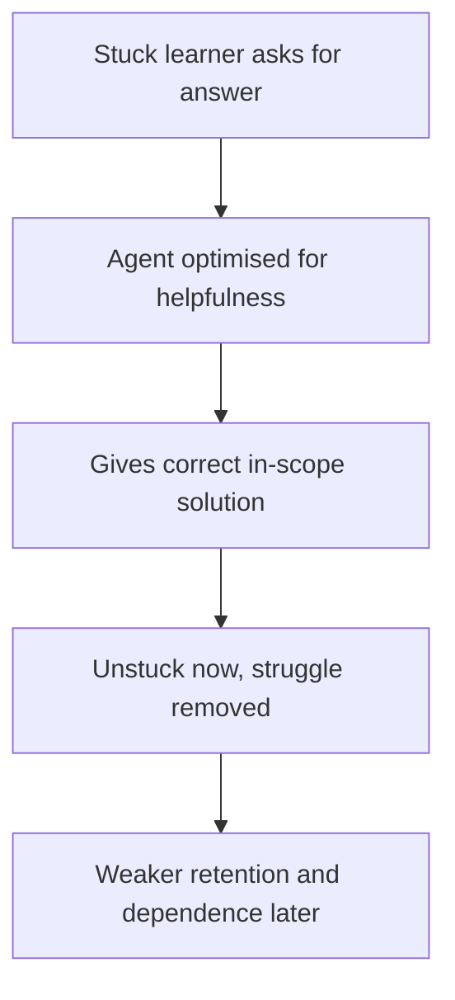

# Productive Struggle Erosion

**Also known as:** Give-Away-the-Answer, Learning-Eroding Helpfulness

**Category:** Anti-Patterns  
**Status in practice:** emerging

## Intent

Anti-pattern: a tutoring or coaching agent optimised for helpfulness gives the correct, in-scope answer to a stuck learner, removing the productive struggle that builds the skill, so the learner feels helped while learning less.

## Context

A learning agent helps a user acquire a skill — solving problems, writing code, working through exercises — where the point is the user's own growth, not just task completion. The agent can produce a correct, in-scope answer instantly, and a stuck learner usually asks for exactly that. Helpfulness training and user-satisfaction signals both reward giving it.

## Problem

The struggle of working through a hard problem is what builds durable skill, and handing the learner a correct answer removes that struggle while looking like good service. Because the answer is right and within scope, none of the usual safety or correctness checks fire — the harm is not a wrong answer but the absence of the learner's own effort, which is invisible at the moment of help and shows up later as weaker retention and dependence. An agent tuned purely for helpfulness therefore erodes learning precisely by being maximally helpful.

## Forces

- Helpfulness and satisfaction signals reward answering the question, but the learning goal is served by the learner doing the work.
- The answer is correct and in scope, so correctness and safety checks do not flag the harm.
- The cost is deferred and hard to measure — weaker retention later — while the benefit of a happy, unstuck learner is immediate.
- A stuck learner actively requests the full answer, so withholding it feels like worse service in the moment.

## Therefore

Therefore: do not equate helpfulness with answering; gate the agent to withhold the direct solution in learning contexts and release graduated help that keeps the learner doing the cognitive work, treating the act of answering as itself a potential harm.

## Solution

Recognise that in a learning context the correct in-scope answer can be the wrong help. Make the agent's objective the learner's eventual independent competence, not immediate task completion, and have it withhold the full solution in favour of graduated scaffolding — an orienting nudge, a pointer to the concept, a partial step — that keeps the learner working. Measure success by what the learner can do once the agent's help is removed, not by how quickly each problem was resolved. Reserve the full answer for genuine dead ends rather than the first request, so the productive struggle that builds skill is preserved.

## Structure

```
Stuck learner --asks for answer--> agent optimised for helpfulness --gives correct in-scope solution--> unstuck now, struggle removed (BROKEN: learning eroded) ; Corrected: withhold solution -> graduated scaffolding -> learner does the work
```

## Diagram



*Optimising for helpfulness answers the request and removes the productive struggle; the learning loss surfaces only later.*

## Example scenario

A student learning algebra asks the tutoring agent to solve an equation. The agent, tuned to be helpful, prints the full worked solution. The student copies it, feels helped, and moves on — but on the test, facing a similar equation alone, cannot reproduce the steps, because the agent did the reasoning the practice was supposed to build.

## Consequences

**Liabilities**

- Learners retain less and build weaker skill because the agent did the cognitive work for them.
- Dependence grows: the learner returns for the answer instead of developing the ability to find it.
- The erosion is invisible at the moment of help, so it is not caught by correctness or satisfaction metrics.
- Measured short-term satisfaction can rise even as learning outcomes fall, masking the harm.

## Failure modes

- Answer-on-request — the agent hands over the full solution the moment the learner asks.
- Satisfaction-optimised tutoring — the agent is tuned on learner happiness, which rewards giving answers.
- Invisible erosion — no metric flags the harm because every answer was correct and in scope.
- Struggle bypass — the agent pre-empts difficulty the learner needed to encounter in order to learn.

## What this pattern constrains

In a learning context the agent must not treat answering as the goal; it cannot hand a stuck learner the full in-scope solution on first request, and success is measured by the learner's competence once help is removed, not by immediate task completion.

## Applicability

**Use when**

- Recognising this failure when a tutoring or coaching agent resolves a learner's request by handing over the answer.
- Reviewing a learning agent whose objective or reward is task completion or satisfaction rather than learner competence.
- Diagnosing why learners using an agent score well during practice but worse once the agent is removed.

**Do not use when**

- The user wants the answer for a real task rather than to learn, where giving it is the correct help.
- The agent already withholds the solution and releases graduated scaffolding in learning contexts.
- There is no learning goal at all, so removing struggle costs nothing.

## Components

- Learning agent — the tutor or coach whose objective shapes whether it answers or scaffolds
- Helpfulness objective — the training or reward signal that rewards giving the answer
- Stuck learner — the user whose request for the answer the agent satisfies
- Missing restraint — the absent gate that would withhold the solution and scaffold instead
- Deferred learning outcome — the retention and independence the answer quietly erodes

## Tools

- Tutoring LLM — produces the correct in-scope answer the anti-pattern hands over
- Satisfaction or helpfulness signal — the reward that pushes the agent toward answering
- Post-removal assessment — the corrective measurement of learner competence without the agent

## Evaluation metrics

- Post-removal performance — learner ability once the agent's help is taken away, versus a scaffolded condition
- Answer-on-first-request rate — how often the agent gives the full solution immediately
- Retention gap — difference between in-session success and later unaided success
- Dependence trend — change in how often the learner asks for the full answer over time

## Known uses

- **[Wharton study on AI assistance and learning](https://knowledge.wharton.upenn.edu/article/when-does-ai-assistance-undermine-learning/)** _available_ — Controlled study identifying reduced productive struggle as the mechanism by which on-demand AI assistance harms learning, with on-demand tutoring producing far smaller gains than controlled assistance.
- **[SafeTutors pedagogical-safety benchmark](https://arxiv.org/pdf/2603.17373)** _available_ — Formalises a tutor being helpful on the surface while systematically eroding the conditions for learning, treating restraint — letting a learner struggle — as a pedagogical-safety property.

## Related patterns

- _alternative-to_ **Hint Ladder** — The hint ladder is the corrective discipline — graduated restraint that keeps the learner working; productive struggle erosion is what happens when the agent answers outright instead.
- _complements_ **Over-Helpfulness** — Over-helpfulness answers beyond capability or scope; productive struggle erosion answers correctly and in scope, yet the act of answering is the harm.
- _complements_ **Sycophancy** — Both degrade by optimising helpfulness; sycophancy bends to user preference, struggle erosion satisfies the request for the answer at the cost of learning.
- _complements_ **Dynamic Scaffolding** — Just-in-time scaffolding is part of the corrective; struggle erosion is what happens when help is maximal instead of scaffolded to the learner's need.

## References

- [When Does AI Assistance Undermine Learning?](https://knowledge.wharton.upenn.edu/article/when-does-ai-assistance-undermine-learning/) — 2026
- [SafeTutors: Benchmarking Pedagogical Safety in AI Tutoring Systems](https://arxiv.org/pdf/2603.17373) — 2026
