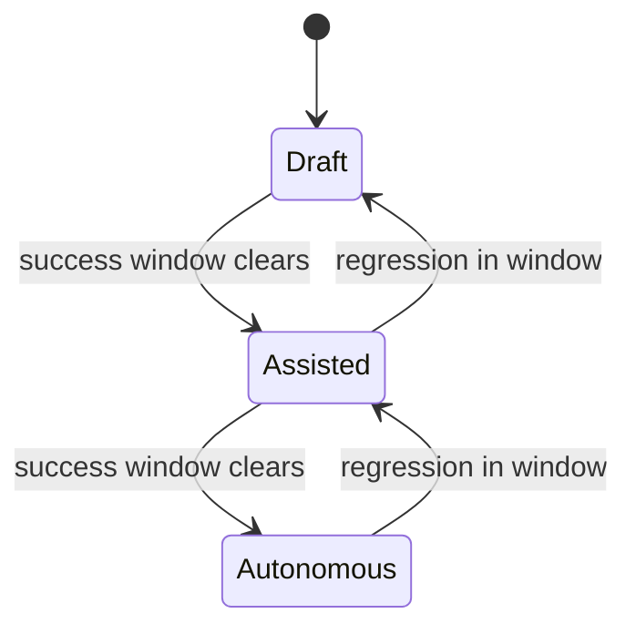

# Progressive Delegation

**Also known as:** Trust-Graded Handoff, Permission Ratchet

**Category:** Multi-Agent  
**Status in practice:** emerging

## Intent

Stage the human-to-agent handoff over time: the agent starts producing drafts a human always reviews; its autonomy expands action-by-action as measured trust accrues.

## Context

A team is introducing an agent that will eventually take over parts of a human workflow — drafting code review comments, triaging support tickets, scheduling meetings. The end state is fully autonomous on routine cases; the starting state is human-supervised because trust has not been built.

## Problem

One-shot deployment swings between two failure modes. Going fully autonomous on day one yields trust incidents because the team has no measured basis for confidence. Going fully supervised forever yields no learning — the team never accumulates the success-rate data that would justify expansion, and the agent's value is capped at 'faster drafter'. Without a per-action ratchet, autonomy decisions are calendar-driven, not evidence-driven.

## Forces

- Trust must be earned per action class, not per agent.
- The success-rate window per action must be long enough to be evidence.
- Demotion when a class regresses must be cheap and visible.
- Multiple action classes can be at different trust levels simultaneously.

## Applicability

**Use when**

- Multiple action classes with materially different risk.
- Per-class success can be measured online with reasonable delay.
- Stakeholders want autonomy to be a measurement, not a meeting decision.

**Do not use when**

- Only one action class exists — a simple [[autonomy-slider]] or [[crawl-walk-run-automation-gating]] suffices.
- No reliable per-class success signal can be measured.
- The agent will live for too short to accumulate evidence per class.

## Therefore

Therefore: ratchet the agent's autonomy per action class as a function of measured historical success, so trust accrues from evidence and a regression in one class only demotes that class.

## Solution

Tag each action class with a current autonomy level (draft -> assisted-send -> autonomous). For each class the runtime tracks a rolling success-rate window. Promotion fires automatically when the window clears a bar over enough samples; demotion fires when it drops below. The promotion mechanism is the policy of record, not a verbal decision in standup. The same agent runs many action classes at different levels simultaneously.

## Example scenario

A meeting-scheduling agent runs three action classes: propose-times (autonomous from day one), send-invite (assisted: drafts an invite, human clicks send), and reschedule (autonomous after 200 successful proposals without complaint). After two months reschedule reaches its bar and promotes; a complaint a month later demotes it back automatically.

## Diagram

## Consequences

**Benefits**

- Autonomy decisions become a function of evidence rather than calendar.
- Different action classes can sit at different levels honestly.
- Trust incidents demote only the affected class, not the whole agent.

**Liabilities**

- Promotion gates can be cheaply gamed if the success metric is weak.
- Demotion thrashing on small windows can yank capabilities away noisily.
- Per-class bookkeeping is overhead that small teams underinvest in.

## What this pattern constrains

Agent autonomy on an action class must not be promoted by calendar or seniority; promotion requires the documented success-rate window to clear the bar.

## Known uses

- **Building Applications with AI Agents (Albada) — Progressive Delegation in human-agent collaboration** — *Available* — <https://www.oreilly.com/library/view/building-applications-with/9781098176495/ch13.html>
- **Production code-review agents promoting suggest→commit per file class** — *Available*

## Related patterns

- *complements* → [crawl-walk-run-automation-gating](crawl-walk-run-automation-gating.md) — Three-tier ramp; progressive-delegation is the per-action ratchet.
- *complements* → [autonomy-slider](autonomy-slider.md)
- *composes-with* → [cost-aware-action-delegation](cost-aware-action-delegation.md)
- *uses* → [approval-queue](approval-queue.md)
- *complements* → [shadow-canary](shadow-canary.md)
- *uses* → [human-in-the-loop](human-in-the-loop.md)

## References

- (book) *Building Applications with AI Agents*, Michael Albada, 2025, <https://www.oreilly.com/library/view/building-applications-with/9781098176495/ch13.html>

**Tags:** autonomy, delegation, trust
