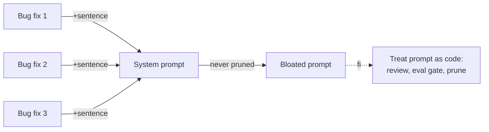

# Prompt Bloat

**Also known as:** Prompt Accretion, Eternal System Prompt

**Category:** Anti-Patterns  
**Status in practice:** deprecated

## Intent

Anti-pattern: every bug fix adds a sentence to the system prompt; nothing is ever removed.

## Context

Production agents whose system prompt grows monotonically over months; no eviction policy; no review for relevance.

## Problem

Past a few thousand tokens, the prompt squeezes retrieval, forces cache misses, and yields diminishing-returns instruction following. Distinct from hero-agent (which is about scope) — this is about prompt accretion as a process.

## Forces

- Adding a sentence feels free; removing one feels risky.
- No clear owner of the prompt's overall design.
- Eval coverage rarely catches bloat-driven regressions.

## Applicability

**Use when**

- Never use this; treat unbounded prompt growth as a process failure.
- Use prompt-versioning and eval-gates on length to keep prompts in budget.
- Lift recurring procedures into agent-skills and stable rules into a constitutional charter.

**Do not use when**

- Any project where every bug fix appends a sentence to the system prompt.
- Any setting where retrieval and cache hits are being squeezed by prompt size.
- Any team without quarterly pruning sprints or PR review on prompt diffs.

## Therefore

Therefore: treat the prompt as code with PR review, a length-budget eval gate, and quarterly pruning — lifting recurring procedures into agent-skills and stable rules into a constitutional charter — so that the system prompt cannot accrete contradictions one bug fix at a time.

## Solution

Don't. Treat the prompt as code: PR review, eval gate on length, quarterly pruning sprints. Lift recurring procedures into agent-skills. Move stable rules into a constitutional charter.

## Example scenario

A coding-agent team adds one sentence to the system prompt every time a customer reports an edge case. Eighteen months later the prompt is 6500 tokens, prompt-cache misses are common, and the model's instruction-following is visibly degraded — newer rules contradict older ones. The team names it prompt-bloat: the prompt goes under PR review with a length budget, recurring procedures are lifted into agent-skills, stable rules move into a constitutional charter, and a quarterly pruning sprint trims dead weight. The prompt halves and quality climbs back.

## Diagram

## Consequences

**Liabilities**

- Token cost per turn rises monotonically.
- Cache misses on every prompt edit.
- Conflicting instructions accumulate; the model picks one at random.

## What this pattern constrains

By definition, this anti-pattern imposes no useful constraint; the missing eviction policy is the failure.

## Known uses

- **Common at six-month-old agent products** — *Available*

## Related patterns

- *alternative-to* → [agent-skills](agent-skills.md)
- *alternative-to* → [constitutional-charter](constitutional-charter.md)
- *complements* → [hero-agent](hero-agent.md)

## References

- (blog) *Eugene Yan: Prompt engineering as a craft*, <https://eugeneyan.com/writing/llm-patterns/>
- (blog) *Hamel Husain: Improving the operations of agents*, <https://hamel.dev>

**Tags:** anti-pattern, prompt
