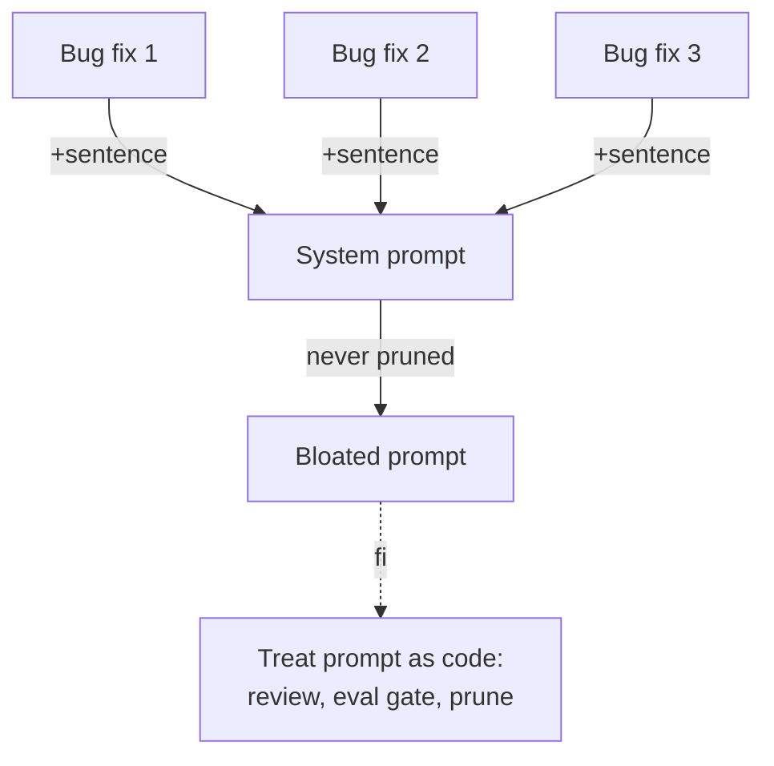

# Prompt Bloat

**Also known as:** Prompt Accretion, Eternal System Prompt

**Category:** Anti-Patterns  
**Status in practice:** deprecated

## Intent

Anti-pattern: every bug fix adds a sentence to the system prompt; nothing is ever removed.

## Context

A production agent has been live for months and the system prompt has grown one sentence at a time. Each bug fix, edge case, and customer complaint adds another instruction; nothing is ever removed because removing a line feels riskier than leaving it. There is no owner of the prompt as a whole, no review on prompt diffs, and no eviction policy for instructions that are no longer relevant.

## Problem

Past a few thousand tokens, the prompt starts to squeeze retrieved context and tool definitions out of the model's attention budget, prompt-cache reuse degrades because every small edit changes the cached prefix, and instructions that were added at different times begin to contradict each other. The model resolves the contradictions inconsistently, so newer rules silently override older ones for some inputs and not others. This is distinct from a hero agent, which is about scope; this is about the accretion process itself, where the prompt is treated as append-only documentation rather than as code.

## Forces

- Adding a sentence feels free; removing one feels risky.
- No clear owner of the prompt's overall design.
- Eval coverage rarely catches bloat-driven regressions.

## Applicability

**Use when**

- Cite this entry when every bug fix lands as one more sentence in the system prompt.
- You are already here if nobody can say which prompt rules are still load-bearing.
- Put prompts under PR review with a length budget (prompt-versioning), lift procedures into agent-skills, and move stable rules into a constitutional charter.

**Do not use when**

- Any project where every bug fix appends a sentence to the system prompt.
- Any setting where retrieval and cache hits are being squeezed by prompt size.
- Any team without quarterly pruning sprints or PR review on prompt diffs.

## Therefore

Therefore: treat the prompt as code with PR review, a length-budget eval gate, and quarterly pruning — lifting recurring procedures into agent-skills and stable rules into a constitutional charter — so that the system prompt cannot accrete contradictions one bug fix at a time.

## Solution

Don't. Treat the prompt as code: PR review, eval gate on length, quarterly pruning sprints. Lift recurring procedures into agent-skills. Move stable rules into a constitutional charter.

## Example scenario

A coding-agent team adds one sentence to the system prompt every time a customer reports an edge case. Eighteen months later the prompt is 6500 tokens, prompt-cache misses are common, and the model's instruction-following is visibly degraded — newer rules contradict older ones. The team names it prompt-bloat: the prompt goes under PR review with a length budget, recurring procedures are lifted into agent-skills, stable rules move into a constitutional charter, and a quarterly pruning sprint trims dead weight. The prompt halves and quality climbs back.

## Diagram

## Consequences

**Liabilities**

- Token cost per turn rises monotonically.
- Cache misses on every prompt edit.
- Conflicting instructions accumulate; the model picks one at random.

## What this pattern constrains

Avoiding it imposes an eviction policy: the system prompt must not grow monotonically; every addition needs review, a length budget enforced by an eval gate, and periodic pruning.

## Known uses

- **Common at six-month-old agent products** — *Available*

## Related patterns

- *alternative-to* → [agent-skills](agent-skills.md)
- *alternative-to* → [constitutional-charter](constitutional-charter.md)
- *complements* → [hero-agent](hero-agent.md)

## References

- (blog) *Eugene Yan: Prompt engineering as a craft*, <https://eugeneyan.com/writing/llm-patterns/>
- (blog) *Hamel Husain: A Field Guide to Rapidly Improving AI Products*, 2025, <https://hamel.dev/blog/posts/field-guide/>

**Tags:** anti-pattern, prompt
