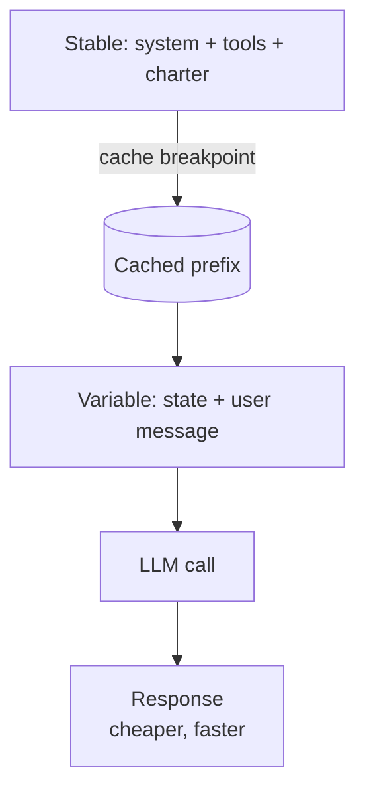

# Prompt Caching

**Also known as:** Cache-Aware Prompts, Stable-Prefix Caching

**Category:** Tool Use & Environment  
**Status in practice:** mature

## Intent

Order prompts so the unchanging prefix can be cached by the provider, cutting per-call cost and latency.

## Context

A team is running an agent that calls the same large language model many times per session. Most of each prompt is a stable prefix that does not change between calls (system prompt, tool definitions, charter, code-style rules) and only a small suffix varies (the current user message, the latest tool result). The provider's API exposes a prompt cache keyed on byte-identical prefixes.

## Problem

Re-sending an identical 10,000-token prefix on every call burns input tokens that the provider would otherwise serve from a warm cache, and it adds time-to-first-token latency for content the model has already seen. Cache hits are silent — a single accidental mutation in the prefix (a timestamp in the system prompt, a tool list reordered by JSON object iteration, a per-call correlation ID) invalidates the cache without any error, so the team can spend months overpaying without realising the cache never warmed.

## Forces

- Cache TTL caps savings (idle agents lose the warm cache) vs always-fresh prefix.
- Stability for cache-hit vs flexibility to mutate the prompt.
- Engineering rigor on prompt order vs developer ergonomics.

## Applicability

**Use when**

- The same long prefix (system prompt, tools, charter) is sent on every call.
- The provider exposes a prompt cache keyed on byte-stable prefixes.
- Variable content can be cleanly placed at the end of the prompt.

**Do not use when**

- Prompts mutate on every call and stable prefixes cannot be guaranteed.
- The provider does not support prompt caching for the model in use.
- Cache breakpoints would split content in ways the provider does not honour.

## Therefore

Therefore: put every stable token (system prompt, tools, charter) at the front and every variable token at the back, with a cache breakpoint at the seam, so that the provider's prefix cache keeps hitting across calls.

## Solution

Place all stable content (system prompt, tool definitions, charter, rules) at the start of the prompt. Place variable content (current state, user message) at the end. Mark the cache breakpoint at the boundary. Audit prompt construction to ensure no accidental prefix mutation.

## Example scenario

A coding agent ships a 12k-token system prompt that includes tool schemas, charter, and code-style rules, and per-call costs feel high. Inspecting the cache-hit metric shows zero hits because the per-call user message is being prepended to the system prompt by accident, breaking the byte-stable prefix. The team applies prompt-caching discipline: stable content (system prompt, tool definitions, charter) moves to the start; variable content (current state, user message) moves to the end; the cache breakpoint is marked at the boundary. Cache hit rate jumps to over 90 percent and per-call cost halves.

## Diagram

## Consequences

**Benefits**

- 70-90% input-cost reduction on long-running agents.
- TTFT roughly halves for the cached portion.

**Liabilities**

- Cache misses are silent and expensive.
- Prompt assembly code must be disciplined.
- Common cache-invalidation footguns: tool-definitions reordering between calls (JSON object iteration, dynamic registration), timestamps/UUIDs/correlation IDs leaking into the cached prefix, and provider-specific breakpoint placement rules (e.g., Anthropic max 4 cache_control breakpoints with 1024-token minimum).

## What this pattern constrains

The cached prefix is forbidden from changing call to call; mutation invalidates the cache.

## Known uses

- **Anthropic prompt caching** — *Available*
- **OpenAI prompt caching** — *Available*
- **OpenAI automatic prompt caching** — *Available*
- **Google Gemini context caching** — *Available*
- **Cursor** — *Available*

## Related patterns

- *complements* → [cost-gating](cost-gating.md)
- *used-by* → [contextual-retrieval](contextual-retrieval.md)
- *complements* → [reasoning-trace-carry-forward](reasoning-trace-carry-forward.md)
- *complements* → [now-anchoring](now-anchoring.md)

## References

- (doc) *Anthropic: Prompt caching*, <https://docs.anthropic.com/claude/docs/prompt-caching>

**Tags:** cost, cache, performance
