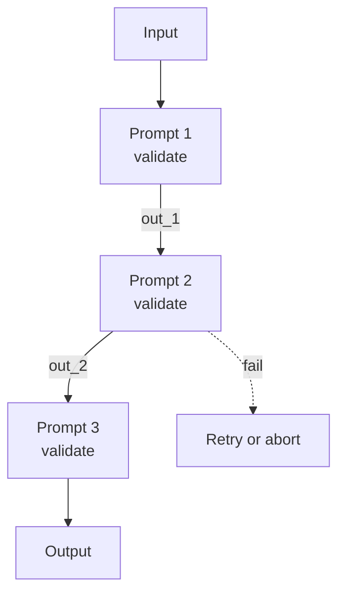

# Prompt Chaining

**Also known as:** Sequential Decomposition, Pipeline of Prompts

**Category:** Routing & Composition  
**Status in practice:** mature

## Intent

Decompose a task into a fixed sequence of LLM calls where each step's output becomes the next step's input.

## Context

A team is building an agent for a task that decomposes cleanly into a fixed sequence of sub-tasks whose order is known before the request arrives — for example turning a meeting transcript into structured action items decomposes into cleaning the transcript, attributing speakers, extracting candidate actions, normalising dates and owners, and emitting validated JSON. Each sub-task has its own definition of done, its own preferred prompt, and its own shape of output. The team controls the orchestration code that runs between LLM calls.

## Problem

If the team tries to do the whole task in a single mega-prompt, the model is asked to juggle several concerns at once and quality suffers across all of them. When the output is wrong, the team cannot tell which sub-task went off the rails because the steps are entangled inside one generation. Retries have to redo the entire task instead of just the failing step, and improvements to one part of the prompt risk regressing another.

## Forces

- Decomposition clarity vs compounded latency.
- Step isolation vs error compounding across the chain.
- Schema rigor between steps vs pipeline flexibility.

## Applicability

**Use when**

- A task decomposes into a fixed sequence of LLM calls with clear handoffs.
- Each step has its own system prompt, expected output shape, and validation.
- Localised retries at a step are preferable to retrying a mega-prompt.

**Do not use when**

- The decomposition is data-dependent and only knowable at runtime (use orchestrator-workers).
- A single well-structured prompt already solves the task reliably.
- Chain length amplifies latency beyond what users tolerate.

## Therefore

Therefore: replace the mega-prompt with a fixed sequence of validated prompts that hand off typed outputs, so that failures localise to a step instead of corrupting the whole task.

## Solution

Define a fixed pipeline of prompts. Each step has its own system prompt, expected output shape, and validation. A failure at step k retries step k or aborts; downstream steps run only on success.

## Example scenario

A team builds a 'turn meeting transcript into a structured action-item list' feature as one mega-prompt. Failures are hard to localise — sometimes the speaker attribution is wrong, sometimes the dates are wrong, sometimes the JSON is malformed. They split it into a prompt-chain: step one cleans the transcript and attributes speakers, step two extracts candidate action items, step three normalises dates and owners, step four validates and emits JSON. Each step has its own validator; a failure at step three retries step three instead of redoing the whole pipeline.

## Diagram

## Consequences

**Benefits**

- Failures localise to a step.
- Each step's prompt can be optimised independently.

**Liabilities**

- Inflexible to inputs that do not match the assumed decomposition.
- Latency = sum of step latencies.

## What this pattern constrains

Step k cannot bypass step k-1's output schema.

## Known uses

- **Anthropic Building Effective Agents (Workflow #1)** — *Available*

## Related patterns

- *complements* → [routing](routing.md)
- *alternative-to* → [parallelization](parallelization.md)
- *specialises* → [pipes-and-filters](pipes-and-filters.md)
- *specialises* → [chat-chain](chat-chain.md)

## References

- (blog) *Anthropic: Building Effective Agents*, 2024, <https://www.anthropic.com/research/building-effective-agents>

**Tags:** pipeline, workflow, decomposition
