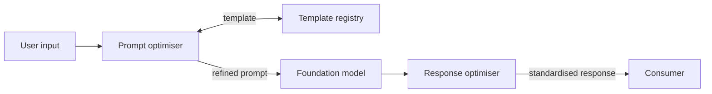

# Prompt/Response Optimiser

**Also known as:** Prompt Template Runtime, Runtime Prompt Refinement, Prompt Standardiser

**Category:** Structure & Data  
**Status in practice:** mature

## Intent

At runtime, transform user inputs and model outputs into standardised, template-aligned prompts and responses against predefined constraints, so the agent and its downstream consumers see consistent shapes.

## Context

An agent must accept free-form prompts and emit responses that other components (other agents, tools, UI) consume; without standardisation, each consumer parses its own way and the agent's behaviour drifts as wording changes.

## Problem

Free-form prompts vary in structure and format; responses vary in shape; both lead to inconsistent agent behaviour and brittle downstream integrations.

## Forces

- Standardisation: consistent shape across prompts and responses helps reliability.
- Goal alignment: optimisation must serve the user's actual goal, not just template compliance.
- Interoperability: other tools/agents need predictable shapes.
- Adaptability: templates must accommodate different domains and constraints.

## Applicability

**Use when**

- Multiple downstream consumers depend on the agent's response shape.
- Domain-specific prompt scaffolding must be reused across many requests.
- Templates can be evolved separately from agent logic.

**Do not use when**

- A single inline prompt suffices and no consumer chain exists.
- Templates would over-constrain user expression in ways that hurt goal alignment.

## Therefore

Therefore: insert a runtime component that refines prompts on the way in and responses on the way out using a registry of templates with constraints, so that what the model sees and what consumers see are standardised against the same contract.

## Solution

A prompt/response optimiser sits between the user-facing surface and the foundation model. On input, it loads a template for the current task (few-shot examples, format constraints, goal restatement) and rewrites the user's prompt to match. On output, it post-processes the model's response into the consumer's expected shape. The template registry can be evolved independently of the agent logic.

## Example scenario

An onboarding agent accepts any free-form question from a new employee. A prompt/response optimiser wraps every user message in a template that restates the company policy context, the employee's department, and the required output format (a JSON object with answer + citation). The model never sees raw user wording without that frame, and the downstream UI always renders a predictable shape.

## Diagram

*Runtime templates standardise both the model's input and its output.*

## Consequences

**Benefits**

- Standardisation across prompts and responses without changing user behaviour.
- Goal alignment: refined prompts re-state the underlying goal explicitly.
- Interoperability: downstream agents/tools consume predictable shapes.
- Adaptability: domain-specific templates without re-training the model.

**Liabilities**

- Underspecification: the optimiser may strip context the user meant to convey.
- Maintenance overhead: templates need to evolve as goals and consumers change.
- Drift if templates aren't versioned alongside the agent.

## What this pattern constrains

Both the model and the downstream consumers see only template-conformant shapes; raw user wording does not propagate.

## Known uses

- **LangChain prompt templates** — *Available*. Practitioners author and reuse prompt templates as a runtime construct. https://api.python.langchain.com/en/latest/prompts/langchain_core.prompts.prompt.PromptTemplate.html
- **Amazon Bedrock Prompt management** — *Available*. Bedrock Prompt management lets users create reusable prompt templates with variables, alternative variants, and versioning. https://docs.aws.amazon.com/bedrock/latest/userguide/prompt-management.html
- **Google Dialogflow** — *Available*. Generators allow users to specify agent behaviours and responses at runtime. https://cloud.google.com/dialogflow

## Related patterns

- *complements* → [prompt-versioning](prompt-versioning.md)
- *complements* → [dynamic-scaffolding](dynamic-scaffolding.md)
- *composes-with* → [structured-output](structured-output.md)
- *alternative-to* → [dspy-signatures](dspy-signatures.md)
- *uses* → [passive-goal-creator](passive-goal-creator.md)
- *uses* → [proactive-goal-creator](proactive-goal-creator.md)

## References

- (paper) Yue Liu, Sin Kit Lo, Qinghua Lu, Liming Zhu, Dehai Zhao, Xiwei Xu, Stefan Harrer, Jon Whittle, *Agent design pattern catalogue: A collection of architectural patterns for foundation model based agents* (2025) — https://doi.org/10.1016/j.jss.2024.112278

**Tags:** prompt-template, standardisation, structure, liu-2025
