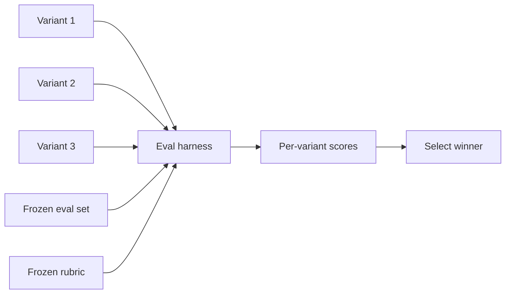

# Prompt Variant Evaluation

**Also known as:** Prompt Flow Variant Compare, Batch-Variant Evaluation

**Category:** Verification & Reflection  
**Status in practice:** mature

## Intent

Author multiple variants of the same prompt node, run them as a batch against a shared dataset, and let an automated evaluation flow score them so the winning variant is selected by measurement.

## Context

A team is iterating on a prompt — different wordings, different examples, different model bindings. Selecting between variants by demo or by author taste produces non-reproducible decisions and loses the comparator the moment the demo is forgotten.

## Problem

Without a batched comparison harness each prompt edit is a vibe check. Authors converge on what looks good on the two examples they happened to test. Subsequent reviewers cannot tell whether the chosen variant is better than the rejected ones because the rejected ones were never measured. The team accumulates committed prompts whose superiority over alternatives no one can verify.

## Forces

- Variants must run against the same dataset for comparison to be valid.
- The eval rubric must be frozen before the variants run, or scoring is post-hoc rationalisation.
- Multiple variants per slot multiply cost — sensible batch size matters.
- Winners must be inspectable: per-variant scores, per-item differences.

## Applicability

**Use when**

- Multiple plausible prompt variants exist and the team needs to pick among them.
- An eval dataset and rubric exist (i.e. [[evaluation-driven-development]] is in place).
- Inference cost permits batched comparison.

**Do not use when**

- No eval rubric exists — there is nothing to compare against.
- Variants differ in ways the rubric cannot measure.
- Live-traffic comparison (Bayesian bandit, shadow-canary) better fits the team's needs.

## Therefore

Therefore: author each prompt change as a variant slot, run the slot's variants as a batch against the same eval dataset with the same rubric, and select by measurement, so prompt decisions are reproducible.

## Solution

Build a prompt-flow harness that supports variant slots. For each slot the author writes 2-N variants. The harness runs all variants against the frozen eval dataset and rubric, scores them (deterministic checker, LLM-judge, or both), and surfaces per-variant scores plus per-item differences. The team picks the winner from the surfaced scores. Distinct from [[shadow-canary]] (live traffic, two versions): variant evaluation is offline, batched, pre-deployment.

## Example scenario

A team has a profile-extraction prompt with five candidate wordings. They run all five against the frozen 100-item eval set using an LLM-judge rubric. Variant 3 wins on overall score but variant 5 wins on a specific edge-case slice; the team picks variant 3 and adds the edge cases to the eval set so future runs measure them.

## Diagram

## Consequences

**Benefits**

- Prompt decisions become measurements with audit trail.
- Surfaces unexpected variant strengths the author would have missed.
- Composes with EDD: variant evaluation is the unit of progress under EDD.

**Liabilities**

- Running many variants multiplies inference cost.
- Eval rubric must be honest; variants can be tuned to game a weak rubric.
- Authors over-iterate when every change is cheap to evaluate.

## What this pattern constrains

A prompt edit must not be selected by demo or author taste; variants are evaluated as a batch against the frozen rubric and the winner is selected by measured score.

## Known uses

- **AI Agents in Action (Lanham) — Prompt Flow variant comparison** — *Available* — <https://livebook.manning.com/book/ai-agents-in-action/chapter-9>
- **Azure Prompt Flow / OpenAI Evals variant slots** — *Available*

## Related patterns

- *composes-with* → [evaluation-driven-development](evaluation-driven-development.md)
- *uses* → [eval-harness](eval-harness.md)
- *uses* → [frozen-rubric-reflection](frozen-rubric-reflection.md)
- *uses* → [llm-as-judge](llm-as-judge.md)
- *composes-with* → [bayesian-bandit-experimentation](bayesian-bandit-experimentation.md)
- *alternative-to* → [shadow-canary](shadow-canary.md)
- *complements* → [prompt-versioning](prompt-versioning.md)
- *composes-with* → [dimensional-synthetic-eval-set](dimensional-synthetic-eval-set.md)

## References

- (book) *AI Agents in Action*, Micheal Lanham, 2025, <https://www.manning.com/books/ai-agents-in-action>

**Tags:** evaluation, prompt-engineering
