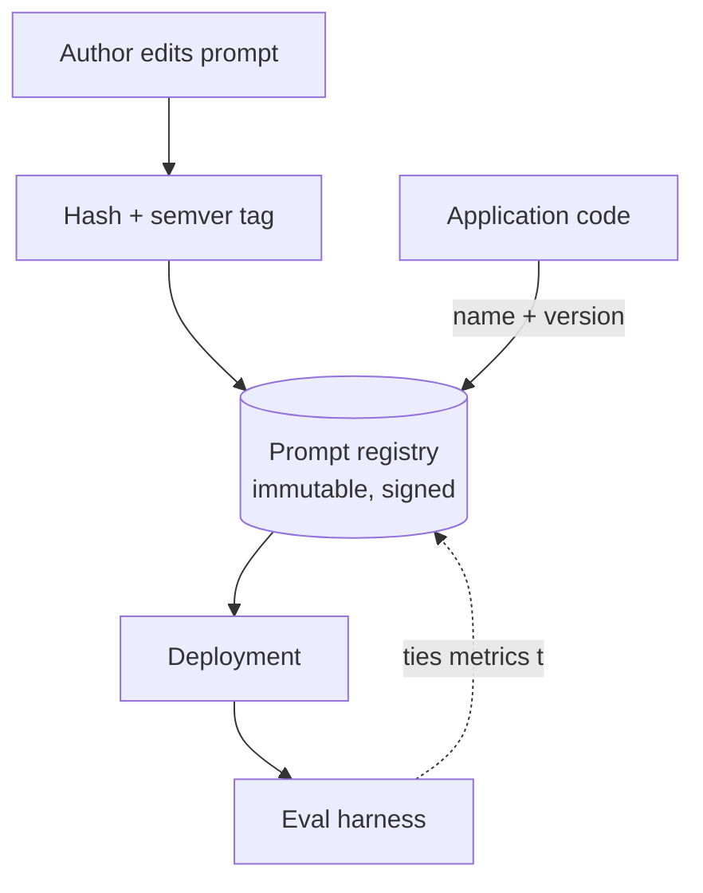

# Prompt Versioning

**Also known as:** Prompt-as-Artifact, Prompt Registry, Versioned Prompts

**Category:** Governance & Observability  
**Status in practice:** mature

## Intent

Treat prompts as immutable, hashed, semver'd artefacts in a registry; deploy and roll back like code.

## Context

A team runs an agent where the system prompt and task prompts are major levers on quality. Multiple engineers edit those prompts, sometimes inline in code, sometimes through a prompt-management tool. The team needs to know exactly which prompt text was live at any given time, to be able to roll back a bad prompt cleanly, and to tie evaluation results to the specific prompt being scored.

## Problem

When prompts live as plain strings inside the application code, a wording change becomes a code change: rolling back the prompt requires reverting a deployment, comparing two prompt versions side by side requires diffing branches, and there is no clean way to say which prompt produced last week's outputs. Evaluation runs cannot be tied back to specific prompt text once that text has been edited in place. The team is forced to choose between treating every prompt edit as a full code release or losing the ability to audit and revert prompts precisely.

## Forces

- Registry adds infrastructure.
- Prompt versioning must integrate with eval harness.
- Signed prompts vs editable prompts.

## Applicability

**Use when**

- Prompts are edited often and audit, rollback, or A/B comparison is required.
- Eval outcomes need to be tied to specific prompt versions.
- A registry can hold immutable, hashed, semver-tagged artefacts.

**Do not use when**

- Prompts are stable and rarely changed.
- No registry exists and the operational cost outweighs current churn.
- Inline prompts already work and there is no audit obligation.

## Therefore

Therefore: store prompts as immutable, hashed, semver-tagged artefacts in a registry that code references by name and version, so that deploys, rollbacks, and eval results all pin to a specific prompt the same way they pin to specific code.

## Solution

Prompts live in a registry as immutable, hashed, version-tagged artefacts. Code references prompts by name + version (semver). Deployments pin specific versions; rollback by version. Eval harness ties metric outcomes to prompt versions. Optionally signed for provenance.

## Example scenario

A team rolls a small wording change into a prompt at 14:00 and by 16:00 the agent's behaviour has shifted in ways nobody predicted. There is no clean rollback short of redeploying the entire service from a prior commit. They adopt prompt-versioning: prompts live in a registry as immutable, hashed, semver-tagged artefacts; code references them by name plus version; deployments pin a specific version; rollback is a one-line config change. Eval-harness metrics tie to prompt versions. The next bad-prompt incident is reverted in under a minute.

## Diagram

## Consequences

**Benefits**

- Prompt rollback without redeploy.
- Eval results map to specific prompts.

**Liabilities**

- Registry infrastructure.
- Version-pinning means prompts stop tracking model upgrades automatically.

## What this pattern constrains

Production calls reference pinned prompt versions only; ad-hoc inline prompts are forbidden.

## Known uses

- **LangSmith Prompts** — *Available*
- **PromptLayer** — *Available*
- **Humanloop** — *Available*
- **Vellum** — *Available*
- **Helicone Prompts** — *Available*

## Related patterns

- *composes-with* → [lineage-tracking](lineage-tracking.md)
- *uses* → [eval-as-contract](eval-as-contract.md)
- *complements* → [shadow-canary](shadow-canary.md)

## References

- (doc) *LangSmith Prompts*, <https://docs.smith.langchain.com/prompt_engineering/concepts>
- (doc) *PromptLayer*, <https://docs.promptlayer.com>
- (doc) *Humanloop*, <https://humanloop.com>

**Tags:** governance, prompt, versioning
