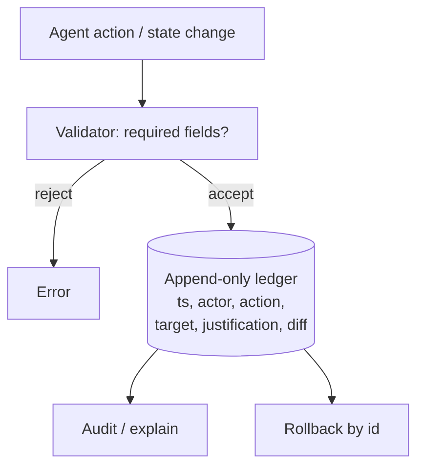

# Provenance Ledger

**Also known as:** Audit Trail, Action Log

**Category:** Governance & Observability  
**Status in practice:** mature

## Intent

Log every agent decision and state change with enough metadata to explain or reverse it later.

## Context

A team runs an agent that takes consequential actions in the real world: approving or rejecting insurance claims, modifying production records, sending money. Sometimes weeks or months later, a regulator, a customer, or an internal auditor asks why the agent did what it did on a specific date. Answering that question requires both the action and the chain of reasoning, retrieved evidence, and model version that surrounded it.

## Problem

Without an immutable, append-only record of every decision and state change tied to a justification, agent behaviour becomes inscrutable after the fact. Rolling back a specific bad action is impossible because there is no event identifier to reverse, and patterns of failure across time are invisible because the trail is not queryable. The team is forced to choose between trusting that nothing will ever be questioned or attempting to reconstruct months-old behaviour from logs that were never designed for audit.

## Forces

- Auditability vs storage cost of every event.
- Schema rigidity vs evolvability over the agent's lifetime.
- PII in events: redaction at write time vs read time.

## Applicability

**Use when**

- Agent decisions and state changes must be explainable or reversible after the fact.
- An immutable, append-only log can be operated and queried.
- Each event can carry timestamp, actor, action, target, and justification fields.

**Do not use when**

- The agent has no consequential state changes worth logging.
- Storage and review cost of immutable logs are unjustified by risk.
- No queryable store is available to make the ledger useful.

## Therefore

Therefore: append every agent decision and state change to an immutable log with timestamp, actor, action, target, justification link, and diff hash, and reject events that lack those fields, so that any change can be explained or reversed after the fact.

## Solution

Append events to an immutable log with: timestamp, actor, action, target, justification (link to thought or decision), diff hash. Enable rollback by id. Reject events that lack the required fields.

## Example scenario

A regulator asks an insurance-claims agent why it rejected a specific claim three months ago. The team can show the final decision but not the chain of reasoning, the retrieved policy clauses, or which model version answered — the audit trail is partial. They add a provenance-ledger: every decision and state change appends an immutable event with timestamp, actor, action, target, justification link, and diff hash. Rollback by event id becomes trivial; the next regulator question is answered with a full reconstruction.

## Diagram

## Consequences

**Benefits**

- Audit and rollback become tractable.
- Pattern of failures becomes visible across time.

**Liabilities**

- Log volume can dominate other storage.
- Justification fields require the agent to write them; lazy agents skip.

## What this pattern constrains

Self-edits and other recorded actions are rejected if they lack a valid justification reference.

## Known uses

- **Langfuse traces** — *Available*
- **OpenTelemetry GenAI semantic conventions** — *Available*
- **Datadog LLM Observability** — *Available*

## Related patterns

- *composes-with* → [append-only-thought-stream](append-only-thought-stream.md)
- *specialises* → [decision-log](decision-log.md)
- *used-by* → [compensating-action](compensating-action.md)
- *complements* → [lineage-tracking](lineage-tracking.md)
- *complements* → [model-card](model-card.md)
- *alternative-to* → [black-box-opaqueness](black-box-opaqueness.md)
- *used-by* → [sandbox-escape-monitoring](sandbox-escape-monitoring.md)
- *complements* → [memo-as-source-confusion](memo-as-source-confusion.md)
- *used-by* → [emotional-state-persistence](emotional-state-persistence.md)
- *complements* → [world-model-separation](world-model-separation.md)

## References

- (doc) *OpenTelemetry GenAI semantic conventions*, 2024

**Tags:** audit, provenance, rollback
