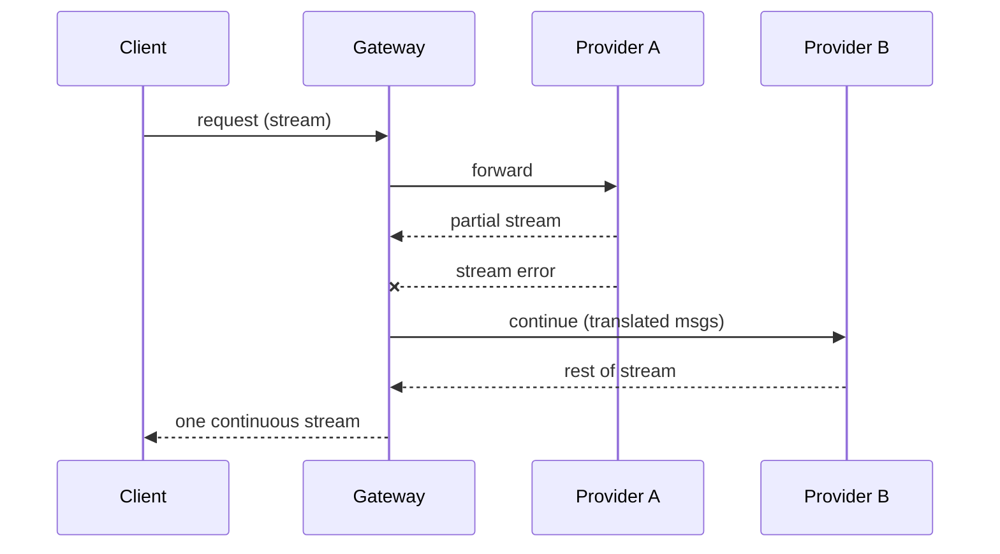

# Provider Fallback

**Also known as:** Mid-Request Failover, Cross-Provider Recovery

**Category:** Routing & Composition  
**Status in practice:** mature

## Intent

When one provider's API errors mid-stream, transparently switch to another provider while preserving state.

## Context

A production agent product streams long responses to the user — multi-paragraph answers, generated code, structured documents — and is willing to integrate with more than one LLM provider to keep that experience working. The team already accepts that any single provider will have rate-limit windows, regional incidents, and the occasional mid-stream disconnect that drops the second half of a response. They control a gateway layer between the client and the upstream providers and can hold conversation state there.

## Problem

A single-provider deployment is hostage to that provider's worst hour: when its stream fails halfway through a generation, the user sees a half-rendered answer followed by an error and has to start over. A request-boundary fallback chain handles the case where a whole call fails before any output, but it cannot recover a stream that began on provider A and died after some tokens were already delivered. Without mid-stream failover, the team's only options are to lose the partial output or to lock in to whichever provider was most reliable last week.

## Forces

- Provider tool-call schemas differ; cross-provider continuation needs schema translation.
- Partial output reconciliation across providers.
- Routing logic must not amplify provider quirks.

## Applicability

**Use when**

- Single-provider outages mid-stream would otherwise drop the user's session.
- A gateway can hold conversation state and translate message formats across providers.
- Tool-call schemas can be normalised at the gateway.

**Do not use when**

- Request-boundary fallback (fallback-chain) is enough and mid-stream recovery is not needed.
- Operational cost of running a normalising gateway is unjustified.
- Cross-provider differences in capabilities make recovered streams unreliable.

## Therefore

Therefore: put a gateway in front that owns the conversation state and switches providers mid-stream with translated schemas, so that the client sees one continuous stream across a provider's outage.

## Solution

A gateway proxy holds the conversation state. On stream error, it switches to a fallback provider, optionally preserving partial output, and continues with translated message format. Tool-call schemas are normalised at the gateway. Streaming clients see one continuous stream.

## Example scenario

A code-review agent product runs on a single provider whose us-east region begins returning 529 errors mid-stream during peak hours. Users see half-rendered reviews abandoned with stack traces. The team puts a gateway in front: it holds conversation state, normalises tool-call schemas across two providers, and on stream error reconnects the user to the fallback provider continuing from the last clean delta. Uptime moves from the underlying provider's SLA to the union of two providers' SLAs, and the support inbox stops filling on incident days.

## Diagram

## Consequences

**Benefits**

- Uptime through provider outages.
- Multi-provider portfolio for cost arbitrage.

**Liabilities**

- Schema translation has its own bugs.
- Quality discontinuity when providers differ in capability.

## What this pattern constrains

Clients must not see the underlying provider; only the provider-agnostic interface is exposed, and failover happens behind it.

## Known uses

- **OpenRouter automatic failover** — *Available*
- **Cursor model switching on rate-limit** — *Available*
- **Portkey gateway fallback** — *Available*
- **Helicone gateway fallback** — *Available*
- **[Sparrot](https://marco-nissen.com/sparrot/)** — *Available* — Per-provider cooldown state is tracked so cooled-down providers are skipped in routing; the loop falls through to the next eligible provider rather than blocking.

## Related patterns

- *specialises* → [fallback-chain](fallback-chain.md)
- *complements* → [circuit-breaker](circuit-breaker.md)
- *complements* → [multi-model-routing](multi-model-routing.md)
- *complements* → [open-weight-cascade](open-weight-cascade.md)

## References

- (doc) *OpenRouter: Provider Routing*, <https://openrouter.ai/docs/features/provider-routing>
- (doc) *Portkey Gateway: Fallback*, <https://portkey.ai/docs>

**Tags:** routing, failover, gateway
