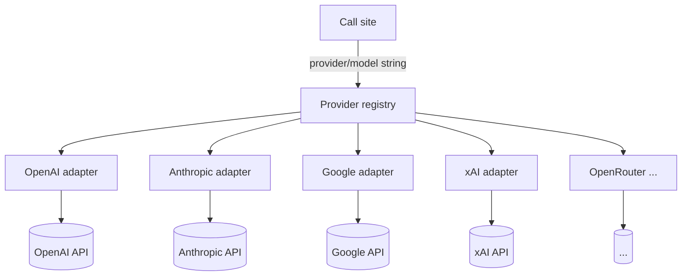

# Provider-String Routing

**Also known as:** Provider/Model String, Unified Model Identifier, Single-String Model Selection

**Category:** Routing & Composition  
**Status in practice:** emerging

## Intent

Select the model and provider for a request through a single namespaced string (`provider/model`) backed by env-var credentials, so the caller specifies what to run with one parameter rather than a typed provider object.

## Context

A team is building an application that needs to talk to several language-model providers and many model variants — OpenAI, Anthropic, Google, xAI, OpenRouter, and others — possibly choosing between them on a per-request basis for cost lanes, experiments, or tenant-specific routing. The application is otherwise model-agnostic; it does not need to depend on the typed object hierarchy of any one provider's software development kit. The team controls the call sites where each model invocation happens.

## Problem

When the call site is written as a typed provider object such as `OpenAI(...)` or `Anthropic(...)`, the provider becomes part of the application's source code and switching between them requires conditional construction at every call site. Per-request, per-tenant, or per-experiment routing across providers turns into a tangle of imports and adapter classes, and adding a new provider means another typed branch wherever models are invoked. The application ends up coupled to provider SDK shapes that have no business in its core logic.

## Forces

- A `provider/model` string is the cheapest possible call-site signature for cross-provider routing.
- Env-var-driven credentials let the deployment pick keys without code changes.
- Capability differences across providers (tool calls, structured output, vision, max-context) must still be discoverable at runtime.
- Per-call provider selection lets experiments, A/B routing, and cost lanes share a single call site.
- String-typed identifiers lose compile-time checking of valid combinations.

## Applicability

**Use when**

- The application targets multiple providers and may change the mix over time.
- Per-call routing (experiments, A/B, cost lanes) shares a single call site.
- Credentials are managed by environment, not by application code.
- A central capability registry is acceptable to track which providers support which features.

**Do not use when**

- The application is single-provider with no realistic switch in the planning horizon.
- Compile-time guarantees on valid model identifiers are essential and a typed enum is preferred.
- The provider exposes features that the unified spec cannot represent and the team accepts the lock-in for them.

## Therefore

Therefore: take a single `provider/model` string at the call site, resolve credentials from environment, and dispatch through a provider-agnostic interface, so that swapping providers is a string change rather than a typed-object change.

## Solution

Define a unified language-model interface and a registry of providers keyed by short prefix (`openai/`, `anthropic/`, `google/`, `xai/`, `openrouter/...`). Each provider implementation knows how to read its credentials from environment variables. The call site takes a single string (`'anthropic/claude-sonnet-4-6'`) and the runtime resolves provider, credentials, and capability flags. Pair with provider-fallback (chain strings for resilience), multi-model-routing (pick a string by quality/cost), and vendor-lock-in (this is its mirror — the un-locked version).

## Structure

Call site → `generate(model='provider/model', ...)` → ProviderRegistry → ProviderAdapter → upstream API.

## Example scenario

A team builds an agent that should route easy tasks to a cheap small model, hard tasks to a frontier model, and a long-context task to a third provider entirely. With a typed provider object hierarchy, each lane needs its own client construction and credential plumbing. The team switches to provider-string routing: the agent receives a `model` string (`'openai/gpt-5-mini'`, `'anthropic/claude-opus-4-7'`, `'google/gemini-2.5-pro'`) and the registry handles credentials and capability discovery. Adding a new provider for one experiment is a string change plus an env-var.

## Diagram

## Consequences

**Benefits**

- Switching provider is a string change.
- Per-call experiments and A/B routing share a single call site.
- Configuration moves out of code into environment.
- Composable with provider-fallback and multi-model-routing without further abstraction.

**Liabilities**

- String typing loses compile-time checking of valid provider/model combinations.
- Per-provider capability gaps must be discoverable at runtime, not at type-check time.
- Misspelled identifiers fail at runtime rather than at edit time.
- Credential rotation depends on the env-var convention being consistent across providers.

## What this pattern constrains

Application code is not allowed to import provider-specific SDK classes at call sites; all model invocations must go through the `provider/model` string interface and the central registry.

## Known uses

- **Mastra (provider/model string across 4000+ models)** — Mastra exposes a single `provider/model` string for selection across 120+ providers; credentials and capability flags resolve at the registry level. *Available* — [link](https://mastra.ai/models)
- **Vercel AI SDK** — Standardised language-model specification abstracts provider differences so the same call site addresses any provider. *Available* — [link](https://ai-sdk.dev/docs/foundations/providers-and-models)
- **LiteLLM** — OpenAI-shaped proxy over 100+ providers, addressed by `provider/model` style strings. *Available* — [link](https://docs.litellm.ai/)

## Related patterns

- *complements* → [multi-model-routing](multi-model-routing.md)
- *complements* → [provider-fallback](provider-fallback.md)
- *alternative-to* → [vendor-lock-in](vendor-lock-in.md)
- *uses* → [translation-layer](translation-layer.md)

## References

- *doc*: [Mastra Models](https://mastra.ai/models) — Mastra
- *doc*: [Vercel AI SDK — Providers and Models](https://ai-sdk.dev/docs/foundations/providers-and-models) — Vercel

**Tags:** routing-composition, provider-agnostic, mastra, vercel-ai-sdk, litellm
