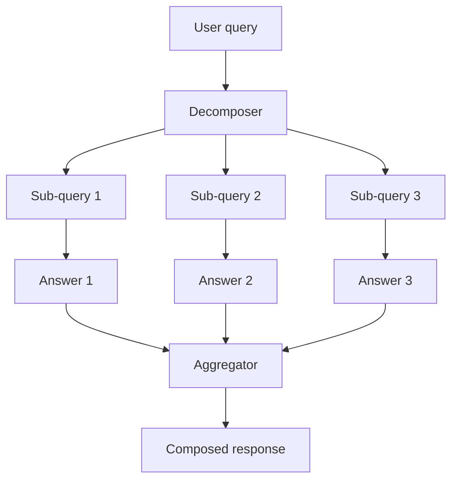

# Query-Decomposition Agent

**Also known as:** Sub-Query Generator, Question Splitter Agent, Decomposer-Aggregator

**Category:** Planning & Control Flow  
**Status in practice:** mature

## Intent

An agent whose explicit job is to split an incoming user query into smaller independent sub-queries that can be answered sequentially or in parallel, then merge results.

## Context

A user asks a multi-part question — 'compare the privacy implications of these three vendors across GDPR, HIPAA, and SOC 2'. Answering it as one prompt produces a sprawling, low-quality response: the model interleaves vendor-axis facts with regulation-axis facts and misses combinations.

## Problem

Monolithic prompts on multi-part questions collapse into vague aggregates. The model has no scaffold for fanning out and re-joining. Plan-and-Execute helps when the answer requires ordered tool actions, but multi-part questions usually need equivalent leaf sub-queries that are independent and can run in parallel. Without a decomposition-then-aggregate stage, deep-research and complex-QA pipelines produce shallow output proportional to the question's compositional complexity.

## Forces

- Leaf sub-queries are often independent and parallelisable.
- Decomposition can over-fan if not bounded by question shape.
- Aggregation step must combine without losing per-leaf nuance.
- Decomposition errors silently produce blind spots in the final answer.

## Applicability

**Use when**

- Questions are compositional (entity × dimension matrices, multi-source comparisons).
- Sub-queries are usefully independent.
- Latency budget allows parallel leaf execution.

**Do not use when**

- Question is atomic and decomposition would invent structure.
- Sub-queries are not independent; ordered planning (Plan-and-Execute) is the right shape.
- Aggregation cost would dominate end-to-end time.

## Therefore

Therefore: have one agent split the query into independent leaf sub-queries and merge the answers, so multi-part questions are answered by fan-out-then-aggregate rather than by one overloaded prompt.

## Solution

Front the workflow with a decomposer agent whose system prompt asks it to enumerate independent sub-queries that, together, would answer the user's question. Run each sub-query (in parallel or sequence) through the answering agent, RAG retriever, or tool. Pass the leaf answers to an aggregator that composes the final response. Distinct from Plan-and-Execute (ordered actions): decomposition produces equivalent leaves, not a plan.

## Example scenario

User asks 'summarise revenue, headcount, and major lawsuits for each of these five companies'. The decomposer produces 15 sub-queries (5 companies × 3 dimensions). Each sub-query runs against the RAG corpus in parallel. The aggregator composes a 5×3 matrix response.

## Diagram

## Consequences

**Benefits**

- Multi-part questions get scaffolded answers with per-leaf depth.
- Leaf parallelism cuts latency on independent sub-queries.
- Decomposition output is itself an inspectable artifact users can challenge.

**Liabilities**

- Mis-decomposition silently drops dimensions of the question.
- Over-decomposition fans out into too many leaves and balloons cost.
- Aggregation can lose nuance present in leaves.

## What this pattern constrains

Multi-part queries must not be answered as one monolithic prompt; decomposition into independent leaves and explicit aggregation is required.

## Known uses

- **Building Applications with AI Agents (Albada) — Query-Decomposition Agent** — *Available* — <https://www.oreilly.com/library/view/building-applications-with/9781098176495/ch05.html>
- **Deep-research products (Anthropic Research, ChatGPT Deep Research) fan-out sub-queries** — *Available*

## Related patterns

- *alternative-to* → [plan-and-execute](plan-and-execute.md) — P&E plans ordered actions; this produces independent leaves.
- *complements* → [self-ask](self-ask.md)
- *alternative-to* → [least-to-most](least-to-most.md)
- *complements* → [goal-decomposition](goal-decomposition.md)
- *uses* → [map-reduce](map-reduce.md)
- *complements* → [clone-fan-out-research](clone-fan-out-research.md)

## References

- (book) *Building Applications with AI Agents*, Michael Albada, 2025, <https://www.oreilly.com/library/view/building-applications-with/9781098176495/ch05.html>

**Tags:** planning, decomposition, multi-query
