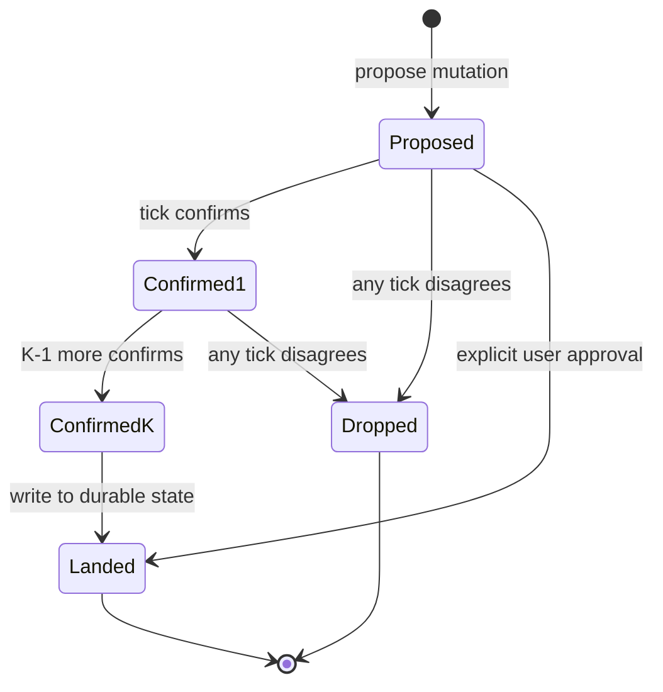

# Quorum on Mutation

**Also known as:** Two-Tick Confirmation, Distributed Consensus (Single Agent)

**Category:** Safety & Control  
**Status in practice:** experimental

## Intent

Require multiple consecutive ticks (or runs) to agree before a mutation to durable state lands.

## Context

A team runs a long-running agent that is allowed to propose changes to its own durable state — its persistent rules, its memory entries, its operating preferences. Over time the agent revises these to fit how the user actually behaves. Some of those proposed changes come from a single frustrated moment in a single conversation, and the agent has no built-in way to tell a passing reaction apart from a genuine long-term preference.

## Problem

If a proposed mutation lands on a single tick's say-so, then a momentary misreading — a user vented once, the agent overinterpreted a single sentence, a transient confusion in context — becomes a permanent rule that degrades the agent for weeks. If the team simply disables self-mutation to avoid this, the agent stops learning from real signals and the operator has to hand-edit every rule change. Without a way to require multiple consecutive endorsements before a mutation lands, single-tick confusion gets baked into durable state.

## Forces

- More ticks = slower change; legitimate improvements are delayed.
- Coordination across ticks needs a proposal / approval state machine.
- User override should always be available for legitimate fast paths.

## Therefore

Therefore: hold each proposed mutation in escrow until K consecutive ticks re-endorse it against fresh context, so that single-tick confusion cannot land as durable state.

## Solution

Mutation proposals are written to a holding area. A subsequent tick must confirm the proposal (still endorses it given fresh context). After K consecutive confirms, the mutation lands. Explicit user approval bypasses the wait.

## Diagram

## Example scenario

A long-running personal agent reads a frustrated user message and proposes a new persistent rule: 'never offer suggestions before being asked.' Under single-tick mutation the rule would land immediately and degrade the agent for weeks. Instead the proposal goes to a holding area; the next tick re-reads the rule against fresh context and the user's later message ('actually keep proposing, I just hated that one') and declines to confirm. The mutation expires unwritten. Only rules that survive K consecutive endorsements join the durable charter.

## Consequences

**Benefits**

- Reduces transient-confusion mutations.
- Surfaces hesitation: K-1 confirms then a withdrawal is itself signal.

**Liabilities**

- Latency on legitimate changes.
- Implementation complexity in the agent's state machine.

## What this pattern constrains

A mutation cannot land on a single tick's say-so; it requires K consecutive endorsements.

## Applicability

**Use when**

- Durable state changes must not capture single-tick confusion.
- Mutation proposals can be held until subsequent ticks confirm them.
- Explicit user approval is available as a bypass for urgent edits.

**Do not use when**

- Mutations are cheap to revert and the quorum delay just slows learning.
- The agent has no durable state worth protecting.
- Single-tick edits with diff review already meet the safety bar.

## Components

- Mutation proposer — agent path that drafts a change to durable state
- Holding area — escrow store for proposals awaiting subsequent-tick endorsement
- Quorum state machine — tracker that advances proposals through K confirmation states
- Endorsement check — re-reads each proposal against fresh context on later ticks
- User-override path — explicit fast-path bypassing the wait for urgent edits

## Tools

- Durable proposal store — keyed by proposal id with confirmation counter and expiry
- Tick scheduler — runs the re-endorsement step at defined cadence

## Evaluation metrics

- Transient-mutation rejection rate — share of single-tick proposals dropped before landing
- Quorum-induced latency on legitimate changes — extra ticks before landing an improvement
- Hesitation signal frequency — K-1 confirms followed by a withdrawal, useful as its own data
- Durable-state-degradation incidents avoided — rules that would have landed under single-tick

## Known uses

- **Author's long-running personal agent (single private deployment)** _available_ — Single-source evidence: one private deployment by the catalog author; no independently documented use yet.
- **[Safe (Safe Smart Account multisig)](https://docs.safe.global/advanced/smart-account-overview)** _available_ — Requires signatures from at least a threshold of owners before a transaction (mutation) executes.
- **[Quorum (multi-agent wallet coordination)](https://quorumclaw.com/)** _available_ — Threshold approval (2-of-2, 2-of-3, 3-of-5) of agent signatures before an action executes.

## Related patterns

- _complements_ **Constitutional Charter**
- _complements_ **Self-Modification Diff Gate**
- _used-by_ **World-Model Separation**
- _complements_ **Race Conditions on Shared Tool Resources**
- _complements_ **Self-Edit Critic Gate**

## References

- [The Byzantine Generals Problem](https://lamport.azurewebsites.net/pubs/byz.pdf) — Lamport, Shostak, Pease, 1982
