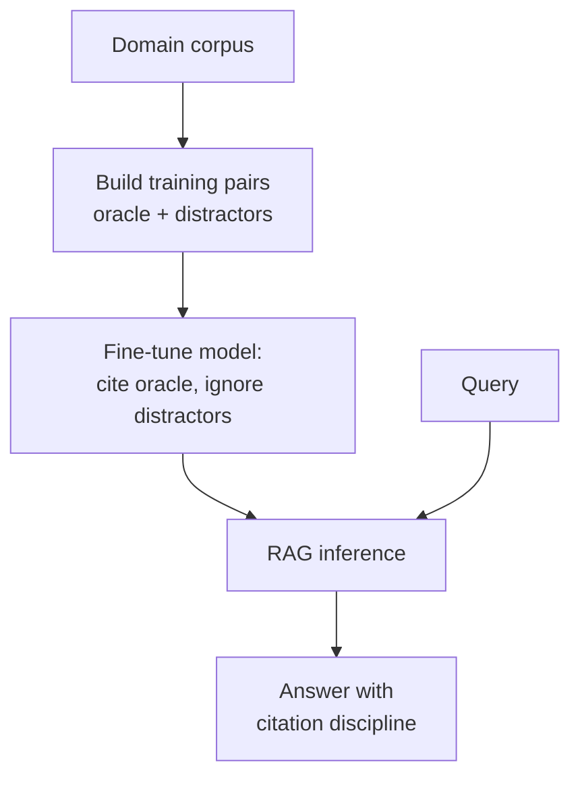

# RAFT

**Also known as:** Retrieval-Augmented Fine-Tuning, Distractor-Robust RAG

**Category:** Retrieval & RAG  
**Status in practice:** emerging

## Intent

Train the model to be robust to irrelevant retrieved documents (distractors) in a domain-specific RAG setting.

## Context

A team is using retrieval-augmented generation in a specific domain and has observed that retrieval almost always returns a mix of documents. Some of the retrieved chunks are genuinely relevant to the user's query; others are topically similar distractors that share keywords or themes but do not actually answer the question. An off-the-shelf retrieval-augmented model attends to all of these chunks and is over-confident on the distractors that look plausible at a glance.

## Problem

Generic models trained on broadly relevant retrievals have not been taught to be sceptical of plausible-looking distractors in their context. When the retrieval mixes one relevant document with two or three convincing distractors, the model's answer drifts towards the loudest irrelevant source, often quoting it directly back at the user. The team needs the model to learn, during fine-tuning, how to ignore distractors in its context window and rely only on the truly relevant documents when those exist — and the team needs to do this with a training procedure that simulates the real retrieval mix rather than assuming clean inputs.

## Forces

- Training data construction (oracle docs + distractors) is its own pipeline.
- Domain shift between training and serving distractors.
- Trade-off between generalisation and domain specialisation.

## Applicability

**Use when**

- Domain-specific RAG models drift to topically similar distractors.
- Training data with oracle and distractor documents can be constructed at scale.
- Citation discipline matters and outputs must be traceable to oracle sources.

**Do not use when**

- Generic RAG quality already meets the domain bar.
- No training pipeline exists to fine-tune on oracle-versus-distractor signals.
- Inference-time retrieval is already filtered enough to make distractors rare.

## Therefore

Therefore: train the model on examples containing both oracle and distractor documents, so that it learns to cite oracles and ignore distractors at serving time.

## Solution

Construct training examples where some documents are oracle and others are distractors. Train the model to cite oracle documents and ignore distractors. Couples chain-of-thought with citation discipline.

## Variants

- **Oracle-only RAFT** — Training examples mix oracle and distractor documents and the model is taught to cite oracle and ignore distractors.
- **CoT-RAFT** — Couples RAFT with chain-of-thought rationales that explicitly cite oracle passages by quote, not just identifier.
- **Domain-mix RAFT** — Fine-tune on training data drawn from several domains with shared distractor structure, trading per-domain ceiling for transfer.

## Example scenario

A clinical-coding RAG assistant keeps citing topically-similar but wrong ICD chapters when the retriever pulls in adjacent conditions. The team builds a RAFT-style training set where each prompt has the oracle code reference plus three convincing distractors, and the gold answer cites only the oracle. After fine-tuning, the model learns to ignore distractors even when they dominate the retrieved context. Production accuracy on the long-tail comorbidity codes climbs without changing the retriever.

## Diagram

## Consequences

**Benefits**

- Robustness to distractor documents in domain RAG.
- Citation discipline improves.

**Liabilities**

- Training data effort.
- Domain-specific; transfer between domains is partial.

## What this pattern constrains

Cited claims must come from documents marked oracle in training; distractor citations are penalised.

## Known uses

- **RAFT paper experiments** — *Available*

## Related patterns

- *specialises* → [naive-rag](naive-rag.md)
- *alternative-to* → [contextual-retrieval](contextual-retrieval.md)

## References

- (paper) Zhang, Patil, Jain, Shen, Zaharia, Stoica, Gonzalez, *RAFT: Adapting Language Model to Domain Specific RAG*, 2024, <https://arxiv.org/abs/2403.10131>

**Tags:** rag, training, domain
