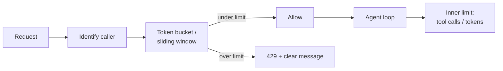

# Rate Limiting

**Also known as:** Throttling, Quota Enforcement

**Category:** Safety & Control  
**Status in practice:** mature

## Intent

Cap the number of requests, tokens, or tool calls per user (or session) within a time window.

## Context

Multi-tenant agent products where one user (or runaway agent) can consume disproportionate resources.

## Problem

Without limits, a single user (or compromised account) can bankrupt the product or starve others.

## Forces

- Generous limits hurt cost; tight limits hurt UX.
- Per-tier limits add complexity.
- Distributed counters need coordination.

## Applicability

**Use when**

- A single user or compromised account could otherwise bankrupt the product or starve others.
- Limits per identity can be enforced at API gateway and inside the agent loop.
- Limit hits can be surfaced to users in a clear, actionable way.

**Do not use when**

- The deployment is a closed internal tool with trusted volume.
- Existing infrastructure already rate-limits effectively at the boundary.
- False rate-limit denials would block more legitimate work than they protect.

## Solution

Define limits per identity at multiple horizons (per minute, per hour, per day). Use token-bucket or sliding-window counters. Apply at API gateway and at agent loop level. Surface limit hits to the user clearly.

## Example scenario

A coding assistant ships a free tier and within a week one signed-up account opens 400 concurrent agent loops, draining the month's token budget in two hours. The team adds per-identity token-bucket counters at three horizons (per minute, per hour, per day) at the API gateway and inside the agent loop itself. Over-budget callers get a clear 429 naming which window tripped and when it resets. Cost stops being a single hostile user away from blowing up.

## Diagram

## Consequences

**Benefits**

- Cost predictability.
- Abuse becomes detectable as limit hits.

**Liabilities**

- Legitimate burst usage is throttled.
- Tier definitions ossify.

## What this pattern constrains

Requests beyond the limit are rejected or queued; no code path may bypass the limiter.

## Known uses

- **Most production agent APIs** — *Available*

## Related patterns

- *complements* → [circuit-breaker](circuit-breaker.md)
- *complements* → [cost-gating](cost-gating.md)
- *complements* → [event-driven-agent](event-driven-agent.md)
- *complements* → [kill-switch](kill-switch.md)

**Tags:** safety, throttle, quota
