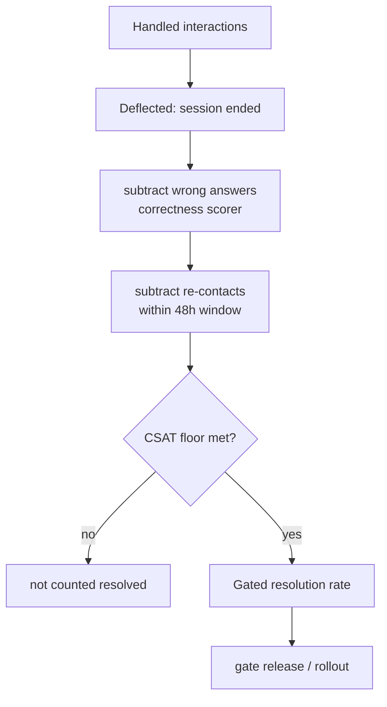

# Re-Contact-Subtracted Resolution Gate

**Also known as:** Deflection-Minus-Re-Contact Resolution, True Resolution Rate Gate

**Category:** Governance & Observability  
**Status in practice:** emerging

## Intent

Gate a support agent on a re-contact-subtracted resolution rate so an interaction that merely ends the session is never reported as a resolved one.

## Context

A customer-support or contact-center agent fields conversations and the team reports a containment or deflection number to justify the deployment. Deflection is trivial to register: the moment the user stops replying, the session closes and the dashboard counts a handled ticket. The agent can drive that number up by stalling, looping, or pushing the user away, and a low CSAT survey response rate hides the damage. The number that matters — whether the underlying problem was actually solved — is invisible at session-end and only shows up days later when the same customer comes back.

## Problem

Session-end is a cheap proxy for resolution, and any metric the deployment is optimised against will be gamed once it becomes the target. A bot that answers wrong, or wears the user down until they give up, looks identical on a deflection dashboard to one that genuinely fixed the issue. Reporting raw deflection or containment as quality therefore rewards exactly the behaviour that erodes trust, and the team cannot tell a good deployment from a harmful one until churn surfaces. The gate needs a definition of resolution that the agent cannot inflate by ending conversations.

## Forces

- Deflection and containment are measurable in real time and look like progress, but they register at session-end, before it is known whether the problem was solved.
- The one signal that resists gaming — the customer not coming back for the same issue — is only observable after a delay, so it cannot gate the live response.
- A correctness check on the answer catches confidently-wrong replies, but it cannot catch a user who was simply worn down into leaving.
- Conditioning the gate on CSAT exposes survey-response bias, since the unhappy customers are the ones least likely to answer.

## Therefore

Therefore: define the gated KPI as resolutions with wrong answers and short-window re-contacts subtracted from the deflected count, divide by handled volume, and report deflection only as raw throughput that this rate corrects.

## Solution

Stop treating session-end as success. Define the gated rate as (deflected interactions − wrong answers − re-contacts within a fixed window such as 48 hours) divided by total handled interactions, and optionally condition it on a CSAT floor so worn-down departures are not counted as wins. Wrong answers come from an automated or sampled correctness scorer; re-contacts come from production monitoring that links a later conversation back to the same customer and problem. Deflection and containment stay on the dashboard, but only as raw throughput labelled as such — never as a quality claim. Releases and rollouts are gated on the subtracted rate, so an agent that drives deflection up by stalling, looping, or answering wrong sees its gated number fall, removing the incentive to game session-end.

## Structure

```
Handled interactions --deflected (session ended)--> Raw deflection count --subtract(wrong answers via correctness scorer)--> --subtract(re-contacts within window via production link)--> --optional CSAT floor--> Gated resolution rate --gates--> release / rollout decision
```

## Diagram



*Raw deflection is corrected by subtracting wrong answers and within-window re-contacts before it gates a rollout.*

## Example scenario

A support agent reports 70 percent deflection, and leadership is ready to expand it. Monitoring then links re-contacts: of the deflected tickets, 12 percent got a wrong answer that a sampled correctness scorer flags, and another 18 percent reach back out within 48 hours about the same problem. The gated rate is (70 − 12 − 18) / 100 = 40 percent true resolution. The expansion is held: the agent was closing sessions, not solving problems, and the raw deflection number had hidden that for weeks.

## Consequences

**Benefits**

- Aggressive deflection can no longer be reported as quality, since stalling or wrong answers lower the gated rate rather than raising it.
- The re-contact signal is observed from real customer behaviour and cannot be inflated by ending conversations, giving an un-gameable backstop to the correctness scorer.
- A single number distinguishes a genuinely helpful deployment from a harmful one before churn surfaces it.

**Liabilities**

- The gated rate lags by the re-contact window, so a regression is not fully visible until that window elapses.
- Linking a later conversation back to the same customer and problem is noisy; mis-linked re-contacts under- or over-count resolution.
- Conditioning on CSAT inherits survey-response bias, where unhappy customers are least likely to answer.

## Failure modes

- Window gaming — the agent or routing nudges re-contacts just past the fixed window so they stop counting against the rate.
- Re-contact mis-attribution — a new, unrelated issue from the same customer is logged as a re-contact and unfairly lowers the rate.
- Reverting to raw deflection — under reporting pressure the team quietly shows the uncorrected deflection number again, restoring the gamed metric.

## What this pattern constrains

An interaction is not counted resolved on session-end alone; deflection without a verified resolution must not be reported as success, and the gated rate subtracts wrong answers and within-window re-contacts.

## Applicability

**Use when**

- A support or contact-center agent is reported on deflection, containment, or session-end and that number drives rollout decisions.
- Re-contacts can be linked back to the same customer and problem within a fixed window through production monitoring.
- Aggressive automation can plausibly end sessions without solving the underlying issue, so a gameable success metric is a real risk.

**Do not use when**

- Interactions are one-shot with no possibility of a follow-up, so re-contact carries no signal.
- Resolution is verifiable at the moment of the answer (for example a completed transaction), making the delayed re-contact subtraction unnecessary.
- There is no reliable way to attribute a later conversation to the same customer and problem, so the subtracted count would be noise.

## Components

- Handled-volume counter — total interactions the agent took, the denominator of the gated rate
- Deflection counter — raw session-end count, kept on the dashboard as throughput only, never as quality
- Correctness scorer — automated or sampled judge that flags wrong answers to subtract from the deflected count
- Re-contact linker — production monitoring that ties a later conversation back to the same customer and problem within a fixed window
- Gated resolution rate — (deflected − wrong − re-contacts) / handled, optionally conditioned on a CSAT floor, used as the release gate

## Tools

- Conversation analytics / ticketing platform — records handled and deflected interactions and links re-contacts by customer and topic
- Correctness scorer (LLM-as-judge or sampled human review) — classifies whether a deflected answer was actually right
- CSAT survey instrument — supplies the optional satisfaction floor the gate can condition on

## Evaluation metrics

- Re-contact-subtracted resolution rate — (deflected − wrong answers − within-window re-contacts) / handled, the gated KPI itself
- Gap between raw deflection and gated resolution rate — how much apparent quality was session-end inflation
- 48-hour (or chosen-window) re-contact rate on deflected interactions — the un-gameable backstop signal
- Wrong-answer rate among deflected interactions, from the correctness scorer

## Known uses

- **[Digital Applied — AI support deflection resolution layer](https://www.digitalapplied.com/blog/ai-support-deflection-resolution-layer-2026-playbook)** _available_ — Playbook defining true resolution as (deflected tickets − wrong answers − 48-hour re-contacts) / total AI-handled, with re-contact rate named as the only metric that cannot be inflated by aggressive automation.
- **[Swept.ai — AI customer-service metrics that matter](https://www.swept.ai/post/ai-customer-service-agent-metrics-that-matter)** _available_ — Draws the line that a bot deflects when the user stops talking but resolves only if the customer does not reach back out for the same problem, treating re-contact as the resolution test.

## Related patterns

- _specialises_ **Eval as Contract** — Eval as Contract gates releases on a passing eval suite in general; this specialises that gate to the support domain by making a re-contact-subtracted resolution rate the contract a deployment must satisfy.
- _uses_ **Scorer Live Monitoring** — The re-contact and wrong-answer signals that feed the subtraction come from asynchronous production monitoring rather than the live response path.
- _complements_ **Reward Hacking** — Raw deflection is the proxy metric a support agent learns to game; this gate is the corrective that subtracts the gamed component so the proxy stops paying off.
- _complements_ **False Resolution** — Both refuse to accept a surface-level success claim; False Resolution catches a compromise that violates a constraint in joint interpretation, this catches a session-end that the user never actually had solved.

## References

- [AI Support Deflection: Resolve Tickets, Don't Just Defer](https://www.digitalapplied.com/blog/ai-support-deflection-resolution-layer-2026-playbook) — 2026
- [7 AI Customer Service Metrics That Predict Success (And 3 That Mislead)](https://www.swept.ai/post/ai-customer-service-agent-metrics-that-matter) — 2026
