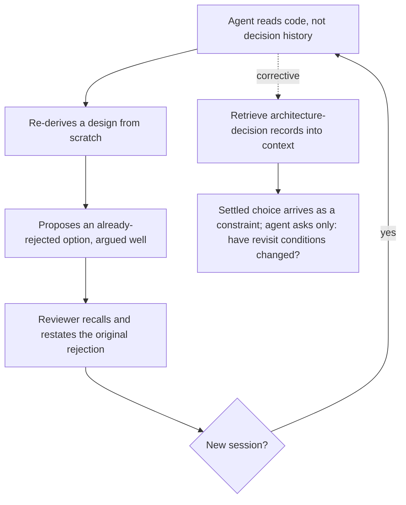

# Re-Proposing Rejected Decisions

**Also known as:** Relitigating Settled Choices, Amnesiac Alternative Re-Suggestion

**Category:** Anti-Patterns  
**Status in practice:** emerging

## Intent

Anti-pattern: a stateless agent sees the code but not the decision history, so it keeps proposing options already considered and rejected, forcing reviewers to relitigate settled choices turn after turn.

## Context

A coding or architecture agent reads the current source on each task but is not given the project's decision history — the architecture-decision records, the discussion threads, the trade-offs that were weighed and the alternatives that were turned down. The code shows what the team chose; it rarely encodes why, or what was rejected and on what grounds. Every fresh session starts the agent from that same incomplete picture.

## Problem

The reasons a team rejected an option — a library that failed a security audit, a queue that did not meet a latency target, a schema abandoned after a migration scare — live outside the code, in records the agent never sees. Lacking that history, the agent re-derives a plausible design from first principles and confidently re-suggests an option that was already weighed and discarded, often arguing for it persuasively. The reviewer then has to recall and restate the original rejection, relitigating a closed question, and the same alternative resurfaces in the next session because nothing about the agent's inputs has changed.

## Forces

- Source code records the choice that was made but almost never the alternatives that were rejected or the grounds for rejecting them.
- A stateless agent re-derives a design from scratch each session, so a once-rejected option is just as likely to be re-proposed as any other plausible candidate.
- Re-suggested options are argued convincingly, so a reviewer cannot dismiss them on sight and must reconstruct the original rejection to refute them.
- The cost lands repeatedly on the human: each relitigation is cheap once, but the same closed question reopens every session until the decision history reaches the agent's context.

## Therefore

Therefore (the corrective): feed the project's architecture-decision records into the agent's context as first-class input, so a settled choice is presented as decided and the agent's only question is whether the documented revisit conditions have changed.

## Solution

The corrective is to make decision history a retrieved input rather than something the agent must rediscover. Maintain architecture-decision records that capture not just the chosen option but the alternatives considered, why each was rejected, and the conditions under which the decision should be revisited. Surface the records relevant to the current task into context — alongside the code — so the agent treats a settled choice as a constraint, not an open design space. Re-frame the agent's task from 'design the best option' to 'work within the recorded decision unless its stated revisit conditions now hold', which turns a relitigation into a narrow, answerable check.

## Structure

```
Code (the what) + missing decision history (the why and the rejected) → agent re-derives → re-proposes a rejected option → human relitigates; the fix adds retrieved decision records so the rejected option arrives pre-closed
```

## Diagram



*Code without decision history makes the agent re-propose rejected options each session; the corrective retrieves the decision records into context.*

## Example scenario

An agent is asked to add a job queue to a service whose code already uses a database-backed queue. Unaware the team trialled and rejected a message broker months ago over its operational cost, the agent confidently proposes switching to that broker, arguing the case well. The reviewer has to dig up the old decision and restate why it was dropped — and next week, on a fresh session, the agent proposes the same broker again, because nothing about what it can see has changed.

## Consequences

**Benefits**

- Naming the failure separates 'the agent has the code' from 'the agent has the reasons', which teams conflate when they assume a current repository carries its own rationale.
- The corrective — retrieve decision records into context — converts an open-ended re-design the reviewer must police into a bounded 'have the revisit conditions changed?' check.

**Liabilities**

- Reviewer time is burned repeatedly relitigating the same closed question, and the cost recurs every session because the agent's inputs never change.
- A persuasive re-proposal of a rejected option can slip through when the reviewer no longer remembers the original grounds, reintroducing a choice the team already discarded for cause.
- Decision records must be written and kept current; stale or missing records leave the agent re-deriving, and over-detailed ones add retrieval cost without closing the question.

## Failure modes

- Amnesiac re-suggestion — the agent proposes an option that was explicitly rejected, with no awareness it was ever considered.
- Persuasive relitigation — the re-proposal is argued so well that the reviewer reopens a settled question instead of citing the prior rejection.
- Session-to-session recurrence — the same rejected alternative resurfaces every new session because the decision history still never reaches the context.
- Silent reintroduction — a rejected choice is re-adopted because the reviewer forgot the original grounds and the agent supplied none.

## What this pattern constrains

An agent working a design or architecture task must not re-open a recorded decision unless its documented revisit conditions are met; a settled choice is treated as a binding constraint, and re-proposing a rejected alternative without citing a changed revisit condition is disallowed.

## Applicability

**Use when**

- Watch for this whenever an agent works a codebase whose architecture-decision records and rejection rationale live outside the source it reads.
- Suspect it when the same already-rejected option keeps resurfacing across sessions and reviewers find themselves restating decisions they thought were settled.
- Audit for it on long-lived projects where 'why we did not do X' is tribal knowledge rather than a retrievable record.

**Do not use when**

- Decision history with rejected alternatives and revisit conditions is already retrieved into the agent's context, which is the corrective rather than the anti-pattern.
- The task is genuinely open-ended design where no prior decision constrains the choice, so there is nothing settled to relitigate.
- Revisit conditions for a recorded decision have actually changed, making a fresh proposal of a previously rejected option legitimate rather than amnesiac.

## Components

- Code-only context — the source the agent reads, which records the chosen option but not the rejected alternatives or their grounds
- Missing decision history — the architecture-decision records, threads, and trade-offs that live outside the code and never reach the agent
- Re-derivation step — the agent reconstructing a design from first principles each session, blind to what was already discarded
- Relitigation loop — the reviewer recalling and restating a prior rejection to refute a re-proposed option
- Decision-record retrieval (corrective) — the step that surfaces relevant decisions, rejected alternatives, and revisit conditions into context

## Tools

- Architecture-decision-record store — the external record of decisions, rejected alternatives, and revisit conditions that the corrective retrieves from
- Context-retrieval / RAG layer — surfaces the decision records relevant to the current task alongside the code
- Coding / architecture agent — the consumer whose re-derivation produces the re-proposal when decision history is absent

## Evaluation metrics

- Rejected-option re-proposal rate — how often the agent suggests an option a prior decision explicitly discarded
- Relitigation frequency — number of reviewer interventions spent restating an already-settled decision
- Cross-session recurrence — whether the same rejected alternative resurfaces in later sessions after being refuted once
- Decision-record coverage in context — fraction of relevant prior decisions actually retrieved into the agent's working context

## Known uses

- **[Slepoe pyatno LLM-razrabotki (Habr essay, solo-developer field report)](https://habr.com/ru/articles/1010478/)** _available_ — Solo developer running an LLM agent across dozens of microservices reports that, without access to the project's decision history, the model re-proposes options already considered and rejected — argued convincingly each time — and names feeding that history into context as the remedy.

## Related patterns

- _complements_ **Decision Log** — Decision Log is the cure-side record this anti-pattern lacks: a persisted account of which alternatives were rejected and why is exactly the history that, fed into context, stops the agent from re-proposing them. The log is the corrective input, not a competing solution.
- _complements_ **Decision Context Maps** — Decision Context Maps gates a decision on a declared set of gathered inputs; recorded prior decisions and their rejected alternatives are one such required input, so requiring the map closes the re-derivation gap this anti-pattern exploits.
- _alternative-to_ **Context Fragmentation** — Sibling missing-context anti-pattern: fragmentation is the agent losing the joint view across constraints it does hold, while this is the agent never receiving the decision history at all and re-deriving from scratch.
- _alternative-to_ **Agent Confession as Forensics** — Both stem from the agent generating rather than retrieving: confession fabricates a past it cannot remember, this re-derives a design ignorant of a past it was never given. Both are cured by grounding the agent in an external record.

## References

- [Slepoe pyatno LLM-razrabotki: kontekst za predelami koda](https://habr.com/ru/articles/1010478/) — 2026
- [Architecture Decision Records (adr.github.io)](https://adr.github.io/)
