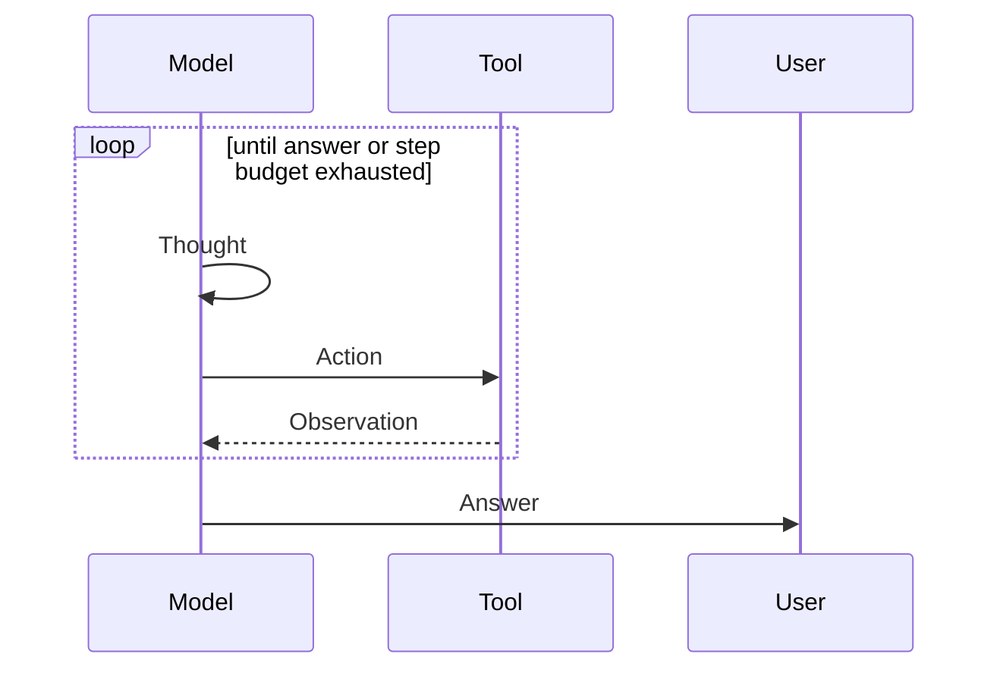

# ReAct

**Also known as:** Reason+Act, Think-Act-Observe Loop

**Category:** Planning & Control Flow  
**Status in practice:** mature

## Intent

Interleave a single thought, a single tool call, and a single observation per step so the agent reasons over fresh evidence.

## Context

The task requires looking things up or acting on the world; the answer cannot be produced by pure thinking.

## Problem

Pure chain-of-thought hallucinates facts; pure tool-blasting wastes calls on the wrong things.

## Forces

- Tool calls are expensive (latency, cost, side effects).
- Observations change the right next step.
- The loop must terminate.

## Solution

On each step the agent emits Thought (private reasoning), Action (one tool call), Observation (the tool's result). Repeat until the agent decides to answer. A step budget bounds the loop.

## Structure

```
[Thought_i, Action_i, Observation_i] for i in 1..N, then Answer.
```


## Applicability

**Use when**

- The next action depends on what was learned from the previous action.
- The agent needs tool access during a multi-step task.
- Outputs from tools are short and inspectable so the model can react to them.

**Do not use when**

- The full plan is known up front; Plan-and-Execute commits earlier.
- Latency is critical; each iteration adds a model round-trip.
- Tool results are large; they will dominate the context window.

## Example scenario

A travel-planning chatbot is asked, 'Find me a flight from Oslo to Tokyo next Tuesday under €800.' It thinks: 'I should check flights.' It calls a flight-search tool. The result shows three options. It thinks again: 'The cheapest is on a Tuesday morning — that fits.' Each step it sees what the previous tool call returned, then decides what to do next.

## Diagram



## Consequences

**Benefits**

- Lowest-overhead path for simple lookups and single-field updates.
- Easy to inspect and debug step by step.

**Liabilities**

- Sequential by nature; long traces are slow and expensive.
- No global plan; the agent can wander.

## What this pattern constrains

Each step the model may call exactly one tool; reasoning between calls is not actuated.

## Known uses

- **Bobbin (Stash2Go)** — *Available*. observe node + route_after_observe edge in LangGraph.
- **LangChain AgentExecutor (default)** — *Available*
- **Claude Code** — *Available*
- **Cursor** — *Available*
- **GitHub Copilot agent** — *Available*
- **Devin** — *Available*

## Related patterns

- *alternative-to* → [plan-and-execute](plan-and-execute.md)
- *uses* → [tool-use](tool-use.md)
- *used-by* → [agentic-rag](agentic-rag.md)
- *alternative-to* → [planner-executor-observer](planner-executor-observer.md)
- *used-by* → [lats](lats.md)
- *used-by* → [computer-use](computer-use.md)
- *specialises* → [self-ask](self-ask.md)
- *composes-with* → [code-execution](code-execution.md)
- *generalises* → [code-as-action](code-as-action.md)

## References

- (paper) Yao, Zhao, Yu, Du, Shafran, Narasimhan, Cao, *ReAct: Synergizing Reasoning and Acting in Language Models*, 2022, <https://arxiv.org/abs/2210.03629>

**Tags:** react, loop, tool-use
