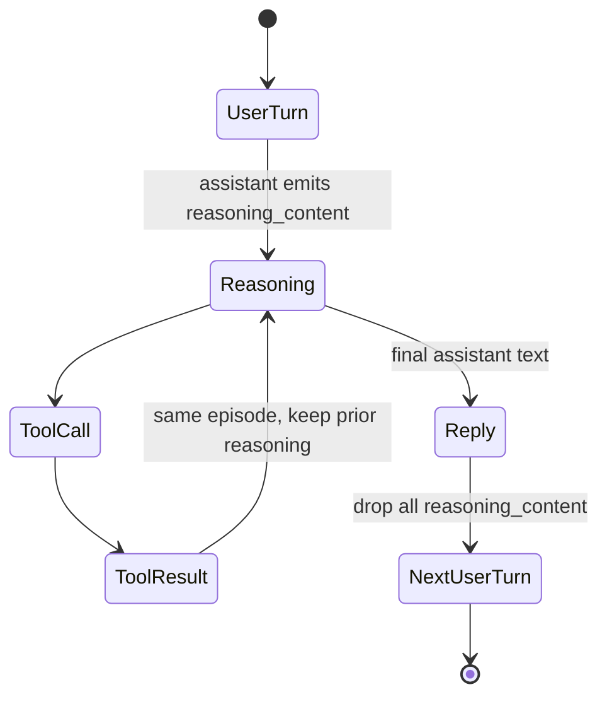

# Reasoning Trace Carry-Forward

**Also known as:** Reasoning Content Episode, CoT Carry Across Tool Calls, Episode-Bound Reasoning

**Category:** Memory  
**Status in practice:** emerging

## Intent

For reasoning models that emit a separate reasoning trace, preserve that trace in context across the same logical task episode (across tool-call/result turns) but drop it at user-turn boundaries.

## Context

The agent uses a reasoning model that exposes a separate reasoning_content field (the model's chain of thought, distinct from the user-visible content), inside a tool-use loop with multi-turn history.

## Problem

Two failure modes pull in opposite directions. (1) If the reasoning trace is dropped between a tool call and its result, the model loses the context of why it called the tool. (2) If the reasoning trace is preserved across user-turn boundaries, conversation history bloats with stale reasoning and the next user task inherits irrelevant prior thinking.

## Forces

- Reasoning trace is the bridge between tool-call intent and post-tool-result interpretation.
- Reasoning trace is private intermediate state, not conversational record.
- Tokens are expensive; preserving traces forever costs money.
- Stale reasoning leaks bias into the next task.


## Applicability

**Use when**

- The model is a reasoning model that emits a separate reasoning trace.
- Within an episode (one user turn through tool calls and results), reasoning context must persist.
- Reasoning traces should be dropped at user-turn boundaries to avoid stale carryover.

**Do not use when**

- The model does not produce a separable reasoning trace.
- The provider already manages reasoning persistence across turns automatically.
- Stateless single-turn use cases that do not span tool-call cycles.

## Solution

Define an episode as: from one user turn to the next user turn (inclusive of all intervening tool calls and tool results). Within an episode, preserve assistant reasoning_content as part of the context concatenation across all turns. At the next user turn boundary, drop reasoning_content from prior episodes (the API will ignore it if you do pass it). The user-visible content remains in history; only the reasoning trace is episode-scoped.

## Example scenario

An agent built on a reasoning model debugs flaky CI by calling a log-fetch tool. Without trace carry-forward, the model emits its hidden reasoning, calls the tool, then on the result turn the reasoning is dropped and it forgets why it asked for those logs and re-derives from scratch, sometimes incorrectly. The team scopes an episode from one user turn to the next and preserves reasoning_content across all intervening tool calls, dropping it only at the next user turn. Tool-result interpretations stop drifting and token usage stays bounded.

## Structure

```
User -> [reasoning + tool_call] -> tool_result -> [reasoning + tool_call] -> tool_result -> [reasoning + final_content] -> User. Within episode: preserve reasoning. Across episodes: drop reasoning, keep content.
```

## Diagram



## Consequences

**Benefits**

- Tool-using episodes get the benefit of CoT continuity.
- Multi-turn dialogues do not accumulate stale reasoning.
- Cheaper than naive reasoning-trace preservation forever.

**Liabilities**

- Episode boundary detection has to be encoded in the agent loop, not the model.
- If the model expects its own past reasoning at a later turn, dropping it breaks that.
- Provider-specific (DeepSeek-style reasoning_content); needs adaptation per API.

## What this pattern constrains

Internal reasoning content may not cross user-task boundaries; only user-visible content persists in conversation history.

## Known uses

- **[DeepSeek API (thinking mode)](https://api-docs.deepseek.com/guides/thinking_mode)** — *Available*. Documented behaviour: pass reasoning_content back across tool-call turns; drop it across user turns.

## Related patterns

- *complements* → [extended-thinking](extended-thinking.md)
- *uses* → [context-window-packing](context-window-packing.md)
- *specialises* → [short-term-memory](short-term-memory.md)
- *complements* → [prompt-caching](prompt-caching.md)

## References

- (doc) *DeepSeek API: Thinking Mode*, <https://api-docs.deepseek.com/guides/thinking_mode>
- (paper) DeepSeek-AI, *DeepSeek-V3 Technical Report*, 2024, <https://arxiv.org/abs/2412.19437>

**Tags:** memory, reasoning, china-origin, deepseek
