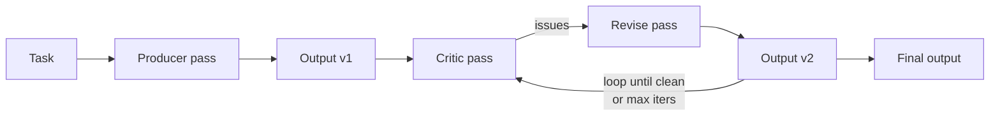

# Reflection

**Also known as:** Self-Critique, Single-Pass Self-Review

**Category:** Verification & Reflection  
**Status in practice:** mature

## Intent

Have the model review its own output and produce a revised version in one or more passes.

## Context

First-pass model outputs contain mistakes a second look would catch; the cost of an extra pass is acceptable.

## Problem

One-shot generation underuses the model; a second pass focused on critique often fixes errors at modest cost.

## Forces

- Same-model self-critique misses correlated blind spots.
- Free-form review drifts; the model invents new criteria each time.
- Termination: when does the loop stop?

## Applicability

**Use when**

- One-shot generation underuses the model and a critique pass would catch errors.
- A critic prompt can identify issues meaningfully on the task's outputs.
- Stop conditions (no new issues, max iterations) can be defined.

**Do not use when**

- The model already produces correct outputs in one pass.
- Latency or cost cannot accommodate extra revision rounds.
- Self-critique at this scale is unreliable and just rationalises errors.

## Therefore

Therefore: have the model critique its own draft against named criteria and produce a revision pass, so that obvious local errors are caught before the output leaves the agent.

## Solution

After producing an output, the model is prompted (often as a critic persona) to find issues. The original output and critique go back into a revision step. Repeat until a stop condition (no new issues, max iterations).

## Example scenario

A drafting agent writes a press release in one shot; legal flags two compliance issues post-hoc. The team adds a critic pass: after the first draft, the same model is prompted as a compliance reviewer to list concrete issues, then a third pass rewrites against that critique. With one extra round-trip, most legal-flag issues are caught before legal sees the draft. The team caps it at two reflection passes to control cost.

## Diagram

## Consequences

**Benefits**

- Catches surface errors cheaply.
- Pairs naturally with structured outputs.

**Liabilities**

- Diminishing returns after one or two passes.
- Self-reinforced confidence on wrong answers (Reflexion replication studies).

## What this pattern constrains

The reviewer may only critique against criteria fixed by the surrounding system; free-form criteria invention is forbidden when the pattern is used at a correctness boundary.

## Known uses

- **Knitting-DSL Pipeline (Stash2Go)** — *Available*. scopedLlmReviewer.js runs a frozen 6-item rubric.
- **Self-Refine paper** — *Available*

## Related patterns

- *generalises* → [frozen-rubric-reflection](frozen-rubric-reflection.md)
- *specialises* → [evaluator-optimizer](evaluator-optimizer.md)
- *generalises* → [reflexion](reflexion.md)
- *used-by* → [agentic-rag](agentic-rag.md)
- *generalises* → [chain-of-verification](chain-of-verification.md)
- *generalises* → [self-refine](self-refine.md)
- *alternative-to* → [same-model-self-critique](same-model-self-critique.md)
- *generalises* → [critic](critic.md)
- *used-by* → [self-rag](self-rag.md)

## References

- (paper) Madaan et al., *Self-Refine: Iterative Refinement with Self-Feedback*, 2023, <https://arxiv.org/abs/2303.17651>
- (paper) Yue Liu, Sin Kit Lo, Qinghua Lu, Liming Zhu, Dehai Zhao, Xiwei Xu, Stefan Harrer, Jon Whittle, *Agent design pattern catalogue: A collection of architectural patterns for foundation model based agents* (2025) — https://doi.org/10.1016/j.jss.2024.112278

**Tags:** reflection, self-critique
