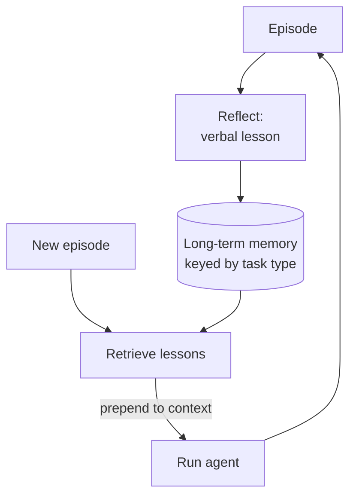

# Reflexion

**Also known as:** Cross-Episode Lesson Writing, Verbal Reinforcement Learning

**Category:** Verification & Reflection  
**Status in practice:** experimental

## Intent

Have the agent write linguistic lessons from past failures and consult them in future episodes.

## Context

A team operates an agent that attempts many similar tasks over time, such as a coding agent solving one programming problem after another or a research assistant answering successive user queries on related topics. Each task is a separate episode and the agent forgets everything between them. The team would like the agent to get better at the kinds of mistakes it has made before, but they cannot afford to fine-tune model weights with reinforcement learning every time a new failure mode shows up.

## Problem

A stateless agent repeats the same mistakes across episodes because it has no memory of having made them before. The information about what went wrong last time exists, briefly, at the end of the last episode and is then thrown away with the conversation. Full reinforcement learning would in principle close the loop but is too expensive to run per failure for most teams, and changing weights is irreversible in ways that small everyday corrections do not warrant. The team needs a way to carry lessons from one episode to the next without touching model weights, but a naive 'remember everything' store quickly accumulates noise that misguides future runs more than it helps.

## Forces

- Lesson quality is bounded by the model's self-critique ability.
- Lesson retrieval (which lesson applies?) is a search problem.
- Lesson rot: outdated lessons may misguide once the world changes.

## Applicability

**Use when**

- Stateless agents repeat the same errors across episodes.
- Linguistic lessons from past failures can be retrieved and prepended in future runs.
- Full RL fine-tuning is too expensive for the setting.

**Do not use when**

- Each episode is fully novel and lessons would not transfer.
- Long-term memory infrastructure is not available.
- Lesson retrieval would surface noise more often than useful guidance.

## Therefore

Therefore: after each episode write a short verbal lesson keyed by task type and retrieve it on the next attempt, so that the agent improves across episodes without changing weights.

## Solution

After each episode, the agent reflects on success/failure and writes a verbal lesson. Lessons are stored in long-term memory keyed by task type. Future episodes retrieve relevant lessons and prepend them to context.

## Example scenario

An agent solving programming-contest problems repeatedly trips over off-by-one in inclusive ranges. After each episode it writes a one-paragraph lesson keyed to 'range parsing' and stores it in long-term memory. On the next problem that mentions inclusive bounds, the relevant lesson is retrieved and prepended to the prompt. Same model, no fine-tune; pass-rate on that error class climbs because the agent now reads its own past lessons before writing code.

## Diagram

## Consequences

**Benefits**

- Improvement without fine-tuning weights.
- Lessons are human-readable and editable.

**Liabilities**

- Single-agent reflexion repeats blind spots because the same model writes and reads the lessons.
- Lesson stores grow; without curation they become noise.

## What this pattern constrains

Lessons are appended, not overwritten; old lessons are explicitly retired rather than silently deleted.

## Known uses

- **Reflexion (reference implementation)** — *Available*. Original Reflexion paper code by Shinn et al.
- **LangGraph Reflexion example** — *Available*. LangGraph ships a Reflexion example.
- **[Sparrot](https://marco-nissen.com/sparrot/)** — *Available* — A reflexion module writes linguistic lessons learned from past failures into memory and consults them in future episodes, so the agent improves across runs without weight updates.

## Related patterns

- *complements* → [episodic-summaries](episodic-summaries.md)
- *specialises* → [reflection](reflection.md)

## References

- (paper) Shinn, Cassano, Berman, Gopinath, Narasimhan, Yao, *Reflexion: Language Agents with Verbal Reinforcement Learning*, 2023, <https://arxiv.org/abs/2303.11366>

**Tags:** memory, reflection, learning
