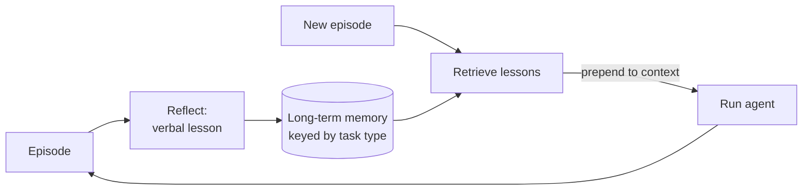

# Reflexion

**Also known as:** Cross-Episode Lesson Writing, Verbal Reinforcement Learning

**Category:** Verification & Reflection  
**Status in practice:** experimental

## Intent

Have the agent write linguistic lessons from past failures and consult them in future episodes.

## Context

The same agent attempts similar tasks repeatedly; without memory across attempts, mistakes recur.

## Problem

Stateless agents repeat the same errors; full RL fine-tuning is too expensive for most settings.

## Forces

- Lesson quality is bounded by the model's self-critique ability.
- Lesson retrieval (which lesson applies?) is a search problem.
- Lesson rot: outdated lessons may misguide once the world changes.

## Applicability

**Use when**

- Stateless agents repeat the same errors across episodes.
- Linguistic lessons from past failures can be retrieved and prepended in future runs.
- Full RL fine-tuning is too expensive for the setting.

**Do not use when**

- Each episode is fully novel and lessons would not transfer.
- Long-term memory infrastructure is not available.
- Lesson retrieval would surface noise more often than useful guidance.

## Therefore

Therefore: after each episode write a short verbal lesson keyed by task type and retrieve it on the next attempt, so that the agent improves across episodes without changing weights.

## Solution

After each episode, the agent reflects on success/failure and writes a verbal lesson. Lessons are stored in long-term memory keyed by task type. Future episodes retrieve relevant lessons and prepend them to context.

## Example scenario

An agent solving programming-contest problems repeatedly trips over off-by-one in inclusive ranges. After each episode it writes a one-paragraph lesson keyed to 'range parsing' and stores it in long-term memory. On the next problem that mentions inclusive bounds, the relevant lesson is retrieved and prepended to the prompt. Same model, no fine-tune; pass-rate on that error class climbs because the agent now reads its own past lessons before writing code.

## Diagram

## Consequences

**Benefits**

- Improvement without fine-tuning weights.
- Lessons are human-readable and editable.

**Liabilities**

- Single-agent reflexion repeats blind spots because the same model writes and reads the lessons.
- Lesson stores grow; without curation they become noise.

## What this pattern constrains

Lessons are appended, not overwritten; old lessons are explicitly retired rather than silently deleted.

## Known uses

- **Reflexion (reference implementation)** — *Available*. Original Reflexion paper code by Shinn et al.
- **LangGraph Reflexion example** — *Available*. LangGraph ships a Reflexion example.

## Related patterns

- *complements* → [episodic-summaries](episodic-summaries.md)
- *specialises* → [reflection](reflection.md)

## References

- (paper) Shinn, Cassano, Berman, Gopinath, Narasimhan, Yao, *Reflexion: Language Agents with Verbal Reinforcement Learning*, 2023, <https://arxiv.org/abs/2303.11366>

**Tags:** memory, reflection, learning
