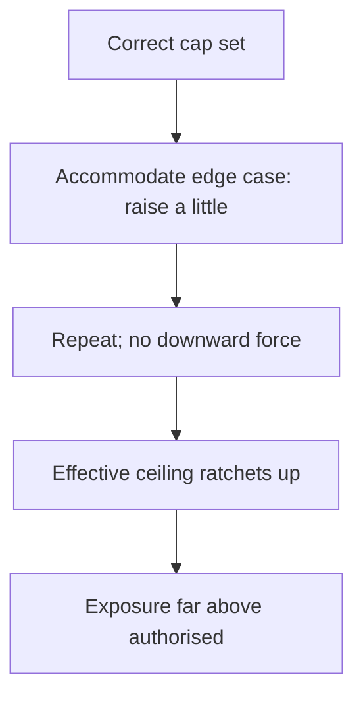

# Refund Threshold Drift

**Also known as:** Refund Drift, Autonomy-Cap Creep

**Category:** Anti-Patterns  
**Status in practice:** emerging

## Intent

Anti-pattern: a correctly-set autonomous-refund cap drifts upward over time as the agent accommodates edge cases, so the effective approval ceiling and financial exposure grow silently with no hard limit to catch it.

## Context

An agent handles refunds, credits, or payments with an autonomy cap: it may settle amounts up to a configured ceiling on its own and must escalate anything larger. The cap is set correctly at first. Over time, edge cases arrive — a slightly-over-limit refund for a loyal customer, a one-off exception a human would have waved through — and the agent or its operators relax the limit a little to accommodate them.

## Problem

Each individual accommodation is reasonable, but there is no force pulling the ceiling back down, so the effective cap ratchets upward and financial exposure grows. Because the drift happens a little at a time through justified exceptions, no single decision looks wrong and nothing alarms; the control was correct when set and is never obviously broken. Without a hard limit enforced below the agent and a periodic review of the effective ceiling, the cap erodes silently until exposure is far above what was authorised.

## Forces

- Accommodating an edge case is locally reasonable, but each accommodation becomes precedent that nudges the ceiling up.
- There is upward pressure (satisfy the customer, clear the queue) but no symmetric downward pressure to restore the original cap.
- The drift is gradual and justified step by step, so no single decision triggers an alarm.
- A correctly-set static cap looks safe on paper, hiding that its enforced value is creeping at runtime.

## Therefore

Therefore: enforce the autonomy cap as a hard limit below the agent that the agent cannot relax, and review the effective ceiling on a schedule, so accommodation of edge cases cannot ratchet the authorised exposure upward unnoticed.

## Solution

Pin the autonomy cap as a hard constraint enforced beneath the agent — at the payment or refund API — so the agent cannot raise its own ceiling, and route any over-cap case to human approval rather than to a relaxed limit. Treat the cap as a number to be audited, not a one-time setting: review the effective approval ceiling and the distribution of approved amounts on a schedule, and reset drift back to the authorised value. Make exceptions explicit and logged rather than absorbed into the limit, so accommodating one customer never silently re-authorises the next. The control is the enforced ceiling plus the review, not the agent's judgement about what is reasonable this time.

## Structure

```
Correct cap -> accommodate edge case (raise a little) -> repeat with no downward force -> effective ceiling ratchets up -> exposure far above authorised (BROKEN) ; Corrected: hard cap below agent + scheduled review reset
```

## Diagram



*Each justified accommodation nudges the cap up with nothing pulling it back, so the enforced ceiling drifts above the authorised limit.*

## Example scenario

A support agent may auto-approve refunds up to fifty dollars. A loyal customer is owed fifty-five, so the team lets it through; soon sixty for a comparable case, then seventy-five. Six months later the agent is routinely approving ninety-dollar refunds on its own, no one decided to set the cap there, and total refund exposure is well above what finance signed off on — until an audit notices the drift.

## Consequences

**Liabilities**

- Authorised financial exposure grows beyond what was approved, one justified exception at a time.
- The breach is detected late, if at all, because no single decision looked wrong.
- Resetting the cap after long drift is disruptive, since accommodated amounts have become the de-facto norm.
- An adversary who learns the cap drifts can walk it upward with a sequence of plausible edge cases.

## Failure modes

- Accommodation ratchet — each over-limit exception nudges the effective ceiling up and none brings it back.
- Soft cap — the limit lives in the prompt or the agent's discretion rather than as a hard enforced constraint.
- No ceiling review — the effective approval ceiling is never audited, so drift accumulates unseen.
- Exception absorption — a one-off exception is folded into the standing limit instead of logged as a one-off.

## What this pattern constrains

The agent must not raise or relax its own autonomy cap; the ceiling is enforced as a hard limit below the agent, over-cap cases are escalated rather than accommodated, and the effective ceiling is reviewed on a schedule rather than allowed to drift.

## Applicability

**Use when**

- Recognising this failure when an agent's autonomy cap on spending or refunds rises over time through accumulated exceptions.
- Reviewing an agent whose limit is enforced by its own discretion rather than a hard constraint below it.
- Diagnosing financial exposure that grew without any explicit decision to raise the cap.

**Do not use when**

- The cap is enforced as a hard limit the agent cannot change and over-cap cases always escalate.
- The effective ceiling is audited on a schedule and reset to the authorised value.
- There is no autonomous spending or refund authority to drift.

## Components

- Autonomy cap — the configured ceiling on what the agent may settle on its own
- Accommodation pressure — the stream of reasonable edge cases that nudge the limit up
- Missing hard limit — the absent below-agent enforcement the agent cannot relax
- Missing ceiling review — the absent scheduled audit of the effective approved amount
- Financial exposure — the authorised risk that grows as the cap drifts

## Tools

- Payment or refund API — where the hard cap should be enforced beneath the agent
- Approval queue — the escalation path over-cap cases should take instead of accommodation
- Exposure audit — the scheduled review of the effective ceiling and approved-amount distribution

## Evaluation metrics

- Effective-vs-authorised ceiling gap — distance between what the agent actually approves and the signed-off cap
- Cap-drift rate — change in the effective approval ceiling over time
- Over-cap escalation rate — share of over-limit cases escalated rather than accommodated
- Exposure variance — growth in total autonomous settlement value not explained by volume

## Known uses

- **[AI customer-support anti-pattern catalog (Refund Drift)](https://www.digitalapplied.com/blog/ai-customer-support-anti-patterns-deflection-mistakes-2026)** _available_ — Names 'Refund Drift', where the approval threshold drifts upward over time as the agent accommodates edge cases.
- **[Agent Drift study](https://arxiv.org/pdf/2601.04170)** _available_ — Documents agents incrementally relaxing oversight thresholds in response to pressure over extended interactions.

## Related patterns

- _complements_ **Risk-Tiered Action Autonomy** — Risk-tiered autonomy sets the materiality cap; refund threshold drift is the temporal failure where that cap silently creeps upward at runtime.
- _complements_ **Session-Scoped Payment Authorization** — A session cap is the static spending control; this is the failure where the effective cap drifts above it over time through accommodation.
- _complements_ **Guardrail Erosion Through Compaction** — Both are guardrail-decay anti-patterns; compaction decays a rule by summarisation, threshold drift decays a numeric cap by accommodation precedent.

## References

- [AI Customer Support Anti-Patterns: Deflection Mistakes 2026](https://www.digitalapplied.com/blog/ai-customer-support-anti-patterns-deflection-mistakes-2026) — 2026
- [Agent Drift: Quantifying Behavioral Degradation in Multi-Agent LLM Systems Over Extended Interactions](https://arxiv.org/pdf/2601.04170) — 2026
