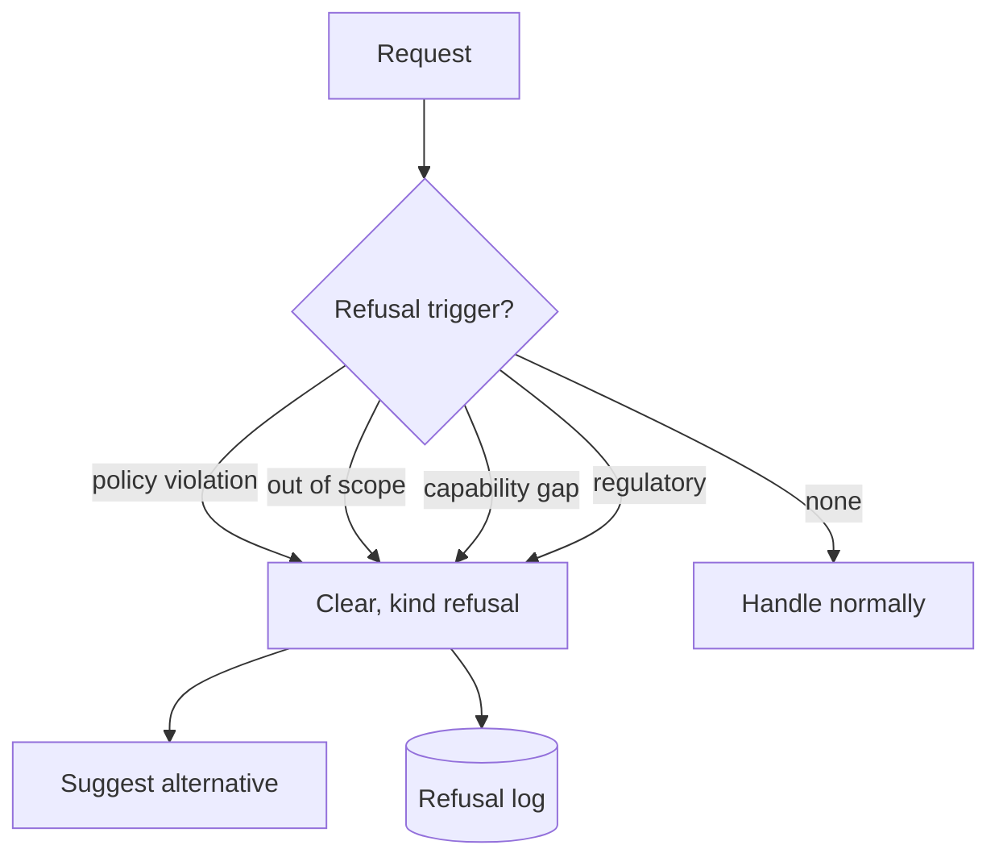

# Refusal

**Also known as:** Decline, Out-of-Scope Response

**Category:** Safety & Control  
**Status in practice:** mature

## Intent

Explicitly refuse requests that fall outside the agent's scope, capability, or policy boundaries.

## Context

A team runs an agent with a defined scope — customer support for a specific product, technical help in a specific domain, internal operations for a specific team — and real users will ask it things outside that scope: medical advice from a banking agent, legal interpretation from a coding assistant, competitor comparisons from a vendor's own bot. Some of these requests are simply off-topic; others are unsafe, regulated, or beyond what the model can reliably do.

## Problem

A helpful-by-default agent answers these out-of-scope questions anyway, producing plausible-sounding but unauthorised content: a stock pick from a system that has no business giving one, a dosage suggestion from a tool that is not a medical device, a confident wrong answer in a domain the model has not been validated against. Silently routing such requests through the model also strips the user of the signal that the agent has a boundary. Without an explicit, kind refusal at the named boundary, the agent drifts into territory that erodes trust and exposes the operator.

## Forces

- Over-refusal frustrates users.
- Under-refusal lands the agent in trouble.
- Refusal text quality matters; templated refusals feel insulting.

## Applicability

**Use when**

- Requests fall outside scope, capability, or policy and helpful-by-default would harm.
- Clear refusal triggers can be defined (policy violation, out-of-scope, regulatory boundary).
- Refusals can name the boundary and suggest an alternative when possible.

**Do not use when**

- The agent is a fully unrestricted research tool with no scope to defend.
- Refusal triggers are so vague they would block legitimate work.
- Logging refusals for review is not feasible and silent drops are unacceptable.

## Therefore

Therefore: trigger an explicit, specific refusal at the named boundary instead of trying to be helpful anyway, so that the agent stays inside its scope and the limit itself becomes visible to the user.

## Solution

Define refusal triggers (policy violation, out-of-scope, capability gap, regulatory boundary). Return a clear, kind, specific refusal that names the boundary and (when possible) suggests an alternative. Log refusals for review.

## Example scenario

A customer-service agent for a bank starts being asked for stock picks, legal advice, and competitor comparisons. Helpful-by-default, it answers and gets the bank into hot water. The team defines refusal triggers (regulatory boundary, out-of-scope, capability gap) and a kind, specific refusal template that names the boundary and points to a human team. Out-of-scope replies stop being plausible-sounding hallucinations and start being short, clear handoffs.

## Diagram

## Consequences

**Benefits**

- Trust improves: the agent has visible limits.
- Compliance posture is defensible.

**Liabilities**

- Calibration of triggers is empirical.
- Refusal-fatigue when triggers are wrong.

## What this pattern constrains

When triggers fire, the agent must refuse rather than attempt the task.

## Known uses

- **OpenAI moderation API** — *Available*
- **Anthropic safety classifier (Claude)** — *Available*
- **Lakera Guard refusal flows** — *Available*
- **NVIDIA NeMo Guardrails** — *Available*

## Related patterns

- *uses* → [constitutional-charter](constitutional-charter.md)
- *complements* → [input-output-guardrails](input-output-guardrails.md)
- *conflicts-with* → [code-switching-aware-agent](code-switching-aware-agent.md)

**Tags:** safety, refusal
