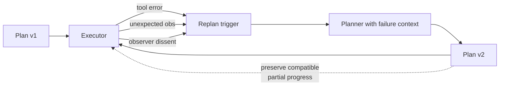

# Replan on Failure

**Also known as:** Adaptive Replanning, Plan Revision

**Category:** Planning & Control Flow  
**Status in practice:** mature

## Intent

Trigger a fresh planning step when execution evidence contradicts the current plan.

## Context

Plan-and-Execute systems where the world differs from the planner's mental model and the executor surfaces evidence the plan must respond to.

## Problem

Plans are made under incomplete information; without replanning, the executor either grinds through a wrong plan or fails silently.

## Forces

- Replanning resets cost; thrashing is real.
- When to trigger replanning is itself a judgment.
- Stale context: the new plan must include lessons from the failed run.

## Applicability

**Use when**

- Plans are made under incomplete information and execution evidence may contradict them.
- Clear replan triggers exist (tool error, unexpected observation, observer dissent).
- Partial progress can be preserved when compatible with the new plan.

**Do not use when**

- Tasks are short and a fresh plan offers no advantage over retry-or-abort.
- Replanning cost dominates and the executor would do better grinding through.
- No reliable triggers exist and replans would fire arbitrarily.

## Therefore

Therefore: define explicit replan triggers and on any of them hand the failure context back to the planner instead of grinding the executor, so that broken plans get repaired with the new evidence rather than driven to budget exhaustion.

## Solution

Define replan triggers (tool error, unexpected observation, observer dissent). When triggered, the executor pauses and the planner runs again with the failure context. The new plan replaces the old one; partial progress is preserved if compatible.

## Example scenario

A travel-booking agent has a plan that assumes a particular hotel API is up; the API returns 500 on every retry. Without replan-on-failure the agent grinds the same dead branch until budget exhausts. Instead, the tool error trips a replan trigger: the planner is invoked again with the failure context, drops the dead branch, picks an alternate provider, and proceeds. The user sees one extra second of latency and a successful booking instead of a timeout.

## Diagram

## Consequences

**Benefits**

- Recovers from plan failures gracefully.
- The planner gets feedback; future plans improve.

**Liabilities**

- Replanning thrash if triggers are too sensitive.
- Compatibility logic between old and new plans is non-trivial.

## What this pattern constrains

The executor cannot deviate from the current plan without raising a replan request.

## Known uses

- **LangGraph plan-and-execute templates** — *Available*

## Related patterns

- *complements* → [plan-and-execute](plan-and-execute.md)
- *uses* → [planner-executor-observer](planner-executor-observer.md)
- *complements* → [exception-recovery](exception-recovery.md)
- *used-by* → [outer-inner-agent-loop](outer-inner-agent-loop.md)

## References

- (doc) *LangGraph: Plan-and-Execute*, <https://langchain-ai.github.io/langgraph/tutorials/plan-and-execute/plan-and-execute/>

**Tags:** planning, replan
