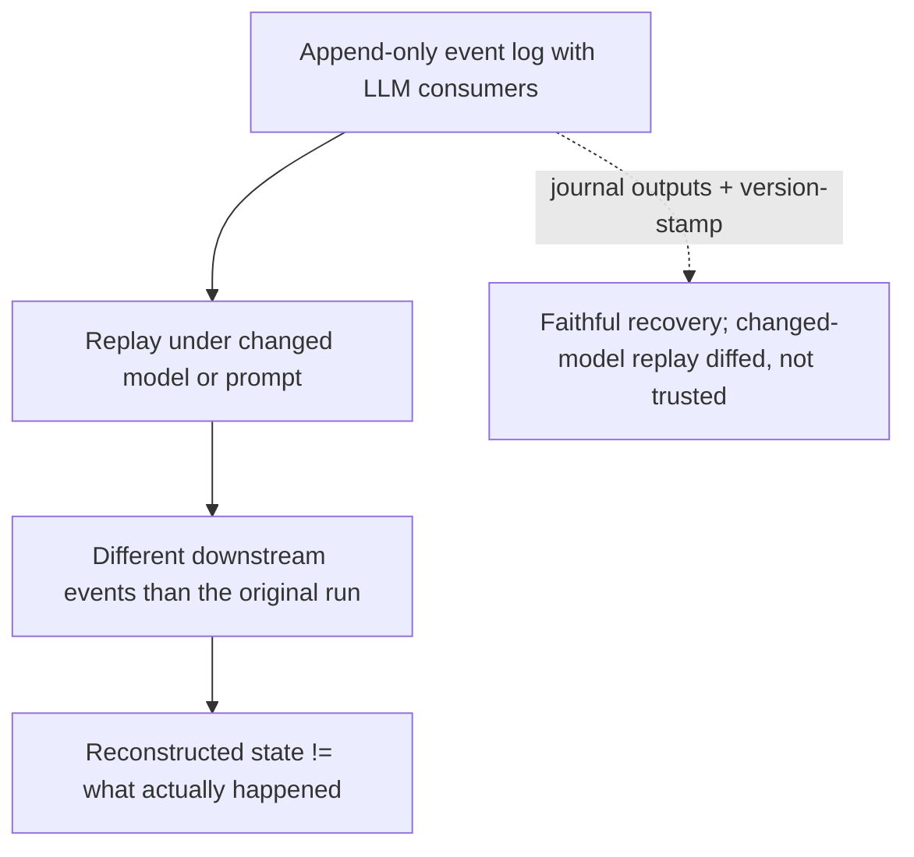

# Replay Divergence

**Also known as:** Replay-Time Output Drift, Non-Deterministic Event Replay

**Category:** Anti-Patterns  
**Status in practice:** emerging

## Intent

Anti-pattern: treat an append-only event log whose consumers are LLMs as deterministically replayable, so replaying it under a changed model or prompt reconstructs different downstream events than the original run.

## Context

A system records agent activity as an append-only event log and treats replay as a first-class capability — to recover state after a crash, to re-derive an audit trail, to branch a past run for debugging, or to reprocess history under an upgraded model. Event sourcing's contract is that replaying the log reconstructs the same state, and the team relies on that determinism. Some consumers of the log are LLM calls.

## Problem

An LLM call is not a pure function of its inputs: the same event replayed under a newer model version, a changed prompt template, or even nominally identical sampling settings can emit a different downstream event than the first run produced. When the replayed output feeds the next step, the divergence compounds — a tool is called with arguments the original never generated, a branch is taken that never happened, and the reconstructed state no longer matches what actually occurred. Nothing errors, because each replayed call is individually well-formed, so the log silently stops being a faithful record. Recovery then restores a state the system was never in, an audit replay yields a different decision than the customer received, and a debugging branch diverges from the very trace it was meant to reproduce.

## Forces

- Event sourcing and durable execution assume replay is deterministic, but an LLM consumer breaks that assumption the moment the model or prompt changes.
- Replaying to re-derive under a new model is sometimes the goal, so journaling the original output defeats that purpose and cannot be the only answer.
- Each replayed call is individually valid, so the divergence raises no error and surfaces only as corrupted downstream state.
- Pinning the model and every sampling input keeps replay faithful but freezes the system on an old model and grows the journal without bound.

## Therefore

Therefore: do not assume an LLM-consumed event log replays deterministically; journal the non-deterministic outputs for faithful recovery, stamp every event with the model version and prompt that produced it, and treat any replay under a changed model as a re-derivation to be diffed against the original rather than trusted as a reconstruction.

## Solution

Separate the two reasons to replay and handle each explicitly. For faithful recovery and audit, record each non-deterministic step's output on first execution and replay the recorded value instead of re-invoking the model, and stamp every event with the model version and prompt hash that produced it. For deliberate re-derivation under a new model, treat the replay as a fresh run rather than a reconstruction: diff its events against the original, surface every divergence, and gate any changed decision behind review. Measure how reproducible the agent actually is and require the strictest determinism tier for events that drive regulated or irreversible actions. Never let a replay whose model or prompt has changed overwrite recovered state as if it were the original.

## Structure

```
Append-only event log (LLM consumers) -> replay under changed model/prompt -> different downstream events -> reconstructed state != original (BROKEN) ; Corrected: journal non-deterministic outputs + version-stamp events + treat changed-model replay as diffed re-derivation
```

## Diagram



*Replaying an LLM-consumed event log under a changed model reconstructs events the original run never produced, and each replayed call looks valid so the divergence is silent.*

## Example scenario

A support-automation team event-sources every agent run so they can replay logs to recover state after a crash. After upgrading the underlying model, an outage forces a replay of the day's log, and where the old model had routed a refund to manual review the new model approves it outright. The replay reconstructs a state in which refunds were issued that never were, each replayed step looks valid, and nobody notices until the books fail to reconcile.

## Consequences

**Liabilities**

- Crash recovery rebuilds a state the system was never in, because re-invoked LLM calls diverge from what originally happened.
- An audit or regulatory replay returns a different decision than was actually issued, undermining the log as evidence.
- A single divergent replayed event changes a branch, and every later event diverges further from the original run.
- The corruption is silent: each replayed call is well-formed, so no error fires and the drift is found only when downstream state fails to reconcile.

## Failure modes

- Crash-recovery corruption — re-invoking the model during replay reconstructs a state the system was never in.
- Audit non-reproducibility — a regulator replaying a logged case gets a different decision than was originally issued.
- Compounding drift — one divergent replayed event flips a branch, and all later events diverge from the original.
- Silent log rot — each replayed call is well-formed, so the log quietly stops being a faithful record with no error raised.

## What this pattern constrains

An LLM-consumed event log must not be assumed to replay deterministically; replay for recovery may not re-invoke the model but must use journaled outputs, and a replay whose model or prompt has changed cannot overwrite reconstructed state as if it were the original run.

## Applicability

**Use when**

- Recognising this risk when an append-only event log or durable-execution workflow has LLM calls among its consumers.
- Reviewing a system that relies on replay for crash recovery, audit, or debugging while the model or prompts change over time.
- Diagnosing why a recovered or re-derived state diverged from what actually happened.

**Do not use when**

- Replay never re-invokes the model because every non-deterministic output is journaled and replayed in place.
- The log has no LLM consumers, so replay is genuinely deterministic.
- The system never replays history and keeps no recovery or audit dependence on it.

## Components

- Append-only event log — the recorded history treated as the source of truth
- LLM consumer — the non-deterministic step whose replayed output can differ from the original
- Replay engine — the recovery, audit, or debugging path that re-runs the log
- Model and prompt version — the changing input that makes replay diverge, often left unstamped on events
- Missing journaling and version stamping — the absent record of original outputs and the producing model

## Tools

- Output journaling — records each non-deterministic step's result so recovery replays the value instead of re-invoking the model
- Event version stamping — tags every event with the model version and prompt hash that produced it
- Replay diffing — compares a changed-model re-derivation against the original run and surfaces every divergence

## Evaluation metrics

- Replay divergence rate — fraction of replayed events that differ from the original run
- State-reconstruction fidelity — how often recovery rebuilds the exact original state
- Audit reproducibility — share of logged decisions a replay reproduces under the recorded model
- Unstamped-event rate — events lacking the model version and prompt hash needed to detect divergence

## Known uses

- **[Production LLM Agents runtime-patterns methodology (arXiv 2605.20173)](https://arxiv.org/abs/2605.20173)** _available_ — Names replay divergence as a failure mode of event-driven sequencing: the same input event replayed on a newer model version produces different downstream events than the first run produced.
- **Durable-execution engines (Temporal-style workflow replay)** _available_ — Durable-execution frameworks require workflow code to be deterministic on replay; an un-journaled LLM call re-invoked during replay produces a non-determinism error or a silent state divergence.

## Related patterns

- _complements_ **Journaled LLM Call** — Journaled-llm-call is the remedy for the crash-recovery case — record the output and replay it instead of re-invoking; this anti-pattern names the broader hazard, including model-version re-derivation that journaling deliberately cannot fix.
- _complements_ **Determinism-Tiered Replay Gate** — The gate measures and tiers how reproducible an agent is and blocks regulated decisions below the strictest tier; this names the underlying hazard the gate exists to grade.
- _complements_ **Replay / Time-Travel** — Replay / time-travel re-runs a past trace to debug or branch; this is the failure where that re-run silently diverges from the trace it was meant to reproduce.
- _complements_ **Confident Inconsistency** — Confident-inconsistency is user-facing output drift across independent re-runs of a query; this is state-reconstruction drift when an event log is replayed, where the harm is corrupted recovery and broken audit fidelity rather than two reviewers seeing different answers.
- _complements_ **Stochastic-Deterministic Boundary (SDB)** — An SDB verifier and reject signal can catch a divergent replayed proposal before it commits; this names the hazard that lives at the replay seam the boundary guards.

## References

- [A Methodology for Selecting and Composing Runtime Architecture Patterns for Production LLM Agents](https://arxiv.org/abs/2605.20173) — 2026
