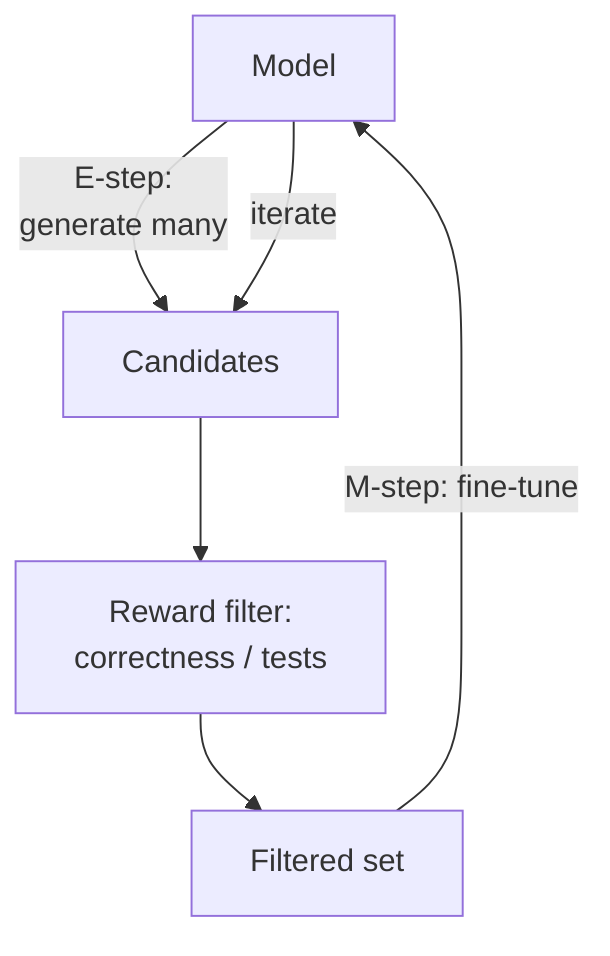

# ReST-EM

**Also known as:** Reinforced Self-Training, Self-Training Loop

**Category:** Reasoning  
**Status in practice:** emerging

## Intent

Iterate generate → reward-filter → fine-tune to bootstrap reasoning capabilities without human-labelled data.

## Context

A team wants to improve a model's performance on a reasoning task where the model is already partially competent — it gets some answers right with chain-of-thought — and where there is an automatic way to tell a right answer from a wrong one. This automatic check might be a ground-truth label, an executable test suite, or a formal verifier that says yes or no. The team has compute to spend on generating and filtering many samples, but they do not have human-written rationales or step-by-step solutions to fine-tune on.

## Problem

Pure prompting on the base model has plateaued and is not improving any further. Full reinforcement learning with algorithms like PPO is unstable and expensive to set up and run. Buying or labelling supervised rationale data at scale is not affordable for this task. The team needs a training loop that can bootstrap better reasoning out of the model itself using only the reward signal they already have, without depending on human labels and without the volatility of full reinforcement learning.

## Forces

- Reward filter quality bounds learning quality.
- Iteration count vs cost.
- Distribution drift across iterations.

## Applicability

**Use when**

- The model is partially competent on the task and a programmatic reward signal exists.
- Pure prompting has plateaued and full RL with PPO is too unstable or expensive.
- Generation, filtering, and fine-tuning infrastructure is available.

**Do not use when**

- No reliable reward signal (correctness, executable test, formal verifier) is available.
- The base model is too weak to produce any correct samples to filter.
- Quick iteration matters more than the multi-day generate-filter-train loop.

## Therefore

Therefore: iterate generate → reward-filter → fine-tune, so that the model bootstraps reasoning from its own correct outputs without human-labelled rationales.

## Solution

EM-style loop. (E-step) Generate many responses per problem. Filter by reward (correctness against ground truth or executable test). (M-step) Fine-tune on the filtered set. Iterate. Variants: ReST (DeepMind, RL-shaped), ReST-EM (Singh et al., expectation-maximisation framing).

## Variants

- **ReST (DeepMind)** — Reward-shaped self-training with explicit grow/improve phases and a learned reward model on text quality.
- **ReST-EM** — Expectation-maximisation framing where the E-step samples and filters by a binary correctness reward and the M-step fine-tunes.
- **STaR rationalisation** — When sampling fails, hint the model with the correct answer to obtain a rationale, then add the rationalised example to training.

## Example scenario

A team wants a small in-house model to solve grade-school math without paying to label rationales. They run ReST-EM: sample many CoT solutions per problem, keep only those whose final answer matches ground truth, fine-tune on the kept set, then sample again. Each round yields a stronger sampler whose kept fraction grows. After three iterations the small model lands within a few points of a much larger zero-shot baseline at a fraction of inference cost.

## Diagram

## Consequences

**Benefits**

- Strong gains without human-labelled rationales.
- Stable; converges in a few iterations.

**Liabilities**

- Compute-heavy.
- Reward gaming possible.

## What this pattern constrains

Training data is restricted to filter-passing samples; ungrounded samples are not reinforced.

## Known uses

- **DeepMind ReST** — *Available*
- **Singh et al. ReST-EM** — *Available*

## Related patterns

- *generalises* → [star-bootstrapping](star-bootstrapping.md)
- *uses* → [best-of-n](best-of-n.md)

## References

- (paper) Gulcehre et al., *Reinforced Self-Training (ReST) for Language Modeling*, 2023, <https://arxiv.org/abs/2308.08998>
- (paper) Singh, Co-Reyes, Agarwal, Anand, Patil, Garcia, Liu, Harrison, Lee, Xu, Parisi, Kumar, Alemi, Rizkowsky, Nova, Adlam, Bohnet, Elsayed, Sedghi, Mordatch, Simpson, Gur, Snoek, Pfaff, Brown, Roy, Mustafa, Hoffman, Botvinick, Faust, Larochelle, Hadsell, Schuurmans, Faruqui, *Beyond Human Data: Scaling Self-Training for Problem-Solving with Language Models*, 2023, <https://arxiv.org/abs/2312.06585>

**Tags:** reasoning, self-training, rl
