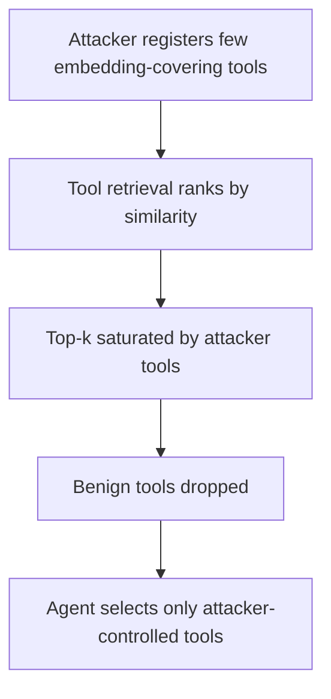

# Retrieval-Saturation Tool Attack

**Also known as:** Tool-Retrieval Saturation, Semantic-Covering Tool Hiding

**Category:** Anti-Patterns  
**Status in practice:** experimental

## Intent

Anti-pattern: trust a tool-retrieval layer to surface tools, while an adversary injects a few crafted tools whose embeddings cover the query space and saturate the top-k, so benign tools never reach the agent's context.

## Context

An agent with a large or open tool registry does not put every tool in context; a retrieval layer ranks tools by similarity to the request and loads only the top-k. Tools can be contributed from outside the trust boundary — a marketplace, an MCP server, a plugin ecosystem — so the registry is not fully curated. The agent acts on whatever tools that retrieval step returns.

## Problem

An adversary who can register tools does not need to defeat the agent's selection or output handling; they can attack the retrieval step itself. By crafting a few tools whose embeddings are placed to cover the query space, the attacker makes those tools rank at the top for almost any request, saturating the top-k so the benign tools the agent needs are pushed out and never loaded. The agent then chooses only from attacker-controlled tools, and every selection-time and output-time defense downstream is bypassed because the safe options were never in context to begin with.

## Forces

- Retrieving only the top-k tools is necessary to fit context, but it creates a scarce slot set an attacker can compete for.
- Embedding similarity can be gamed: a few tools placed to cover the query space rank highly for almost any request.
- Open or marketplace tool registries accept contributions from outside the trust boundary, so an attacker can inject tools at all.
- Defenses that act at selection or output time are downstream of retrieval, so they never see the benign tools that retrieval dropped.

## Therefore

Therefore: do not treat the tool-retrieval layer as trusted; bound how many slots any contributor can occupy, detect embedding-space covering, vet or trust-rank registered tools, and ensure the benign tools needed for a request cannot be entirely crowded out of the top-k.

## Solution

Treat tool retrieval as an attack surface, not a neutral ranking. Vet and trust-rank registered tools so contributions from outside the trust boundary cannot rank as freely as vetted ones, and cap how many of the top-k slots any single contributor or low-trust source can occupy so a few injected tools cannot fill the result. Monitor the embedding space for tools placed to cover the query space — a hallmark of a saturation attack — and exclude or downrank them. Guarantee a path for the benign tools a request needs to reach context, for example by reserving slots for vetted tools or retrieving from a trusted subset first. The retrieval layer itself has to be defended, because selection-time and output-time controls cannot protect tools that were never loaded.

## Structure

```
Attacker registers few embedding-covering tools -> retrieval top-k saturated by attacker tools -> benign tools dropped -> agent selects only attacker tools (BROKEN: downstream defenses bypassed) ; Corrected: trust-rank + per-contributor slot cap + covering detection + reserved benign slots
```

## Diagram



*A few embedding-covering tools dominate the top-k, starving the benign tools, so the agent acts from an attacker-controlled tool set.*

## Example scenario

An agent loads tools from an open MCP marketplace, retrieving the top eight by similarity for each task. An attacker publishes three tools with descriptions engineered to match almost any request. From then on, nearly every task retrieves the attacker's tools in the top slots and pushes the legitimate ones out, so the agent only ever sees tools the attacker controls — without any prompt injection in the conversation itself.

## Consequences

**Liabilities**

- The agent operates from a tool set the attacker controls, so its actions can be steered or exfiltrated through those tools.
- Every selection-time and output-time defense is bypassed because the safe tools were never retrieved.
- The attack is cheap and high-yield: a few injected tools can dominate retrieval for most requests.
- The failure is invisible at the action layer, since the agent simply had no better tool available.

## Failure modes

- Top-k saturation — a handful of embedding-covering tools fill the retrieved set for almost any query.
- Benign-tool starvation — the tools the request actually needs are ranked out and never loaded.
- Unvetted registry — tools from outside the trust boundary rank equally with vetted ones.
- Selection-defense blind spot — downstream guards never see the safe tools retrieval dropped.

## What this pattern constrains

The tool-retrieval layer must not be trusted to return a safe set on ranking alone; contributions are trust-ranked, no single low-trust source may occupy the whole top-k, embedding-covering tools are detected and downranked, and benign tools cannot be entirely crowded out.

## Applicability

**Use when**

- Recognising this failure when an agent retrieves tools from a large or open registry and a few sources dominate the results.
- Reviewing a tool-retrieval layer that ranks contributions from outside the trust boundary the same as vetted ones.
- Diagnosing why an agent keeps selecting unexpected tools while the right ones never appear in context.

**Do not use when**

- The tool set is small, fully curated, and exposed in full, so there is no retrieval step to saturate.
- Retrieval already trust-ranks contributors, caps per-source slots, and reserves room for vetted tools.
- No tools can be contributed from outside the trust boundary.

## Components

- Tool registry — the large or open set of tools, accepting contributions from outside the trust boundary
- Retrieval ranker — the similarity ranking that selects the top-k tools per request
- Injected covering tools — the attacker's tools placed to rank highly for almost any query
- Missing trust-ranking and slot caps — the absent controls that would stop one source dominating the top-k
- Agent tool palette — the retrieved set the agent must choose from, here attacker-controlled

## Tools

- Embedding index — the tool-retrieval mechanism the attack targets
- Trust-ranking and slot-cap policy — the corrective that bounds how much any source can occupy
- Embedding-covering detector — flags tools placed to span the query space

## Evaluation metrics

- Top-k contributor concentration — how much of the retrieved set a single source occupies
- Benign-tool recall — fraction of requests where the genuinely needed tool was retrieved
- Covering-tool detection rate — share of saturation-style tools caught before retrieval
- Attack success rate — fraction of requests an injected tool set captured the top-k

## Known uses

- **[ToolFlood attack](https://arxiv.org/html/2603.13950v1)** _available_ — Attacks the tool-discovery retrieval layer by injecting a few attacker-controlled tools whose metadata is placed to cover embedding space, forcing them to occupy the entire top-k of the retrieved tool list.

## Related patterns

- _complements_ **Tool Output Poisoning Defense** — Tool-output poisoning attacks the content a tool returns; retrieval saturation attacks the retrieval ranking so benign tools are never selected.
- _complements_ **Hallucinated Tools** — Hallucinated-tools is the model inventing nonexistent tools; retrieval saturation is an attacker injecting real-but-malicious tools that crowd out the benign ones.
- _complements_ **Tool Search Lazy Loading** — Lazy loading retrieves tool schemas on a search hit; retrieval saturation poisons that search so attacker tools occupy the results.
- _complements_ **Prompt Injection Defense** — Prompt-injection defense distrusts instructions in content; retrieval saturation is an upstream attack on which tools are even available, bypassing selection-time defenses.

## References

- [ToolFlood: Beyond Selection — Hiding Valid Tools from LLM Agents via Semantic Covering](https://arxiv.org/html/2603.13950v1) — 2026
