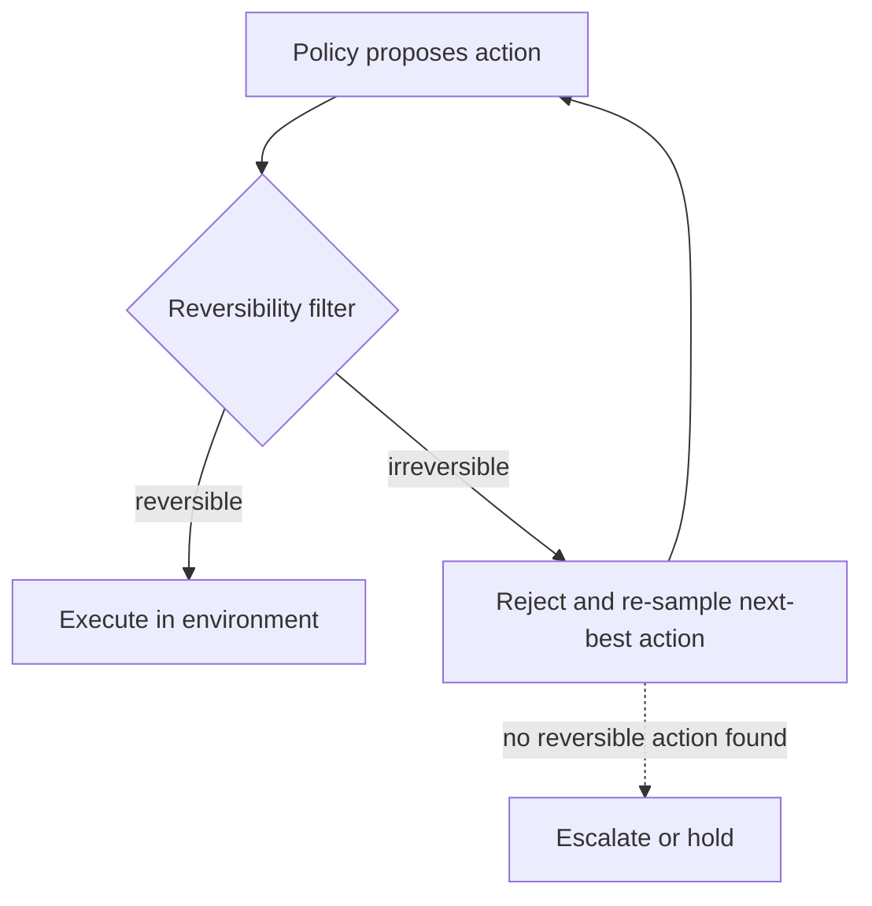

# Reversibility-Aware Action Filter

**Also known as:** Reversibility Filter, Irreversible-Action Filter, Reversibility Gate

**Category:** Safety & Control  
**Status in practice:** experimental

## Intent

Insert a standing filter between the policy and the environment that estimates each proposed action's reversibility and re-samples the policy until a reversible action is chosen.

## Context

An agent acts in an environment where some actions can be undone and others cannot, and the cost of an irreversible mistake is far higher than the cost of trying again. The policy proposes actions ranked by expected reward, but reward does not encode whether a step can be taken back. Convention is to penalise bad outcomes after they happen or to ask a human before risky steps, yet many environments offer no human in the loop and no faithful simulator to consult first.

## Problem

A policy optimised for reward will reach for an irreversible action whenever it scores highest, even when an equally good reversible alternative exists, because reversibility is invisible to the objective. Detecting the harm afterwards is too late, since the defining property of an irreversible action is that no compensator restores the prior state. Gating every step on a human or a simulator does not scale to environments that run faster than a person can review and that have no sandbox to dry-run against. The result is an agent that occasionally takes a one-way step it never needed to take.

## Forces

- A reward-maximising policy is indifferent to reversibility, so it will pick a one-way action whenever its score edges out a reversible one.
- Estimating reversibility is itself uncertain: a learned estimator can misjudge a step, and a manifest class can be coarse or stale.
- Filtering hard makes the agent timid and can starve it of any legal move; filtering soft lets a damaging step slip through.
- Human approval and faithful simulation are the safe defaults but both assume a reviewer or a sandbox that high-throughput, real-world environments often lack.

## Therefore

Therefore: make reversibility a first-class property of every action, classify it before execution, and let only reversible actions through by default while re-sampling the policy when its top choice is one-way.

## Solution

Place a filter as a standing intermediate layer between the policy and the environment, so every proposed action passes through it before it can execute. The filter assigns each action a reversibility estimate, either from a learned model trained to predict whether the prior state can be recovered or from a per-tool reversibility class declared in the tool manifest outside the agent's reach, such as read-only, reversible, external-reversible, or irreversible. When the action clears a reversibility threshold it executes; when it is judged irreversible the filter rejects it and the policy is re-sampled for its next-best action, repeating until a reversible one is chosen. The agent still optimises reward, but it does so over the subset of actions it can take back, which makes an irreversible step opt-in rather than the default. The threshold sets how cautious the agent is, and genuinely necessary one-way actions can be routed to an explicit escalation rather than silently retried forever.

## Structure

```
Policy proposes action --> Reversibility filter (learned estimate or manifest class) --reversible--> Execute in environment; --irreversible--> reject and re-sample policy for next-best action --> back to filter; persistent no-reversible-action --> escalate or hold
```

## Diagram



*The filter is a standing layer between policy and environment; irreversible actions are rejected and the policy is re-sampled until a reversible action is found.*

## Example scenario

A warehouse robot agent can move a box, scan a shelf, or shred a label, and only shredding cannot be undone. A reversibility filter sits between its policy and its motors: when the policy's top action is shredding, the filter marks it irreversible and asks the policy for its next-best move, repeating until it picks moving or scanning. The robot still chases its goal, but it now reaches for a one-way action only when no reversible step will do, and that case is handed off for explicit approval rather than taken on its own.

## Consequences

**Benefits**

- Irreversible actions become opt-in rather than the default, so the agent stops taking one-way steps it never needed.
- The guard is proactive and self-contained: it needs no human reviewer and no faithful simulator, so it fits high-throughput environments.
- A single threshold tunes the agent's caution across the whole action surface without retraining the policy.

**Liabilities**

- The filter is only as good as its reversibility estimate; a misclassified action is either wrongly blocked or wrongly allowed through.
- Re-sampling until a reversible action appears can leave the agent stuck or looping when every available move is judged one-way.
- A too-cautious threshold makes the agent timid and starves it of legitimate progress, while a too-loose one defeats the guard.

## Failure modes

- Estimator miscalibration — a one-way action is scored reversible and executes, or a safe action is scored irreversible and is never tried.
- Re-sample deadlock — no proposed action clears the threshold and the agent loops or stalls instead of escalating.
- Stale manifest class — a tool's declared reversibility no longer matches its behaviour after an upstream change, so the class lies.
- Threshold drift — the cautious threshold is loosened over time to unstick the agent until it no longer blocks the dangerous steps it was meant to.

## What this pattern constrains

An action estimated as irreversible cannot execute by default; the filter must re-sample the policy for a reversible alternative before the environment is touched, and the policy may not select or relax its own reversibility threshold.

## Applicability

**Use when**

- The environment mixes reversible and irreversible actions and the cost of an unnecessary one-way step is high.
- There is no human reviewer in the loop and no faithful simulator to dry-run actions against before they execute.
- Reversibility can be estimated, either by a learned model or by a per-tool reversibility class declared in the manifest.

**Do not use when**

- Reaching the goal genuinely requires irreversible actions, where filtering them out would deadlock the agent rather than redirect it.
- A faithful simulator or a human approver is available and a simulate-then-verify or human-gated step is the better safeguard.
- Reversibility cannot be estimated with any reliability, so the filter would block or admit actions close to at random.

## Components

- Reversibility estimator — assigns each proposed action a reversibility score from a learned model or a manifest class
- Action filter — admits actions above the reversibility threshold and rejects those judged irreversible
- Policy re-sampler — requests the next-best action from the policy whenever the filter rejects the current one
- Tool reversibility manifest — declares each tool's reversibility class outside the agent's reach
- Escalation handler — routes a genuinely necessary one-way action to approval or a hold instead of looping forever

## Tools

- Reversibility model — a learned estimator trained to predict whether the prior state can be recovered after an action
- Tool manifest registry — stores and serves the per-tool reversibility class the filter reads
- Policy runtime — the agent's action-selection model that the filter re-samples for next-best actions

## Evaluation metrics

- Irreversible-action rate — fraction of executed actions that turn out to be one-way, which the filter aims to drive toward zero
- Reversibility-estimate accuracy — how often the filter's reversible/irreversible judgement matches ground truth
- Re-sample depth — how many alternatives the policy must offer before a reversible action is admitted
- Goal-completion rate under filtering — share of tasks still completed once irreversible actions are filtered out

## Known uses

- **[Reversibility-Aware RL (RAC), Google Research](https://research.google/blog/self-supervised-reversibility-aware-reinforcement-learning/)** _pure-future_ — Self-supervised method that learns to estimate reversibility and inserts a filter between policy and environment, rejecting irreversible actions and re-sampling until a reversible one is chosen.
- **[OWASP AISVS action-class authority](https://theweatherreport.ai/posts/aisvs-action-class-authority/)** _available_ — Specifies grading each tool by a reversibility class (read-only, reversible, external-reversible, irreversible) declared in its manifest outside the agent's reach, so the class gating an action is not something the agent can rewrite.

## Related patterns

- _alternative-to_ **Simulate Before Actuate** — Both gate an irreversible action before it fires, but simulation dry-runs the step and asks a verifier to approve it, whereas this filter classifies reversibility directly and re-samples for a reversible action with no simulator and no reviewer.
- _complements_ **Compensating Action** — Compensating actions undo a step after it executes; this filter prevents the genuinely irreversible step from being taken in the first place, so the two cover the reversible and irreversible halves of the action surface.
- _complements_ **Risk-Tiered Action Autonomy** — Risk tiers gate actions by financial materiality and release the material ones to a human; this filter gates by reversibility and re-samples automatically, so a deployment can combine a materiality axis with a reversibility axis.
- _uses_ **Policy-as-Code Gate** — The per-tool reversibility class lives in a manifest or policy declared outside the agent's reach, which is exactly the externally compiled, agent-immutable rule that a policy-as-code gate enforces.

## References

- [Self-Supervised Reversibility-Aware Reinforcement Learning](https://research.google/blog/self-supervised-reversibility-aware-reinforcement-learning/) — Nathan Grinsztajn, Johan Ferret, Olivier Pietquin, Philippe Preux, Matthieu Geist (Google Research), 2021
- [AISVS Action-Class Authority: reversibility class in the tool manifest](https://theweatherreport.ai/posts/aisvs-action-class-authority/) — 2025
