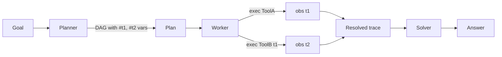

# ReWOO

**Also known as:** Reasoning Without Observation, Plan-as-DAG, Placeholder-Variable Plan

**Category:** Planning & Control Flow  
**Status in practice:** experimental

## Intent

Plan a complete dependency DAG with placeholder variables before any tool runs, then execute and substitute observations into the plan.

## Context

Many agent tasks have planning that does not actually depend on early observations; ReAct re-prompts the big model after each tool call wastefully.

## Problem

Token cost in ReAct grows linearly with steps because each observation re-enters the prompt for the next reasoning turn.

## Forces

- Pre-planning fails when dependencies are truly observation-dependent.
- Placeholder substitution requires a typed variable convention.
- Plan correctness must be high; mid-run replans defeat the saving.


## Applicability

**Use when**

- Most planning steps do not depend on early observations and can be planned upfront.
- ReAct-style observation re-injection is the dominant token cost.
- Tools have stable signatures so the planner can reference outputs by variable.

**Do not use when**

- Plans must adapt at every step based on observations (true exploratory tasks).
- Tool outputs are large or complex enough that the solver still needs reasoning per step.
- A simple ReAct loop already meets latency and cost targets.

## Solution

Three roles. Planner emits a DAG with steps `t1 = ToolA(x); t2 = ToolB(#t1)` using variable references. Worker executes each tool in dependency order. Solver reads the resolved trace and produces the final answer. The planner never sees observations.

## Example scenario

A research agent built with ReAct burns tokens because each tool observation re-enters the prompt for the next reasoning turn; an eight-step task quadratic-blows. The team rewrites it as ReWOO: planner emits a DAG with placeholder variables (`t1 = Search(x); t2 = Summarise(#t1)`), a worker resolves the DAG, and a solver reads the final trace once. Total tokens drop sharply on multi-tool tasks while quality holds.

## Structure

```
Planner(query) -> DAG(steps with #refs) -> Worker(steps) -> resolved_trace -> Solver(query, trace) -> answer.
```

## Diagram



## Consequences

**Benefits**

- Up to 5x fewer tokens than ReAct on the original benchmarks.
- Plan is fully inspectable before any tool fires.

**Liabilities**

- Bad plans are paid for in full.
- Not a fit for tasks where observation truly redirects planning.

## What this pattern constrains

The Planner cannot see tool outputs; substitution happens only at the Worker stage.

## Known uses

- **Pure future for Stash2Go** — *Pure future*. Periodic offline normalisation of yarn catalogue when an upstream weight definition changes.
- **agent-patterns library** — *Available*

## Related patterns

- *specialises* → [plan-and-execute](plan-and-execute.md)
- *generalises* → [llm-compiler](llm-compiler.md)

## References

- (paper) Xu, Peng, Liang, Lei, Mukherjee, Liu, Xu, *ReWOO: Decoupling Reasoning from Observations for Efficient Augmented Language Models*, 2023, <https://arxiv.org/abs/2305.18323>

**Tags:** planning, dag, cost
