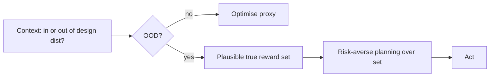

# Risk-Averse Reward Proxy

**Also known as:** Goodhart-Robust Optimisation, IRD-Based Conservatism

**Category:** Safety & Control  
**Status in practice:** experimental

## Intent

When operating outside the distribution the reward was designed for, treat the specified objective as a noisy proxy and plan conservatively across plausible true objectives.

## Context

An agent's reward (prompt, scoring function, fine-tune signal) was designed against a specific training or testing distribution. The agent now operates in a novel situation: a new domain, new user type, new task shape. The reward continues to score outputs, but its mapping to what the designer would have wanted in this novel context is no longer reliable.

## Problem

An aggressive optimiser will maximise the literal proxy in the novel situation and find degenerate solutions the designer never intended. Reward hacking, specification gaming, and Goodhart's law all live here. The agent's confidence in its reward is unwarranted because the reward was not designed for this context, yet standard optimisation does not represent this uncertainty.

## Forces

- Reward design assumes a distribution; novel distributions break the assumption.
- Aggressive optimisation finds degenerate maxima that the designer would reject.
- Conservative planning across plausible objectives sacrifices performance on the literal proxy.
- Detecting 'out of distribution' is itself an open problem.

## Applicability

**Use when**

- The agent regularly encounters contexts outside the reward's design distribution.
- Specification gaming or reward hacking in novel contexts is a real risk.
- Engineering capacity exists to construct a plausible-reward set or posterior.

**Do not use when**

- Deployment distribution is fixed and matches the reward design distribution.
- Cost of conservatism on the literal proxy is unacceptable for the product.
- Plausible-reward construction would be a fiction — no honest set can be built.

## Therefore

Therefore: when out of the reward's design distribution, plan to score acceptably across plausible true objectives consistent with the proxy, rather than maximising the literal proxy.

## Solution

Following Inverse Reward Design: treat the designed reward as an observation about the true reward under the design distribution. In a novel context, maintain a set (or posterior) of true rewards consistent with that observation. Plan risk-averse over the set — prefer actions whose worst-case (or low-quantile) value across plausible true rewards is acceptable, rather than actions that maximise expected value under the literal proxy. Direct mitigation against specification gaming in deployment shift.

## Example scenario

A scoring rubric for a writing-assistant agent was tuned on press-release output. The agent is then used on a novel context — drafting a difficult internal HR memo. The reward score still fires, but its mapping to 'what the designer would judge as good in this context' is unreliable. The agent plans conservatively across plausible true rubrics, declining to generate text whose worst-case interpretation across plausible rubrics is unacceptable.

## Diagram

## Consequences

**Benefits**

- Directly limits reward-hacking exposure in novel contexts.
- Composes with preference-uncertain agents naturally.
- Makes 'distribution shift' a planning-time consideration, not just a monitoring one.

**Liabilities**

- Conservatism loses literal-proxy performance even when not needed.
- Set/posterior over true rewards is hard to construct honestly.
- Out-of-distribution detection is itself unreliable — the pattern may activate too rarely or too often.

## What this pattern constrains

The literal proxy reward must not be optimised aggressively when the agent is out of the reward's design distribution; risk-averse planning over plausible true rewards is required.

## Known uses

- **Inverse Reward Design experiments (Hadfield-Menell et al., NeurIPS 2017)** — *Available* — <https://arxiv.org/abs/1711.02827>
- **Alignment-research deployments exploring IRD-like conservatism** — *Available*

## Related patterns

- *complements* → [preference-uncertain-agent](preference-uncertain-agent.md)
- *complements* → [soft-optimization-cap](soft-optimization-cap.md)
- *alternative-to* → [reward-hacking](reward-hacking.md)
- *complements* → [confidence-reporting](confidence-reporting.md)

## References

- (paper) *Inverse Reward Design*, Hadfield-Menell, Milli, Abbeel, Russell, Dragan, 2017, <https://arxiv.org/abs/1711.02827>
- (book) *Human Compatible*, Stuart Russell, 2019, <https://www.penguinrandomhouse.com/books/566677/human-compatible-by-stuart-russell/>

**Tags:** alignment, safety, robustness
