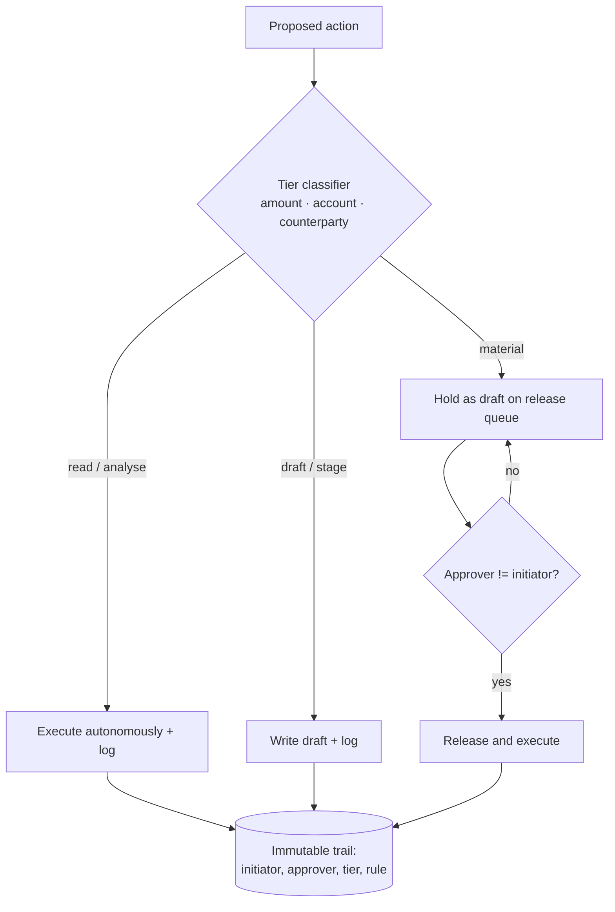

# Risk-Tiered Action Autonomy

**Also known as:** Maker-Checker Agent Boundary, Segregation-of-Duties Action Gate, Four-Eyes Action Release

**Category:** Safety & Control
**Status in practice:** emerging

## Intent

Set an agent's permitted action class by the financial materiality of the action, letting it read and draft freely while requiring a different human principal to release material postings, payments, or filings.

## Context

An agent operates inside a financial system of record — an ERP, accounting suite, treasury, or payments platform — where actions range from harmless reads to irreversible movements of money. Regulators and internal controls already require that the person who initiates a financial transaction is not the person who approves it, and that material postings leave an audit trail. The agent is fast and tireless at the low-risk end of this range and genuinely dangerous at the high-risk end, and the same model produces both kinds of action.

## Problem

Treating autonomy as a single switch forces a bad choice: granted wholesale, the agent can post journals, release payments, or file returns on its own, collapsing the segregation of duties that controls depend on; withheld wholesale, every trivial reconciliation waits on a human and the agent is not worth running. A single global approval step does not help either, because it makes a human rubber-stamp thousands of low-risk drafts while giving a high-value payment the same shallow glance. Worse, if the human approver is the same identity that launched the agent, the four-eyes control exists only on paper.

## Forces

- Low-risk, high-volume actions are where the agent pays for itself, and gating them all on a human destroys that value.
- High-risk, low-volume actions are where an error is expensive or irreversible, and skipping a human is unacceptable.
- Segregation of duties requires that the approver be a different principal from the initiator, which a single-operator agent setup quietly violates.
- Materiality is the dimension regulators and auditors reason about, but it is not the same as token cost or model confidence.
- Approval fatigue makes a uniform gate worse than useless: reviewers stop reading when most of what they see is trivial.

## Therefore

Therefore: classify each proposed action by materiality and route it to a tier — execute autonomously, execute with logging, or hold for release — and require that the release of a material action be performed by a human principal distinct from the one who initiated the agent, so autonomy scales with risk and segregation of duties is enforced structurally rather than assumed.

## Solution

Define a small set of risk tiers over the action surface, keyed on materiality rather than on cost or model confidence: for example read and analyse freely, draft and stage with full logging, and hold-for-release for anything that moves money or alters the books above a threshold. Classify every proposed action into a tier before it executes, using deterministic rules — amount thresholds, account sensitivity, counterparty, jurisdiction — rather than the model's own judgement of its risk. Actions in the autonomous tiers run and are logged; actions in the release tier are written as drafts and placed on a queue that only a human can clear. Bind that release step to a different identity than the one that initiated the agent run, so the maker (agent plus its operator) and the checker (the approver) are structurally separate. Record initiator, approver, tier, and the rule that set the tier in an immutable trail so the control is auditable after the fact.

## Structure

```
Proposed action --> tier classifier (deterministic: amount, account, counterparty) --> {autonomous: execute + log | staged: draft + log | release: draft + approval queue}. Release queue --(cleared by approver != initiator)--> execute. Trail records {initiator, approver, tier, rule}.
```

## Diagram



*Each action is tiered by materiality; only the material tier is held, and its release requires a human principal distinct from the agent's initiator.*

## Example scenario

A finance team runs an agent in its ERP to clear the accounts-payable backlog. The agent reads ledgers and reconciles freely; it codes and stages invoices as drafts with full logging; but any payment above a set amount, any new payee, or any cross-border transfer is held as a draft on an approval queue. A controller — signed in as a different user than the analyst who started the agent — reviews only those held items and releases them. Every release records who initiated, who approved, the tier the action landed in, and the rule that put it there, so an auditor can later confirm that no material payment moved without two distinct people.

## Consequences

**Benefits**

- Autonomy is high where it is safe and bounded where it is costly, instead of one global setting that is wrong at both ends.
- Segregation of duties holds by construction because the release identity is structurally distinct from the initiator.
- Reviewers spend attention on the few material actions instead of rubber-stamping trivial drafts.
- The materiality rule that set each tier is recorded, so an auditor can replay why an action ran on its own or waited for a human.

**Liabilities**

- Defining materiality tiers and thresholds is domain work the finance or controls function must own, not engineering.
- A mis-tuned threshold either leaks a material action into an autonomous tier or floods the release queue and revives approval fatigue.
- Enforcing approver-distinct-from-initiator requires real identity and role data a thin single-operator deployment may not have.
- The release queue adds latency to exactly the actions that are most time-sensitive, such as a payment near a cut-off.

## What this pattern constrains

The agent must not execute any action classified into the release tier without an explicit clearance from a human principal whose identity differs from the initiator of the agent run; it must not select or downgrade its own risk tier; and a material action whose tier cannot be determined must be held rather than executed.

## Guardrails

- Self-tiering block — the agent cannot set or lower its own action's tier
- Indeterminate-tier hold — an action whose tier cannot be computed is held, not executed

## Applicability

**Use when**

- The agent's actions span a wide range of financial materiality, from harmless reads to irreversible payments.
- Controls or regulation require that the approver of a material action differ from its initiator.
- A uniform approval gate would either bottleneck low-risk volume or rubber-stamp high-risk actions.
- Materiality can be decided by deterministic rules such as amount, account, counterparty, or jurisdiction.

**Do not use when**

- Every action the agent can take is low-stakes and reversible, so a single autonomy setting is enough.
- There is no second human identity available to act as checker, making segregation of duties impossible to enforce.
- The action surface is uniform in risk, so tiering adds machinery without separating anything.

## Components

- Tier classifier — deterministic rules mapping an action to a risk tier by amount, account, and counterparty
- Action tiers — the small fixed set (autonomous, staged, hold-for-release) the surface is partitioned into
- Release queue — holds material drafts until a human clears them
- Approver identity — a principal distinct from the agent's initiator who releases held actions
- Audit trail — immutable record of initiator, approver, tier, and the rule that set the tier

## Tools

- Approval queue / inbox — surface where a human reviews and releases held actions
- Identity and role directory — supplies initiator and approver identities to enforce separation
- Immutable log store — append-only trail for replay and audit of every release decision

## Evaluation metrics

- Maker-checker violation rate — material actions released by the initiating identity; the target is zero
- Tier-misclassification rate — material actions routed to an autonomous tier, caught in audit
- Release-queue dwell time — latency added to held actions, watched against payment cut-offs
- Reviewer load — held items per approver per day, a proxy for approval fatigue

## Known uses

- **[Stampli](https://www.stampli.com/blog/ap-automation/ai-agents-in-finance/)** — *Available* — Accounts-payable agents draft and code invoices while human approvers retain release of payments, aligned to segregation of duties.
- **[SafePaaS](https://www.safepaas.com/ai-governance/how-to-govern-ai-access-to-erp-and-financial-systems/)** — *Available* — Governs agent access to ERP and financial systems with an approval matrix and segregation-of-duties rules.
- **[Finmatics](https://www.finmatics.com/)** — *Available* — Assisted-accounting agents propose postings for SAP that a human checks and releases under the four-eyes principle.

## Related patterns

- *alternative-to* → [cost-aware-action-delegation](cost-aware-action-delegation.md) — Cost-aware delegation tiers actions by token or compute cost; this pattern tiers them by financial materiality and adds the approver-distinct-from-initiator constraint.
- *complements* → [autonomy-slider](autonomy-slider.md) — An autonomy slider is a continuous global knob; risk-tiering is a discrete, per-action partition with a release gate at the top.
- *complements* → [progressive-delegation](progressive-delegation.md) — Progressive delegation ratchets autonomy on a success-rate window; this keys the ceiling on materiality instead of track record.
- *complements* → [approval-queue](approval-queue.md) — The release tier uses an approval queue, but adds that the clearing identity must differ from the initiator.
- *complements* → [human-in-the-loop](human-in-the-loop.md) — Human-in-the-loop is the mechanism; risk-tiering decides which tier of action it is mandatory for.
- *complements* → [session-scoped-payment-authorization](session-scoped-payment-authorization.md) — Payment authorization is a concrete high-materiality action that lands in the release tier.
- *complements* → [policy-as-code-gate](policy-as-code-gate.md) — A policy engine can express the deterministic materiality rules that set each action's tier.
- *complements* → [compensating-action](compensating-action.md) — When a staged action turns out wrong after execution, a compensating action reverses it; the release gate keeps the worst actions from auto-executing in the first place.
- *complements* → [canonical-entity-grounding](canonical-entity-grounding.md) — In an ERP the agent grounds the entities a draft references before that draft is staged for release.

## References

- (blog) integral, *KI in der Buchhaltung: Wie sich Buchführung durch künstliche Intelligenz verändert*, 2026, <https://www.integral.de/de/ratgeber/ki-buchhaltung>
- (blog) Teradata, *AI Agents for Financial Analysis: Use Cases, Workflows, Guardrails*, 2026, <https://www.teradata.com/insights/ai-and-machine-learning/ai-agent-financial-analysis>
- (blog) SafePaaS, *How to Govern AI Access to ERP and Financial Systems*, 2026, <https://www.safepaas.com/ai-governance/how-to-govern-ai-access-to-erp-and-financial-systems/>
- (blog) AWS Security Blog, *Preparing for agentic AI: a financial services approach*, 2026, <https://aws.amazon.com/blogs/security/preparing-for-agentic-ai-a-financial-services-approach/>

**Tags:** segregation-of-duties, maker-checker, four-eyes, autonomy, safety-control, finance, erp, approval
