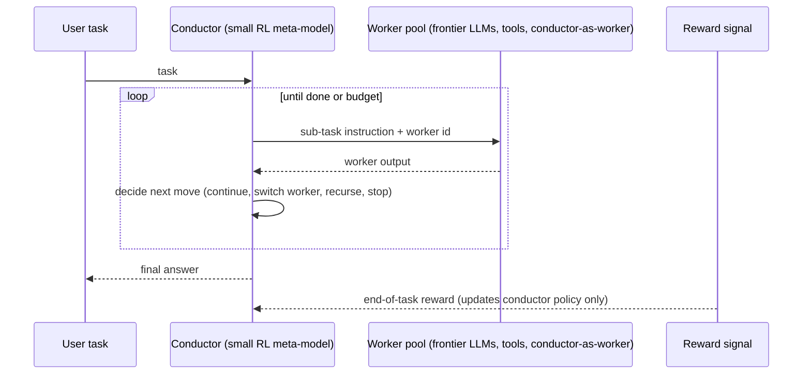

# RL-Trained Conductor Orchestrator

**Also known as:** 指揮者モデル, Trained Conductor, Fugu Conductor, Self-Calling Orchestrator

**Category:** Multi-Agent
**Status in practice:** emerging

## Intent

Train a small meta-model with reinforcement learning to dynamically dispatch sub-tasks across a pool of frontier LLM workers, learning the communication topology end-to-end rather than hard-coding routing, and allowing the conductor to recursively invoke itself as a worker.

## Context

Production multi-agent stacks that route sub-tasks to a heterogeneous pool of frontier models (different vendors, sizes, specialisations) plus tools. The routing logic is usually a tree of hand-written rules and prompt-time hints. Tasks span many domains, and no single hand-coded routing tree generalises well across them.

## Problem

Hand-coded orchestrator logic does not generalise. Static heuristics for which model gets which sub-task miss task-specific signals and grow stale as the worker pool changes. A frontier model used as the orchestrator is expensive on every step and still does not learn from the reward signal of finished tasks. There is no obvious place for the system to improve its own decomposition strategy from experience.

## Forces

- Routing decisions are task-dependent and the right worker for a sub-task is not knowable from static rules alone.
- Frontier models are expensive to use as the always-on orchestrator on every dispatch step.
- The worker pool changes — new models arrive, old ones are deprecated — and hand-coded routing must be rewritten each time.
- Reward signal from task outcomes is available but unused by static orchestration.
- Some sub-tasks are themselves decomposable, so the orchestrator must be able to recurse without infinite expansion.

## Therefore

Therefore: train a small meta-model end-to-end with reinforcement learning to emit natural-language sub-task instructions, choose a worker from the pool for each instruction, and recursively call itself when a sub-task is itself decomposable, so the communication topology is learned from task rewards rather than hand-coded.

## Solution

A small conductor model (often in the 7B–13B range) sits in front of a pool of worker LLMs and tools. On each step the conductor emits a natural-language sub-task instruction and a worker selection; the worker is run, its output returned, and the conductor decides the next move. The conductor is trained with reinforcement learning against final task rewards: it learns which workers handle which sub-task shapes, how to phrase the hand-off, when to stop, and when to recursively dispatch a sub-task back to itself as a worker. Recursion is bounded by a depth limit and a step budget. Workers remain frozen frontier models; only the conductor is trained.

## Structure

```
User task -> Conductor (small RL-trained meta-model) -> (sub-task instruction, worker id) -> Worker pool {frontier LLMs, tools, conductor-as-worker} -> worker output -> Conductor next step ... -> final answer. Reward from task outcome flows back into the conductor's policy only.
```

## Diagram



*A small RL-trained conductor dispatches sub-tasks across frozen frontier workers; only the conductor learns.*

## Example scenario

A product routes user tasks across four frontier models plus a code-execution tool. The team replaces its rule-based router with a 7B conductor trained on six months of task outcomes. The conductor learns that long-context summarisation goes to one vendor, code synthesis to another, image understanding to a third, and that some research tasks should be broken into three sub-tasks where the conductor recursively calls itself as the second-level planner. Average cost-per-task drops, and routing improves without anyone editing rules.

## Consequences

**Benefits**

- Routing improves from experience instead of by hand-editing rules.
- Cheap meta-model on the hot path; frontier models are only called as workers when the conductor selects them.
- Recursive self-dispatch handles decomposable sub-tasks without a separate planner agent.
- Worker pool churn is absorbed by retraining the conductor rather than rewriting routing logic.

**Liabilities**

- Requires a reward signal and an RL training pipeline, which most teams do not have in-house.
- Conductor policy can be opaque; a learned routing tree is harder to audit than a written one.
- Recursive self-dispatch needs strict depth and budget caps or it can fan out aggressively.
- Worker drift (a vendor updates a model) silently changes the policy's effective action semantics.

## What this pattern constrains

The conductor must respect a hard recursion-depth cap and a step budget on every task, must emit explicit sub-task instructions and worker selections rather than free-form thoughts, and must not invoke workers outside the registered pool — including its own untrained ancestor models.

## Applicability

**Use when**

- A heterogeneous frontier-model worker pool is in production and routing matters.
- Task-outcome rewards are observable at scale.
- An RL training pipeline (or partner) is available.

**Do not use when**

- Routing is dominated by one model and a static cascade suffices.
- Reward signal is not available or is too noisy to learn from.
- Audit and explainability requirements demand human-readable routing rules.

## Known uses

- **[Sakana AI Fugu](https://sakana.ai/fugu-beta/)** — *Available* — Commercial RL-trained conductor orchestrating across frontier LLM workers; beta announced April 2026.
- **[Sakana AI Conductor + Trinity](https://sakana.ai/learning-to-orchestrate/)** — *Available* — Research line on learning to orchestrate, accepted at ICLR 2026.

## Related patterns

- *specialises* → [orchestrator-workers](orchestrator-workers.md) — Specialises orchestrator-workers with an RL-trained meta-model instead of rule-based routing.
- *alternative-to* → [multi-model-routing](multi-model-routing.md) — Multi-model-routing uses static cascades or heuristics; this pattern learns the routing policy.
- *alternative-to* → [mixture-of-experts-routing](mixture-of-experts-routing.md) — MoE routing selects experts inside one model; this pattern routes across whole frontier models.
- *complements* → [agent-as-tool-embedding](agent-as-tool-embedding.md) — Workers in the pool may themselves be agents wrapped as tools.

## References

- (blog) Sakana AI, *Learning to Orchestrate*, 2025, <https://sakana.ai/learning-to-orchestrate/>
- (blog) Sakana AI, *Fugu beta*, 2026, <https://sakana.ai/fugu-beta/>

**Tags:** multi-agent, orchestration, reinforcement-learning, routing, self-recursion
