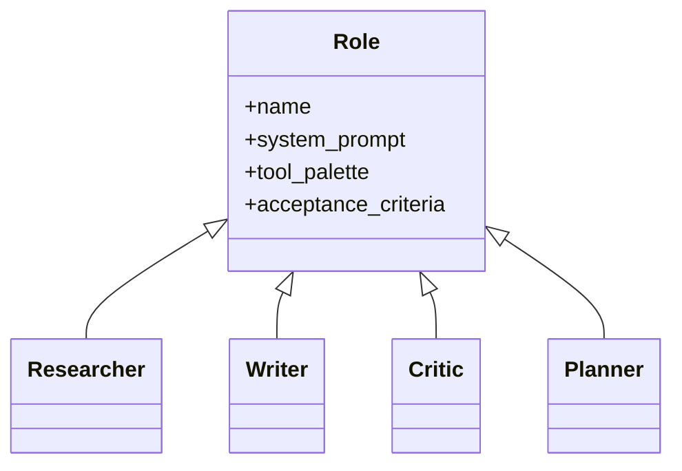

# Role Assignment

**Also known as:** Persona Roles, Agent Crew, Specialist Roles

**Category:** Multi-Agent  
**Status in practice:** mature

## Intent

Assign each agent a named role (researcher, writer, critic, planner) with a role-specific prompt, tool palette, and acceptance criteria.

## Context

Multi-agent systems where personas need to be distinct enough that the user (and the system) can reason about who did what.

## Problem

Generic agents drift toward similarity; without explicit roles, contributions blur and review becomes hard.

## Forces

- Role definitions can ossify into bureaucracy.
- Cross-role handoffs need typed contracts.
- Role count multiplies prompt-engineering effort.

## Applicability

**Use when**

- Multiple agents collaborate and the user needs to reason about who did what.
- Different parts of the workflow have distinct responsibilities, tools, and acceptance criteria.
- Generic agents have been observed drifting toward similarity or duplicating effort.

**Do not use when**

- A single agent with one prompt already handles the workflow well.
- Roles would be artificial and add prompt overhead without separating concerns.
- The team cannot articulate distinct responsibilities and acceptance criteria per role.

## Therefore

Therefore: give each agent a named role with a scoped prompt, a scoped tool palette, and explicit acceptance criteria for its outputs, so that contributions are attributable and review focuses on the role boundary.

## Solution

Define each role with a system prompt naming its responsibility and constraints, a tool palette scoped to its role, and acceptance criteria for outputs it produces. Workflow assigns tasks to roles. Outputs are evaluated against the role's acceptance criteria.

## Example scenario

A multi-agent content pipeline with three identical generic agents keeps producing similar bland outputs and reviewers cannot tell whose work to trust. The team gives each agent a named role with role-specific prompt and a scoped tool palette: researcher (search-only), writer (draft tools), critic (lint and policy tools). Outputs become identifiable, review focuses on the role boundary, and disagreement between writer and critic surfaces as a productive signal rather than confusion.

## Diagram

## Consequences

**Benefits**

- Outputs are attributable and reviewable per role.
- Specialisation improves quality on each role's task.

**Liabilities**

- Bureaucratic overhead.
- Role drift over long sessions.

## What this pattern constrains

An agent operates only within its role's constraints and tool palette; cross-role action is forbidden.

## Known uses

- **CrewAI** — *Available*
- **AutoGen named agents** — *Available*

## Related patterns

- *complements* → [supervisor](supervisor.md)
- *alternative-to* → [inner-committee](inner-committee.md)
- *complements* → [handoff](handoff.md)
- *complements* → [mixture-of-experts-routing](mixture-of-experts-routing.md)
- *complements* → [autogen-conversational](autogen-conversational.md)
- *generalises* → [camel-role-playing](camel-role-playing.md)
- *used-by* → [sop-encoded-multi-agent](sop-encoded-multi-agent.md)
- *specialises* → [dynamic-expert-recruitment](dynamic-expert-recruitment.md)
- *used-by* → [cross-domain-agent-network](cross-domain-agent-network.md)

## References

- (doc) *CrewAI docs*, <https://docs.crewai.com>

**Tags:** multi-agent, roles, crew
