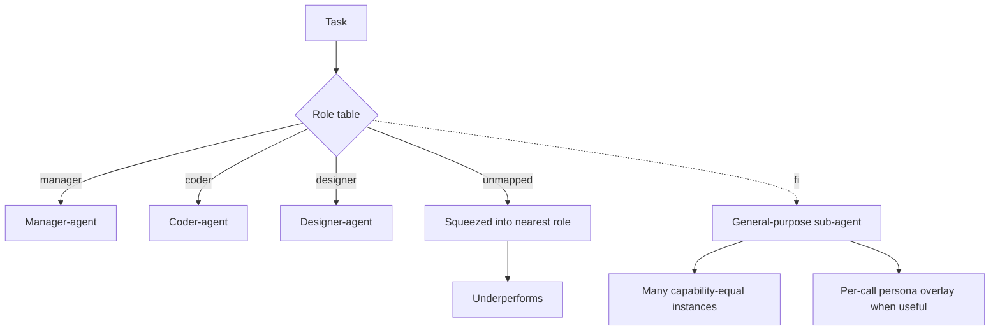

# Role-Typed Subagents

**Also known as:** Predefined-Role Multi-Agent, Manager-Coder-Designer Layout, Fixed-Role Crew

**Category:** Anti-Patterns  
**Status in practice:** deprecated

## Intent

Anti-pattern: pre-allocate roles (manager, coder, designer, researcher) across a fixed set of typed sub-agents and route tasks to them by role label.

## Context

A team is designing a multi-agent system and, before seeing real workloads, decides on a fixed set of roles — typically manager, researcher, coder, designer, reviewer — and gives each role its own narrow system prompt and restricted tool palette. The orchestrator routes each task to a sub-agent by matching the task to a role label. The architecture diagram looks like clean separation of concerns, and each specialist agent is cheaper per call than a general-purpose one.

## Problem

Real workloads do not partition cleanly into the roles the architect imagined in advance. Tasks that fall between two roles get squeezed into whichever label is closest, and the chosen specialist underperforms because its tool palette is missing what the task actually needs. Adding a new role means changing the architecture rather than parameters, and capability-equal parallelism — running many fully capable, identical sub-agents in parallel on the same subtask — is structurally impossible because no sub-agent has the full tool set.

## Forces

- Role labels make the architecture diagrammable and look like sound separation of concerns.
- Cheaper per-call specialised prompts can outperform a single generalist on narrow tasks.
- Real workloads do not partition cleanly into the roles you guessed in advance.
- Capability-equal fan-out (clone-fan-out-research) requires general-purpose sub-agents, which a typed role table forbids.

## Applicability

**Use when**

- Cite this entry when a design pre-allocates manager/coder/designer/researcher agents and routes by label.
- You are already here if tasks outside the anticipated role table have nowhere to go, or role agents idle while one is the bottleneck.
- Use one general-purpose sub-agent shape and scope specialisation per call (system-prompt overlay, tool subset).

**Do not use when**

- The task space is well-understood and stable across roles — even then, per-call overlays beat baked-in role types.
- Capability-equal parallelism (many identical agents working in parallel) is on the roadmap.
- The architecture is expected to grow new task shapes over time.

## Therefore

Therefore: prefer general-purpose sub-agents with the full tool palette over a fixed role table, so that the system can decompose tasks the architect did not anticipate and can run capability-equal parallel instances against the same subtask.

## Solution

Don't bake role types into the architecture. Use one general-purpose sub-agent shape with the full tool palette and let the orchestrator route by task content, not role label. When specialisation pays, scope it per-call (system-prompt overlay, tool subset for this task) rather than per-agent-type. For wide tasks, prefer capability-equal fan-out over typed crews. See clone-fan-out-research, role-assignment (the valid form: per-call persona, not per-agent type), supervisor.

## Example scenario

A team builds a multi-agent product with manager, researcher, coder, and designer sub-agents, each with its own tightly scoped tool palette. A new task type — multilingual marketing copy with light data analysis — fits none of the roles, so it is forced into the researcher role and underperforms. The team rewrites the system: one general-purpose sub-agent shape with the full tool palette, and a per-call system-prompt overlay when specialisation pays. The marketing task now succeeds; a later wide-research task fans out twenty capability-equal instances against the same prompt, which the typed crew could not have done.

## Diagram

## Consequences

**Liabilities**

- Tasks outside the foreseen role table get squeezed into the nearest label.
- Capability-equal parallelism is impossible by construction.
- Adding a new role requires re-architecting rather than parameter changes.
- The role labels invite team boundaries (the coder agent's team, the designer agent's team) that ossify the system.

## What this pattern constrains

Avoiding it forbids baking the org chart into the architecture: sub-agent capability must not be fixed by role label; specialisation belongs in per-call overlays, not in a static typology the orchestrator routes by.

## Known uses

- **Manus Wide Research (named as a deliberate design rejection)** — Manus contrasts Wide Research with traditional predefined-roles multi-agent systems; every Wide Research sub-agent is a fully capable, general-purpose Manus instance. *Available* — [link](https://manus.im/blog/introducing-wide-research)

## Related patterns

- *alternative-to* → [clone-fan-out-research](clone-fan-out-research.md)
- *alternative-to* → [role-assignment](role-assignment.md)
- *alternative-to* → [supervisor](supervisor.md)
- *complements* → [orchestrator-workers](orchestrator-workers.md)

## References

- *blog*: [Introducing Wide Research](https://manus.im/blog/introducing-wide-research) — Manus, 2025

**Tags:** anti-pattern, multi-agent, role-typing, manus
