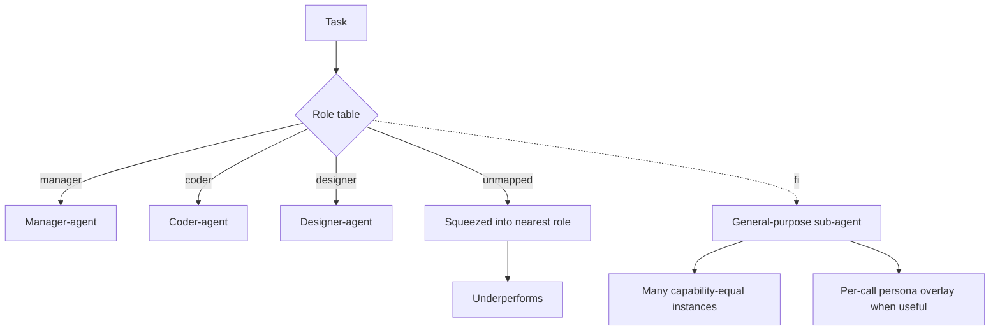

# Role-Typed Subagents

**Also known as:** Predefined-Role Multi-Agent, Manager-Coder-Designer Layout, Fixed-Role Crew

**Category:** Anti-Patterns  
**Status in practice:** deprecated

## Intent

Anti-pattern: pre-allocate roles (manager, coder, designer, researcher) across a fixed set of typed sub-agents and route tasks to them by role label.

## Context

Multi-agent designs where the architect decides up-front which roles exist and assigns each sub-agent a narrow system prompt and tool palette tied to that role.

## Problem

The fixed role table constrains the system to whatever decomposition the architect anticipated; tasks that do not fit a named role are forced into the closest one, and capability-equal parallelism (running many full-capability instances against the same task) is structurally unavailable.

## Forces

- Role labels make the architecture diagrammable and look like sound separation of concerns.
- Cheaper per-call specialised prompts can outperform a single generalist on narrow tasks.
- Real workloads do not partition cleanly into the roles you guessed in advance.
- Capability-equal fan-out (clone-fan-out-research) requires general-purpose sub-agents, which a typed role table forbids.

## Applicability

**Use when**

- Never as the architectural backbone; role labels are not a free lunch.
- Treat persona prompts as per-call overlays on general-purpose sub-agents, not as a fixed agent typology.
- When tempted to add a new typed sub-agent, ask first whether a general-purpose sub-agent with a per-call overlay would do.

**Do not use when**

- The task space is well-understood and stable across roles — even then, per-call overlays beat baked-in role types.
- Capability-equal parallelism (many identical agents working in parallel) is on the roadmap.
- The architecture is expected to grow new task shapes over time.

## Therefore

Therefore: prefer general-purpose sub-agents with the full tool palette over a fixed role table, so that the system can decompose tasks the architect did not anticipate and can run capability-equal parallel instances against the same subtask.

## Solution

Don't bake role types into the architecture. Use one general-purpose sub-agent shape with the full tool palette and let the orchestrator route by task content, not role label. When specialisation pays, scope it per-call (system-prompt overlay, tool subset for this task) rather than per-agent-type. For wide tasks, prefer capability-equal fan-out over typed crews. See clone-fan-out-research, role-assignment (the valid form: per-call persona, not per-agent type), supervisor.

## Example scenario

A team builds a multi-agent product with manager, researcher, coder, and designer sub-agents, each with its own tightly scoped tool palette. A new task type — multilingual marketing copy with light data analysis — fits none of the roles, so it is forced into the researcher role and underperforms. The team rewrites the system: one general-purpose sub-agent shape with the full tool palette, and a per-call system-prompt overlay when specialisation pays. The marketing task now succeeds; a later wide-research task fans out twenty capability-equal instances against the same prompt, which the typed crew could not have done.

## Diagram

## Consequences

**Liabilities**

- Tasks outside the foreseen role table get squeezed into the nearest label.
- Capability-equal parallelism is impossible by construction.
- Adding a new role requires re-architecting rather than parameter changes.
- The role labels invite team boundaries (the coder agent's team, the designer agent's team) that ossify the system.

## What this pattern constrains

By definition, this anti-pattern imposes no useful constraint; the constraint it adds — fixed role membership — forbids capability-equal parallelism and tasks outside the anticipated role table.

## Known uses

- **Manus Wide Research (named as a deliberate design rejection)** — Manus contrasts Wide Research with traditional predefined-roles multi-agent systems; every Wide Research sub-agent is a fully capable, general-purpose Manus instance. *Available* — [link](https://manus.im/blog/introducing-wide-research)

## Related patterns

- *alternative-to* → [clone-fan-out-research](clone-fan-out-research.md)
- *alternative-to* → [role-assignment](role-assignment.md)
- *alternative-to* → [supervisor](supervisor.md)
- *complements* → [orchestrator-workers](orchestrator-workers.md)

## References

- *blog*: [Introducing Wide Research](https://manus.im/blog/introducing-wide-research) — Manus, 2025

**Tags:** anti-pattern, multi-agent, role-typing, manus
