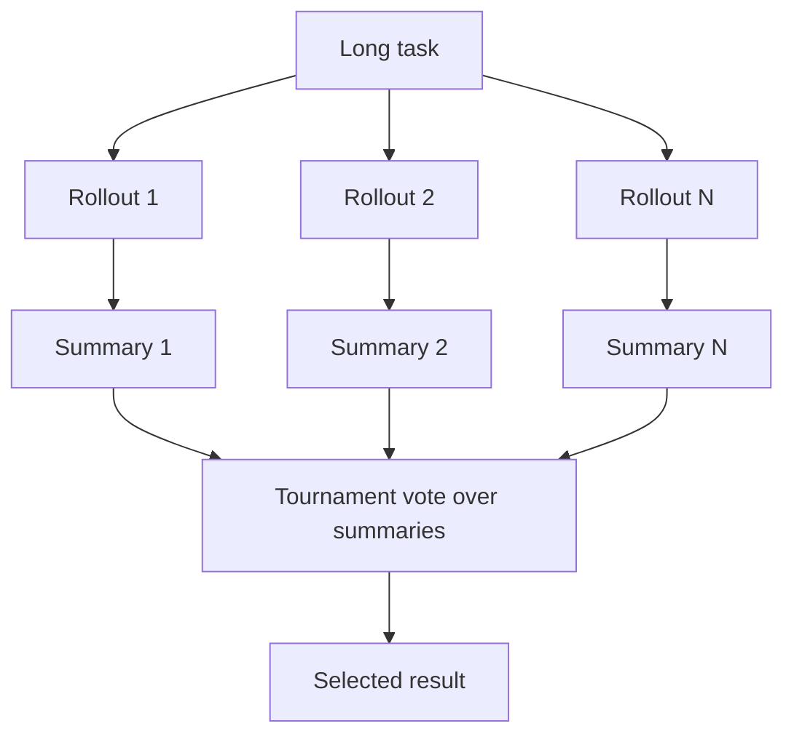

# Trajectory-Summary Test-Time Scaling

**Also known as:** Rollout-Summary Scaling, Recursive Tournament Voting

**Category:** Reasoning  
**Status in practice:** experimental

## Intent

When an agent's outputs are extended action-observation trajectories rather than short answers, scale test-time compute by compressing each rollout into a structured summary and selecting or reusing across those summaries instead of raw traces.

## Context

Test-time scaling improves quality by spending more inference compute — sampling several attempts, voting, or searching — and it works cleanly when each attempt is a short, directly comparable answer. Long-horizon agents break that assumption: a single attempt is a trajectory of dozens of tool calls and observations, far too long to compare verbatim and too noisy to majority-vote token by token. There is still good reason to spend more compute to raise success rates on these long tasks.

## Problem

Best-of-N and self-consistency assume the candidates are short outputs that a reward model can rank or a vote can aggregate. A hundred-step trajectory is neither: its salient content — the hypotheses tried, the progress made, the dead ends — is buried in low-signal trace detail, so naive ranking compares noise and naive voting has nothing to count. Without a comparable representation, extra rollouts add cost but not a reliable way to pick or combine the best one.

## Forces

- Spending more rollouts raises the chance one of them succeeds, but only if there is a reliable way to identify or combine the good ones.
- A trajectory's decision-relevant content is a small fraction of its tokens, so comparing or voting over raw traces drowns the signal.
- Compressing a rollout to a summary risks discarding the very detail that distinguishes a good attempt from a plausible-looking bad one.
- Sequential reuse (re-rolling conditioned on prior summaries) and parallel selection (voting across summaries) need the same summary representation but spend compute differently.

## Therefore

Therefore: make the unit of test-time scaling a structured summary of each rollout — its hypotheses, progress, and failures — and select across summaries by tournament voting or condition new rollouts on them, rather than ranking or voting over raw trajectories.

## Solution

Run several rollouts of the long task, and convert each into a structured summary that keeps its salient hypotheses, progress, and failure modes while shedding low-signal trace detail. Scale in two directions over these summaries. For parallel scaling, compare summaries against each other — for example by recursive tournament voting — to select the strongest attempt without ever diffing raw traces. For sequential scaling, feed the summaries of earlier rollouts back in as conditioning so a fresh rollout starts from what previous attempts learned. The summary, not the trajectory, is the object that gets ranked, voted on, and carried forward, which makes long-horizon outputs comparable at a fraction of their token cost.

## Structure

```
N rollouts --summarise each--> structured summaries --(parallel) tournament vote / (sequential) condition re-rollout--> selected or improved result
```

## Diagram



*Each rollout is compressed to a structured summary; selection and reuse run over the summaries, not the raw trajectories.*

## Example scenario

A coding agent gets eight attempts at a hard multi-file bug. Each attempt is about eighty tool calls long, so the attempts cannot be compared directly. The system summarises each as 'tried X, fixed the import but tests still fail on the date parser' and runs a tournament over the summaries; the winner — the one whose summary shows passing tests — is returned, and its summary also seeds a ninth attempt that starts where it left off.

## Consequences

**Benefits**

- Long-horizon tasks gain the success-rate lift of test-time scaling that short-answer methods could not provide on trajectories.
- Comparing summaries instead of raw traces makes selection cheap enough to run many rollouts under a fixed budget.
- The same summary representation serves both parallel selection and sequential reuse, so one mechanism covers both scaling modes.

**Liabilities**

- A summary that omits a load-bearing detail can rank a worse attempt above a better one, so summary quality bounds the whole method.
- Producing structured summaries adds an extra model pass per rollout, spending some of the compute the scaling is meant to buy.
- Tournament or conditioning logic adds orchestration the short-answer baselines do not need.

## Failure modes

- Lossy summary — the compression drops the detail that distinguished the best rollout, so selection picks a weaker one.
- Summary homogenisation — distinct trajectories compress to near-identical summaries, collapsing the signal the vote needs.
- Conditioning lock-in — sequential reuse anchors every new rollout to an early summary's mistake.
- Budget inversion — the summarisation passes cost more than the extra rollouts gain.

## What this pattern constrains

Test-time selection and reuse operate only on the structured rollout summaries, never on the raw trajectories directly; a rollout cannot be ranked, voted on, or carried forward until it has been compressed into the summary representation.

## Applicability

**Use when**

- The task is long-horizon, so each attempt is a trajectory too long to compare or vote on verbatim.
- More inference compute is available and expected to raise success if the good attempts can be identified.
- A reliable summariser can capture an attempt's hypotheses, progress, and failures.

**Do not use when**

- Outputs are short, directly comparable answers, where best-of-N or self-consistency already apply.
- A single rollout reliably solves the task, so extra attempts add cost without benefit.
- No summariser can compress trajectories without dropping the detail that distinguishes success from failure.

## Components

- Rollout generator — produces several full trajectories for the long task
- Rollout summariser — compresses each trajectory into a structured summary of hypotheses, progress, and failures
- Tournament selector — compares summaries against each other to pick the strongest attempt for parallel scaling
- Conditioning loop — feeds earlier summaries back in to seed a fresh rollout for sequential scaling
- Budget controller — splits the compute between extra rollouts and the summarisation passes they require

## Tools

- Tool-calling LLM — runs the rollouts and produces the summaries
- Summary scorer or judge — ranks summaries during tournament voting
- Compute-budget accounting — tracks rollout and summarisation spend against the budget

## Evaluation metrics

- Long-horizon success rate vs a single-rollout baseline at equal compute — what the scaling buys
- Selection accuracy — how often the tournament picks the genuinely best rollout against an oracle check
- Summary overhead fraction — share of the compute spent on summarisation rather than rollouts
- Sequential lift — success gain from conditioning re-rollouts on prior summaries

## Known uses

- **[Scaling Test-Time Compute for Agentic Coding](https://arxiv.org/abs/2604.16529)** _pure-future_ — Converts each long coding rollout into a structured summary and selects via recursive tournament voting rather than diffing raw traces.
- **Memex(RL)** _pure-future_ — Frames long-horizon test-time scaling as represent-select-reuse over compressed rollout representations.

## Related patterns

- _specialises_ **Test-Time Compute Scaling** — The general principle is spend-more-inference-compute; this specialises it for outputs that are long trajectories rather than short answers.
- _alternative-to_ **Best-of-N Sampling** — Best-of-N ranks raw candidate outputs and picks one; here the ranked unit is a compressed trajectory summary, and reuse can re-roll from it.
- _alternative-to_ **Self-Consistency** — Self-consistency votes over short comparable answers; trajectories are not comparable verbatim, so the vote runs over their summaries.
- _complements_ **Episodic Summaries** — Both compress a trajectory to a summary; episodic-summaries does it to save memory cost, this does it to make rollouts selectable.
- _complements_ **Reasoning Trace Carry-Forward** — Carry-forward keeps a single trace within an episode; this carries a summary of a whole rollout across attempts for sequential scaling.

## References

- [Scaling Test-Time Compute for Agentic Coding](https://arxiv.org/abs/2604.16529) — 2026
