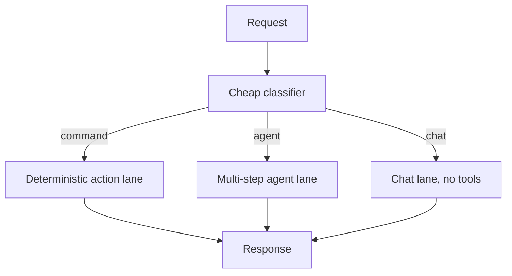

# Routing

**Also known as:** Mode Selector, Intent Classifier, Task Router

**Category:** Routing & Composition  
**Status in practice:** mature

## Intent

Classify an incoming request and dispatch it to the specialist (lane / agent / model) best suited to handle it.

## Context

An agent product receives a heterogeneous mix of incoming requests: short deterministic commands ("open settings"), open-ended chats with no tool use, and longer multi-step tasks that need a planner, retrieval, and several tool calls. Each kind of request benefits from a different prompt, a different tool palette, and sometimes a different model. The team has the option of building several specialist lanes behind a single front door.

## Problem

If every request goes through one all-purpose prompt that can handle the hardest case, the cheap and simple requests over-pay on tokens and latency for capabilities they never use. If every request goes through a prompt tuned for cheap cases, the complex requests are stuck without the planning and tools they need and the product feels incompetent on anything non-trivial. A single shared prompt forces the team to pay for the worst case on every request or under-serve the hard cases.

## Forces

- Routing itself costs a model call.
- Misrouting can be worse than not routing at all.
- The router needs visibility into capabilities of each downstream specialist.

## Applicability

**Use when**

- Traffic is heterogeneous and different requests benefit from different prompts or models.
- A single all-purpose prompt is over-paying for cheap requests or under-serving complex ones.
- A lightweight classifier can produce a stable label cheaply.

**Do not use when**

- All requests look alike and a single specialist already serves them well.
- Misrouting cost is high and the classifier cannot meet the required accuracy.
- Latency budget cannot accommodate an extra classifier hop.

## Therefore

Therefore: put a cheap classifier in front that labels each request and dispatches it to the specialist lane built for that label, so that traffic pays the price and gets the depth that matches its kind.

## Solution

A lightweight classifier model (often the cheapest available) returns a label. The host dispatches the request to the specialist for that label. Common lanes: command (deterministic action), agent (multi-step), chat (no tools).

## Example scenario

A help-desk product handles cheap FAQ lookups and rare deep-research queries through one expensive prompt; per-query cost is irrational. The team puts a small classifier in front: it returns one of `command`, `agent`, `research`, `human` and the host dispatches to the right lane. Eighty percent of traffic lands in the cheap deterministic command lane, the heavy agent only runs when needed, and average per-query cost falls by an order of magnitude.

## Diagram

## Consequences

**Benefits**

- Cheap requests pay cheap prices.
- Each lane can be tuned in isolation.

**Liabilities**

- Two-call latency on every request.
- Lane definitions ossify; reclassification is hard once users learn the lanes.

## What this pattern constrains

A request gets exactly one lane; downstream specialists cannot accept work outside their declared lane.

## Known uses

- **Bobbin (Stash2Go)** — *Available*. mode_selector classifies intent into command / agent / chat.
- **Anthropic Building Effective Agents (Workflow #2)** — *Available*

## Related patterns

- *generalises* → [multi-model-routing](multi-model-routing.md)
- *used-by* → [supervisor](supervisor.md)
- *generalises* → [mixture-of-experts-routing](mixture-of-experts-routing.md)
- *complements* → [fallback-chain](fallback-chain.md)
- *used-by* → [dynamic-scaffolding](dynamic-scaffolding.md)
- *alternative-to* → [hero-agent](hero-agent.md)
- *used-by* → [disambiguation](disambiguation.md)
- *complements* → [prompt-chaining](prompt-chaining.md)
- *used-by* → [tool-loadout](tool-loadout.md)

## References

- (blog) *Anthropic: Building Effective Agents*, 2024, <https://www.anthropic.com/research/building-effective-agents>

**Tags:** routing, classifier
