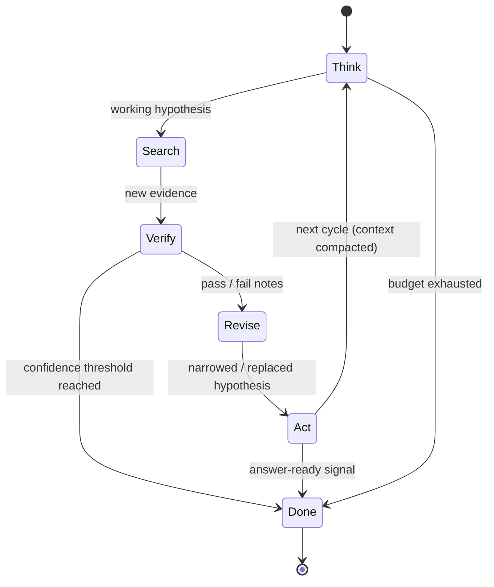

# Rumination Agent

**Also known as:** 沉思, Rumination Loop, Long-Horizon Research Loop, Hypothesis-Revising Agent

**Category:** Planning & Control Flow
**Status in practice:** emerging

## Intent

Run a single agent through a protracted think-search-verify-revise-act loop spanning hundreds of tool calls, autonomously re-formulating hypotheses across the run.

## Context

Open-ended research, deep-investigation, and long-horizon analysis tasks where a single short ReAct loop or a one-shot plan is too shallow. The agent has access to retrieval, browsing, and code-execution tools and is expected to spend minutes-to-hours on a single question.

## Problem

Short reasoning budgets and one-shot plans collapse complex investigations into surface-level answers. Multi-agent research orchestrators (lead-researcher + subagents) introduce coordination overhead and message-passing artefacts. A single agent that can re-question its own working hypothesis across hundreds of tool calls — without handing off to peers — needs an explicit control loop, otherwise it either terminates too early or wanders into unbounded looping.

## Forces

- Depth of investigation requires many sequential tool calls, but long traces bloat context and degrade attention.
- Re-formulating hypotheses mid-run is essential for hard questions, yet uncontrolled re-formulation is indistinguishable from drift.
- A single agent avoids inter-agent message-passing overhead, but loses the natural checkpoints a multi-agent split provides.
- The loop must be long-running but not unbounded; termination criteria are domain-dependent.

## Therefore

Therefore: structure the agent's run as an explicit think-search-verify-revise-act cycle with named hypothesis state and a per-cycle revision step, so that one model can sustain a protracted investigation while keeping each cycle short enough to stay coherent.

## Solution

Each outer iteration runs five named phases: (1) think — emit an updated working hypothesis given the trace so far; (2) search — issue retrieval, browsing, or tool calls scoped to that hypothesis; (3) verify — check the new evidence against the hypothesis with explicit pass/fail notes; (4) revise — either narrow, broaden, or replace the hypothesis based on verification; (5) act — write findings, update an externalised plan, or commit an artefact. The loop terminates on confidence threshold, budget exhaustion, or explicit answer-ready signal. Context is compacted between cycles by replacing prior search dumps with verified-evidence summaries, so the trace stays linear in cycles, not in tool calls.

## Structure

```
Single agent runtime with named cycle phases. State: working hypothesis, evidence ledger, cycle counter, budget. Tools: retrieval, browser, code execution. Termination: confidence threshold OR budget OR answer-ready.
```

## Diagram



*Each outer iteration cycles five named phases; the loop exits on confidence, budget, or an answer-ready signal.*

## Example scenario

A user asks an agent to assess whether a recent paper's empirical claims hold up. The agent forms an initial hypothesis (claim is supported), then over forty cycles searches for replications, reads supplementary materials, runs small reproductions in a sandbox, narrows the hypothesis to one specific table, eventually flips to claim is partially supported with one figure non-reproducible, and writes the verified findings into a structured report. No subagents are spawned; the same model carries the thread end-to-end.

## Consequences

**Benefits**

- Single-agent simplicity avoids multi-agent coordination overhead.
- Explicit hypothesis revision gives a checkable place where drift becomes visible.
- Per-cycle compaction keeps context bounded even across hundreds of tool calls.

**Liabilities**

- Long runs are expensive in tokens and wall-clock time.
- Compaction loses raw evidence; replay fidelity degrades.
- Without strong termination criteria the loop devolves into Unbounded Loop.
- Single-agent self-revision still shares all the failure modes of Same-Model Self-Critique.

## What this pattern constrains

The agent must not branch into parallel sub-investigations, must not skip the verify phase before revising the hypothesis, and must not extend the run past the declared cycle or token budget without explicit budget-extension authorisation.

## Applicability

**Use when**

- The task is open-ended research where a short ReAct loop returns surface answers.
- A single model can hold the investigation's working state and you want to avoid multi-agent coordination.
- Hundreds of tool calls are acceptable and budgeted.

**Do not use when**

- The task is short or well-specified; ReAct or plan-and-execute is enough.
- Verification needs an independent model; pair with cross-model review instead.
- Hard latency budgets forbid minutes-to-hours runs.

## Known uses

- **[Kimi K2 Thinking (Moonshot AI)](https://zhuanlan.zhihu.com/p/1969908447005873171)** — *Available* — Long-horizon thinking model with explicit protracted reasoning loop over tool calls.
- **[GLM-Z1-Rumination (Zhipu AI)](https://ai-bot.cn/glm-z1-rumination/)** — *Available* — Z1 variant tuned for rumination-style research loops.
- **[AutoGLM沉思 (Zhipu AI)](https://finance.sina.com.cn/tech/csj/2025-03-31/doc-inerpqhq7160075.shtml)** — *Available* — Consumer-facing agent built around the rumination loop.

## Related patterns

- *generalises* → [react](react.md) — ReAct is the short-loop ancestor; rumination is its protracted single-agent descendant.
- *complements* → [extended-thinking](extended-thinking.md) — Extended thinking is single-turn; rumination spans many turns of tool use.
- *alternative-to* → [lead-researcher](lead-researcher.md) — Lead-researcher splits the work across agents; rumination keeps it in one.
- *conflicts-with* → [unbounded-loop](unbounded-loop.md) — Rumination requires explicit termination criteria to avoid this anti-pattern.

## References

- (blog) *Kimi K2 Thinking — Moonshot AI*, 2025, <https://zhuanlan.zhihu.com/p/1969908447005873171>
- (blog) *GLM-Z1-Rumination — Zhipu AI*, 2025, <https://ai-bot.cn/glm-z1-rumination/>
- (blog) *AutoGLM沉思 — Zhipu AI rolls out rumination-mode agent*, 2025, <https://finance.sina.com.cn/tech/csj/2025-03-31/doc-inerpqhq7160075.shtml>

**Tags:** long-horizon, single-agent, research, hypothesis-revision, deep-investigation
