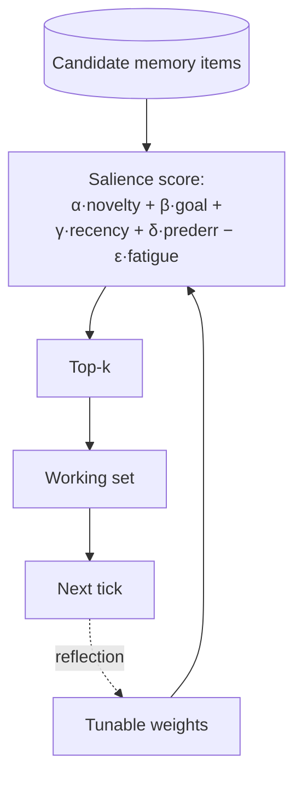

# Salience Attention Mechanism

**Also known as:** Salience Scoring, Attention Selection, Top-K Memory Attention

**Category:** Memory
**Status in practice:** emerging

## Intent

Score every candidate memory item with a weighted salience function so each tick attends to a small, relevant top-k subset rather than re-reading all memory.

## Context

A long-running agent's memory store grows past what can fit into a single call's context. The agent has accumulated thoughts, summaries, insights, and observations over hours or days, and on every tick only a small, currently relevant slice of that store should drive the next step.

## Problem

Without an explicit notion of salience, the agent has only two bad strategies. Dumping all of memory into context blows up the token budget and gives the model no focus on what matters now. Taking only the most recent items provides no continuity and misses anything older that has become relevant again because of a surprise in the current context. Recency alone misses the items that matter; bulk loading buries them in noise. The agent needs a way to score every candidate memory by how salient it is to the current moment and to surface only the top-scoring ones into context.

## Forces

- Recency, novelty, goal-relevance, and prediction error all matter, and they trade off.
- Re-reading all memory each tick is unaffordable at scale.
- Pure recency loses long-tail relevance; pure relevance loses temporal grounding.
- Rumination loops reward the same items over and over without a fatigue term.

## Therefore

Therefore: score each candidate memory by a weighted sum of novelty, goal-relevance, recency, prediction error, and fatigue and pick the top-k each tick, so that attention is bounded, tunable, and resistant to rumination loops.

## Solution

Score each candidate memory item `m` with a weighted sum: `alpha * novelty(m) + beta * goal_relevance(m) + gamma * recency(m) + delta * prediction_error(m) - epsilon * fatigue(m)`. Pick the top-k into the working set for the next tick. Persist the weights in a tunable config so a reflection pass can adjust them. The fatigue term penalises items that have already been attended to many times in the recent window, breaking rumination loops.

## Diagram

## Consequences

**Benefits**

- Bounded attention cost per tick regardless of memory store size.
- Salience scores are inspectable and tunable.
- Fatigue term breaks repetitive attention loops without manual intervention.

**Liabilities**

- Weight tuning is empirical and per-deployment.
- A bad scoring function can suppress genuinely relevant items.
- Salience scoring is itself work; it has to stay cheap to run every tick.

## What this pattern constrains

The agent cannot read its full memory store at every tick; salience scoring is mandatory and the top-k cap is enforced by the retrieval layer, not left to the model.

## Applicability

**Use when**

- The persistent memory store is too large to read in full at every tick.
- Memory items have features (recency, importance, frequency, similarity) that can be combined into a salience score.
- The agent needs predictable per-tick read cost.

**Do not use when**

- The memory is small enough to fully load every tick.
- All memory items are equally relevant and ranking adds noise rather than signal.
- Strict determinism is required and salience scores would change with every new write.

## Variants

### Generative-Agents recipe

Score each memory by a weighted sum of recency (exponential decay), importance (LLM-rated at write time), and relevance (embedding cosine to current query).

*Distinguishing factor:* three-factor weighted sum

*When to use:* Default. Well-validated by the Generative Agents paper.

### Top-k by similarity only

Drop recency and importance; rank purely by embedding similarity to the current query.

*Distinguishing factor:* single signal

*When to use:* When memory items have no meaningful age or rated importance (e.g. pure factual stores).

### Tag-gated salience

Filter memory by tags or namespaces first, then apply salience scoring within the filtered set.

*Distinguishing factor:* two-stage filter then score

*When to use:* When memory is multi-tenant or the agent has structural reasons (current task, persona) to ignore most of it.

## Example scenario

A long-running personal agent has months of memory; dumping it all into context is impossible and grabbing the most recent items misses the user's recurring goals. The team scores each candidate memory with a weighted sum of novelty, goal-relevance, recency, prediction-error, and a fatigue penalty. Each tick attends to top-k items only. Surprising long-tail facts rise above last-hour chatter when they actually matter, and token usage per tick stays flat as memory grows.

## Known uses

- **Long-running personal agent loops (private deployment)** — *Available*
- **[Sparrot](https://marco-nissen.com/sparrot/)** — *Available* — Per-tick salience scoring directs attention toward what matters most rather than processing everything uniformly.

## Related patterns

- *complements* → [episodic-summaries](episodic-summaries.md)
- *complements* → [vector-memory](vector-memory.md)
- *composes-with* → [five-tier-memory-cascade](five-tier-memory-cascade.md)
- *alternative-to* → [context-window-packing](context-window-packing.md)
- *used-by* → [preoccupation-tracking](preoccupation-tracking.md)
- *used-by* → [mode-adaptive-cadence](mode-adaptive-cadence.md)

## References

- (paper) Park, O'Brien, Cai, Morris, Liang, Bernstein, *Generative Agents: Interactive Simulacra of Human Behavior*, 2023, <https://arxiv.org/abs/2304.03442>
- (paper) Laurent Itti, Christof Koch, *Computational modelling of visual attention*, 2001, <https://pubmed.ncbi.nlm.nih.gov/11256080/>

**Tags:** memory, salience, attention, scoring
